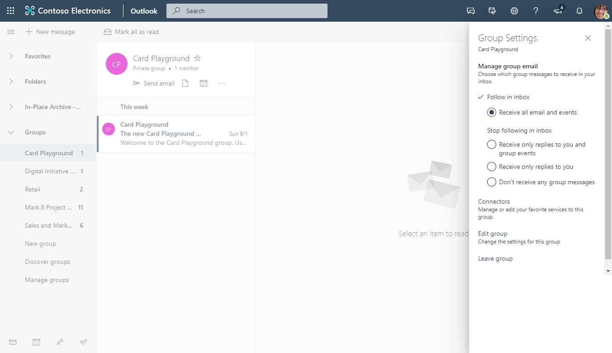
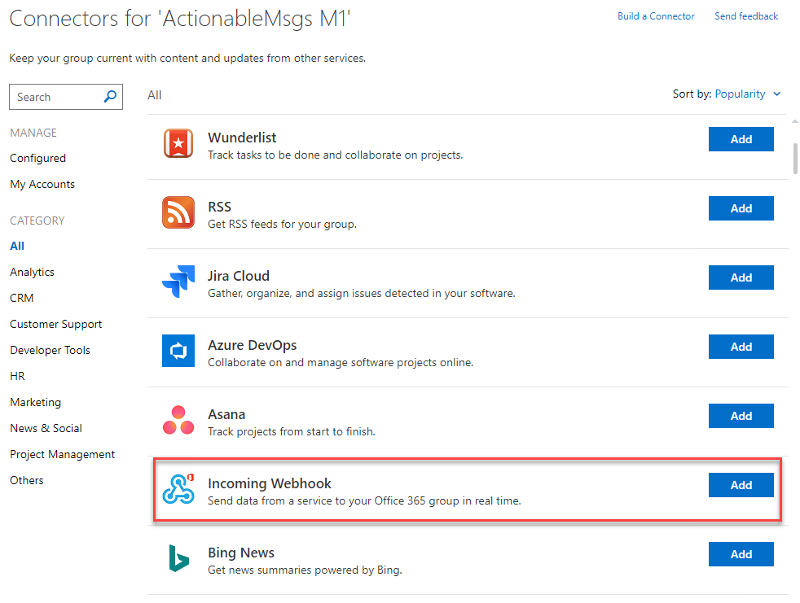
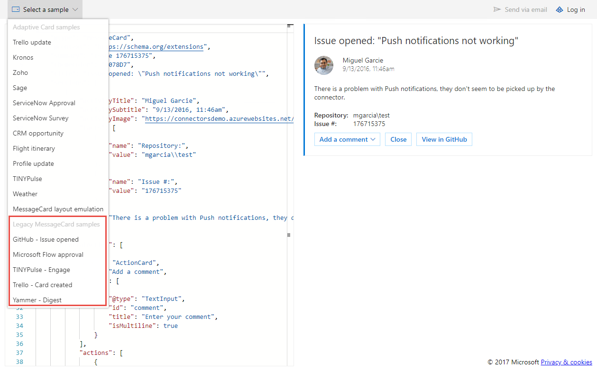

# Demo - Create a Card payload and submit it via an Incoming Webhook

In this demo, you will copy an example card from the Message Card Playground website and send it to an Office 365 group in your tenant.

To run this demo, perform the following steps from the lab:

## Create a group and configure the webhook

1. Open a browser and go to [Microsoft Outlook](https://outlook.office.com). Log in with your Office 365 credentials.

1. Create a new group, or select an existing group.

1. In the Group information card above the message list, select the elipsis (**...**) then select **Settings**.

    

1. In the Group Settings pane, select **Connectors**.

    

1. In the list of connectors, scroll down and select **Add** next to **Incoming Webhook**.

    

1. Enter a name for the connector and select **Create**.

1. The page will re-display, now including a URL for the connector. Use the icon next to the URL to copy it to the clipboard.

    

    > Note: The URL will be used several times in this exercise, as will the clipboard. We recommend pasting the URL into Notepad or other application.

1. Select **Done**. Then close the Connector and Group settings menus.

## Explore MessageCard playground

1. In another browser tab or window, navigate to [MessageCard Playground](https://messagecardplayground.azurewebsites.net).

1. The playground site provides for uploading a custom card definition or reviewing several samples. Use the **select a sample** dropdown to select a sample that closely matches your requirements.

    

    > Note: The image in this lab uses the **MessageCard layout emulation**, but that is not required.

    > Note: If you get an error that the post request failed, "Error: Summary or Text is required". Please add the following property to the JSON sample right under the "version" property and before the "body" property.

    ```html
    "summary", "Your Subject Goes Here"
    ```

## Send card via PowerShell

It is not necessary to use the playground website to send test messages. Any facility for sending HTTP POST requests can also send cards to the group.

1. In the MessageCard Playground site, select a different sample card. (This will be easier to identify in the Conversation view if the cards are different.)

1. Select the JSON and copy it to Notepad.

1. Save the card source as **connector-card.json**.

1. Open **Windows PowerShell** and change to the directory containing the **connector-card.json** file.

1. Execute the following commands:

    ```powershell
    $message = Get-Content .\connector-card.json
    $url = <YOUR WEBHOOK URL>
    Invoke-RestMethod -ContentType "application/json" -Body $message -Uri $url -Method Post
    ```

    

    > The `Invoke-RestMethod` cmdlet will return **1** to indicate success.
