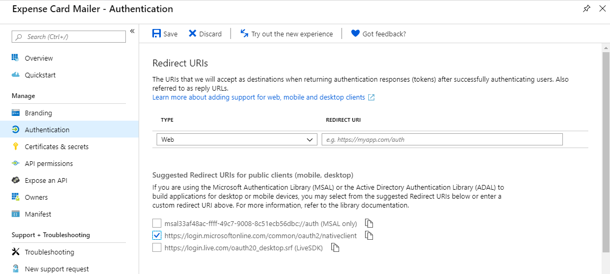

# Demo: Sending Actionable Messages

In this demo, you will use PowerShell to send an email containing a message card.

## Prerequisites

This demo requires an Office 365 subscription with an active mailbox. A sample JSON file, `expenseCard.json` is used as the basis for this lab. 

### Create a card

1. Visit the [MessageCard Playground](https://messagecardplayground.azurewebsites.net/) site. 

1. Replace the JSON data in the MessageCard Playground app with the contents of the **expenseCard.json** file. 

1. Review the card in the MessageCard Playground, highlighting the `potentialAction` attribute and its children.

## Write PowerShell to send email via Microsoft Office 365 SMTP Server

PowerShell provides a utility method `Send-MailMessage` that is used to send emails. You can use this method with the Office 365 SMTP Server to send an email using PowerShell.

1. Open the **PowerShell ISE**.

1. Open the file **SendCardviaEmail.ps1**.

1. Review the script, highlighting the `$htmlMessage` variable and the construction of the message.

1. In the interactive pane, change the directory to the location containing the **expenseCard.json** file.

1. Run the script. When prompted, enter your login credentials for your Microsoft Office 365 mailbox.

    

1. When the script completes, check your inbox for the email just sent.