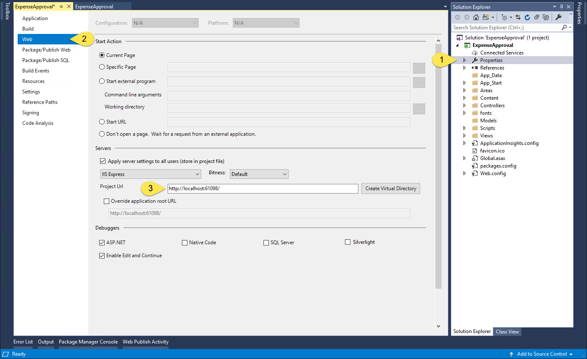
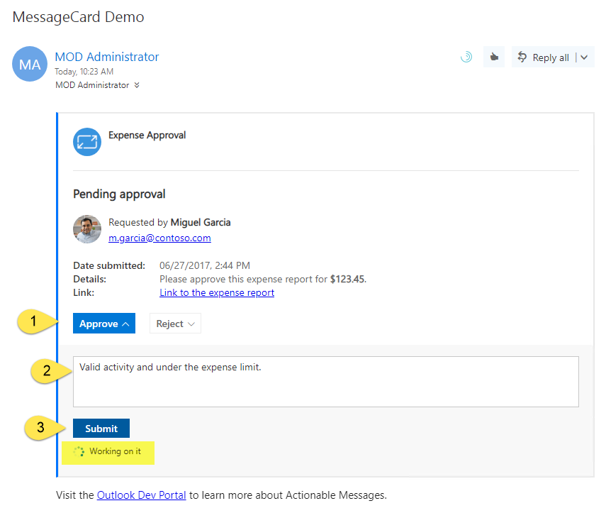
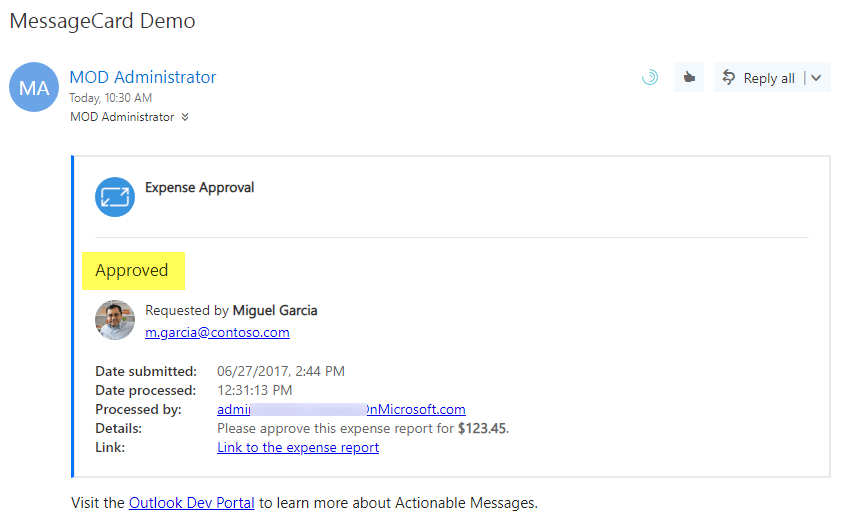

# Demo: Adding actions to cards

In this demo, you will walk through creating and registering an application to process Actions on MessageCards.

## Prerequisites

This demo uses Visual Studio 2017. It also requires an Office 365 subscription with an active mailbox.

## Open Visual Studio solution

1. Launch **Visual Studio 2017**.

1. In Visual Studio 2017, select **File > Open > Project/Solution**.

1. Select the **ExpenseApproval.sln** solution from the **Demos\03-Expense-Approval** folder.

1. In **Solution Explorer**, double-click on **Properties**.

1. In the **Properties** designer, select the **Web** tab.

1. Note the **Project URL**.

    

## Run the ngrok secure tunnel application

1. Open a new **Command Prompt** window.

1. Download [ngrok](https://ngrok.com/download) and unzip the **ngrok secure tunnel application**. Change to the directory that contains the **ngrok.exe** application.

1. Run the command `ngrok http [port] -host-header=localhost` Replace `port` with the port portion of the URL noted above.

1. The ngrok application will fill the entire prompt window. Make note of the forwarding address using HTTPS. This address is required in the next step.

1. Minimize the ngrok command prompt window. It is no longer referenced in this lab, but it must remain running.

    

## Register a new provider

1. Open your browser and go to the [Actionable Email Developer Dashboard](https://outlook.office.com/connectors/oam/publish). Select **New Provider**.

1. Provide a **Friendly Name**.

1. For the **Sender email address from which actionable emails will originate**, enter your email address.

    > NOTE: For production applications, a static email address, such as `actions@contoso.com`, is recommended.
    
1. For the target URL, enter the HTTPS forwarding address from ngrok. 

1. For the **Scope of submission**, select **My Mailbox (auto-approved)**.

    > NOTE: The following are the restrictions on Actions for the possible scopes:
    > - **My Mailbox** enables actionable emails from your service sent to your own mailbox.
    > - **Organization** enables actionable message from your service to any Office 365 email user within your organization. This scope is typically used for enabling actionable messages from a service that is specific to your organization, like a line- of-business application internal to your organization.
    > - **Global** enables actionable message from your service for any email user in Office 365.
    >
    > Selecting "Organization" or "Global" will require a review and approval of your service.

1. Accept the terms of service and select **Save**.

## Configure validation values

The helper functions validate that the request is coming from a known mailbox. The valid values are configured in the **web.config** file. 
1. Open the **web.config** file.

1. Add the following to the **appSettings** node. The values of these settings must match the entries on the Actionable Email Developer Dashboard
    - Replace the token [sender-email] with the **Sender email address from which actionable emails will originate** value.
    - Replace the token [registered-action-url] with the **Target URLs** value.

    ````xml
    <add key="sender" value="[sender-email]" />
    <add key="registeredActionURL" value="[registered-action-url]" />
    ````

1. Press **F5** to build the solution and launch the debugger.

1. Set a breakpoint in the **ExpenseController** class to see when messages arrive and debug interactively.

## Update and send Expense Card

1. Open the **expenseCard.json** file in the **Demos\03-Expense-Approval** folder.

1. Locate the **target** properties containing the placeholder URL **tbd.ngrok.io**. Replace the placeholder with the forwarding address from the ngrok tunnel. This should also match the value registered on the Actionable Email dashboard and the value in web.config.

1. Save the **expenseCard.json** file.

1. Using PowerShell, execute the **SendCardviaEmail.ps1** script from the **Demos\03-Expense-Approval** folder.

    

## Test the card

1. Open the email containing the expense card. Select the **Approve** button. Enter sample text in the **Reason** box. Select **Submit**.

    

1. The debugger in your code is reached, and you can step through the code to see the bearer token is validated, the sender and email domains are validated, the refresh card body is retrieved and the response is sent with the appropriate headers.

1. In your email client, the card is now updated to reflect the data sent in the refresh card.

    