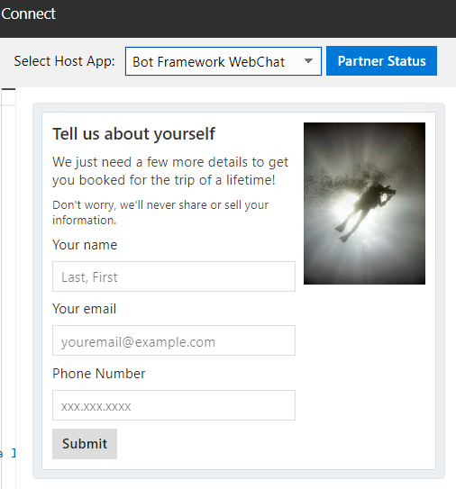

# Creating and sending cards

In this demo, you will walk through building an Adaptive Card and sending it to your inbox using a console application.

## Prerequisites

This demo requires an Office 365 subscription with an active mailbox. A sample JSON file, `supportTicketCard.json` is used as the basis for this lab.

## Preview the Adaptive Card

1. Open the browser to the [Adaptive Card samples page](http://adaptivecards.io/samples/).
1. In the left navigation bar, select on the **Input Form** link. The Input Form sample will show.
1. Review and discuss the preview of the card in the right-hand column. Note that the **Submit** and **Show Card** buttons at the bottom of the card both use the Submit action (Action.submit).
1. Select the **Try it yourself** button. This will open a new tab with the Visualizer page pre-loaded with the Input Form sample card.
1. Point out the value of the **Select Host App** dropdown. The default is **Bot Framework web chat**.

    

1. Choose **Outlook Actionable Messages (Preview)** from the dropdown. Notice that a warning message is display above the card preview. Also notice that the Submit button is not displayed.

    

1. Point out that Action.Submit is not supported by Outlook. Outlook implemented an action (Action.Http) this is not supported in other hosts. Action.Http is discussed later in the module.

## Send the card via console application 

### Register the application

1. Go to the [Application Registration Portal](https://apps.dev.microsoft.com) and sign in with either a Microsoft account or an Office 365 account.

1. Select the **Add an app** button. Enter a name for the application and select **Create**.

1. Select the **Add Platform** button and choose **Native Application**.

1. Select **Save**.

1. Copy the value of **Application ID** for reference later.

### Update application

1. Launch **Visual Studio 2017**.

1. Open the solution **Demos/01-CardPlayground/SendAdaptiveCard/SendAdaptiveCard.sln**.

### Add the application ID to the project

1. Open the [App.config](App.config) file.

1. Find the following line:

    ```xml
    <add key="applicationId" value="[your-app-id-here]" />
    ```

1. Paste the application ID you copied from the portal into the `value`, replacing the token `[your-app-id-here]` and save the file.

### Review message format

1. In **Visual Studio**, open file **MessageBody.html**.

1. Notice that the `<head>` element contains a `<script>` tag. The type for the tag is `application/adaptivecard+json`. This value instructs Microsoft Outlook that the code following should be interpreted as an Adaptive Card.

1. Compile and run the SendAdaptiveCard application.


1. Open Outlook. Select the message titled "Adaptive card sent from code."