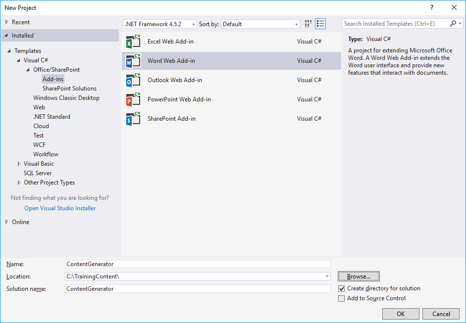
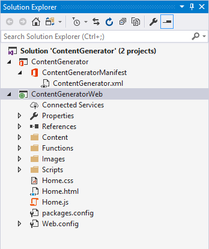
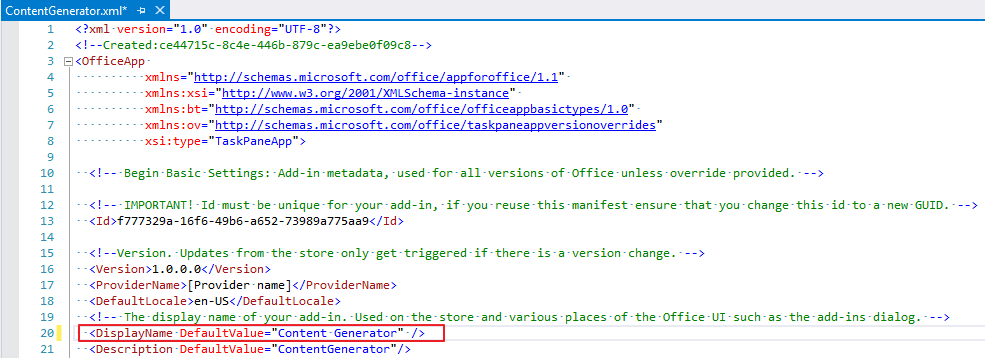
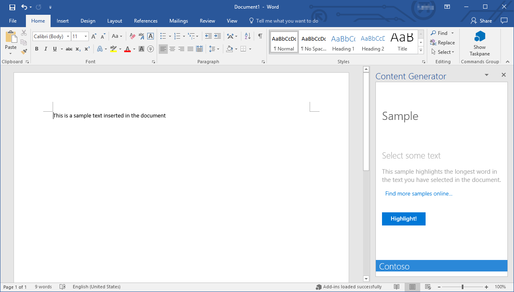
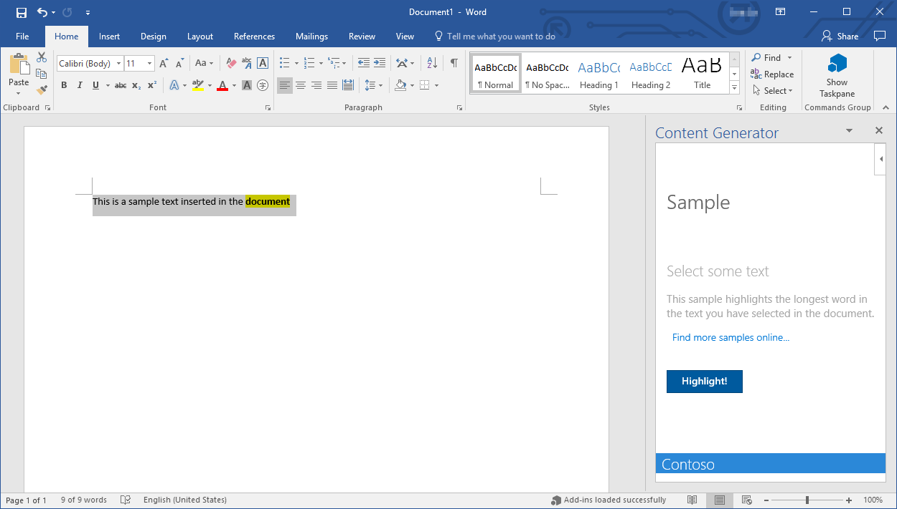
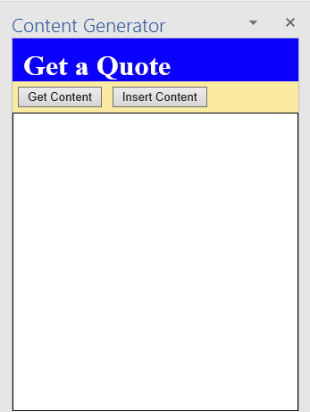
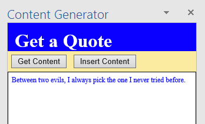
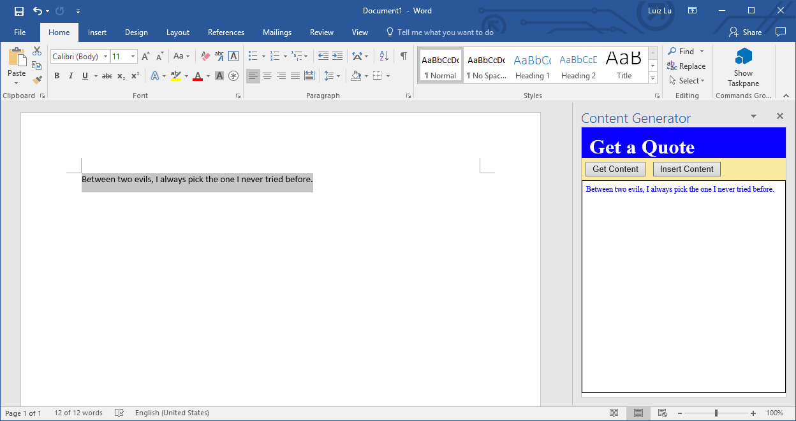

# Getting Started with App for Office Development

In this lab you will get hands-on experience working with the new App for Office development model. Through the exercises in this lab you will learn how to create and test an App for Office that runs inside Microsoft Word.

**Prerequisites:** Before you can start this lab, you must have installed Office 2013 with Service Pack 1 and Visual Studio 2013 with Update 2 on your development workstation.

## Exercise 1: Creating Your First App for Office Project in Visual Studio 2013
*In this exercise you will create a new App for Office project in Visual Studio so that you can begin to write, test and debug your first app. The user interface of the App for Office you will create in this lab will not be very complicated. You will use the starter user interface that Visual Studio generates automatically when you create a new App for Office project and make a few minor adjustments.*

1. Launch Visual Studio 2013 as administrator.
2. From the **File** menu select the **New Project** command. When the **New Project** dialog appears, select the **App for Office** project template from the **Office/SharePoint** template folder as shown below. Name the new project **ContentGenerator** and click **OK** to create the new project.
 

3. When you create a new App for Office project, Visual Studio prompts you with the **Choose the app type** page of the **Create app for Office** dialog. This is the point where you select the type of App for Office you want to create. Leave the default setting with the radio button titled **Task pane** and select **OK** to continue.
 

4. On the **Choose the host applications** page of the **Create app for Office** dialog, uncheck all the Office application except for **Word** and then click **Finish** to create the new Visual Studio solution. 
 

5. Take a look at the structure of the new Visual Studio solution once it has been created. At a high-level, the new solution has been created using two Visual Studio projects named **ContentGenerator** and **ContentGeneratorWeb**. You should also observe that the top project contains a top-level manifest for the app named **ContentGeneratorManifest** which contains a single file named **ContentGenerator.xml**.
 

6. In the Solution Explorer, double-click on the node named **ContentGeneratorManifest** to open the app manifest file in the Visual Studio designer. Update the **Display Name** settings in the app manifest from **ContentGenerator** to **Content Generator**.
 

7. Save and close **ContentGeneratorManifest**.
8. Over the next few steps you will walk through the default app implementation that Visual Studio generated for you when the app project was created. Begin by looking at the structure of the **app** folder which has two important files named **app.css** and **app.js** which contain CSS styles and JavaScript code which is to be used on an app-wide basis.
 

9. You can see that inside the **app** folder there is a child folder named **Home** which contains three files named **Home.html**, **Home.css** and **Home.js**. Note that the app project is currently configured to use **Home.html** as the app's start page and that **Home.html** is linked to both **Home.css** and **Home.js**.
 
10. Double-click on **app.js** to open it in a code editor window. you should be able to see that the code creates a global variable named **app** based on the JavaScript *Closure* pattern. The global **app** object defines a method named **initialize** but it does not execute this method. 
 
		var app = (function () {
		  "use strict";

		  var app = {};

		  // Common initialization function (to be called from each page)
		  app.initialize = function () {
		    $('body').append(
			  '
' +
			  '
' +
			  '

' +
			  '

' +
			  '

' +
			  '
' +
			  '
');

			  $('#notification-message-close').click(function () {
			    $('#notification-message').hide();
			  });

			  // After initialization, expose a common notification function
			  app.showNotification = function (header, text) {
			    $('#notification-message-header').text(header);
			    $('#notification-message-body').text(text);
			    $('#notification-message').slideDown('fast');
			  };
			};

			  return app;
		})();
11. Close **app.js** and be sure not to save any changes.
12. Next you will examine the JavaScript code in **home.js**. Double-click on **home.js** to open it in a code editor window. Note that **Home.html** links to **app.js** before it links to **home.js** which means that JavaScript code written in **Home.js** can access the global **app** object created in **app.js**.
13. Walk through the code in **Home.js** and see how it uses a self-executing function register an event handler on the **Office.initialize** method which in turn registers a document-read event handler using jQuery. This allows the app to call **app.initialize** and to register an event handler using the **getDataFromSelection** function. 
 
		(function () {
		  "use strict";

		  // The initialize function must be run each time a new page is loaded
		  Office.initialize = function (reason) {
		    $(document).ready(function () {
		      app.initialize();
		      $('#get-data-from-selection').click(getDataFromSelection);
		    });
		  };

		  // Reads data from current document selection and displays a notification
		  function getDataFromSelection() {
		    Office.context.document.getSelectedDataAsync(Office.CoercionType.Text,
		      function (result) {
		        if (result.status === Office.AsyncResultStatus.Succeeded) {
		          app.showNotification('The selected text is:', '"' + result.value + '"');
		        } else {
		          app.showNotification('Error:', result.error.message);
		      }
			});
		  }
		})();
14. Close **Home.js** and be sure not to save any changes.
15. Now it time to examine the HTML that has been added to the project to create the app's user interface. Double-click **Home.html** to open this file in a Visual Studio editor window. Examine the layout of HTML elements inside the body element. 

		<body>
			

				

					<h1>Welcome</h1>
				

			

			

				

					
<strong>Add home screen content here.</strong>

					
For example:

					<button id="get-data-from-selection">Get data from selection</button>

					

						<a target="_blank" href="https://go.microsoft.com/fwlink/?LinkId=276812">Find more samples online...</a>
					

				

			

		</body>
16. Replace the text message of **Welcome** inside the **h1** element with a different message such as **My App for Office**. Also trim down the contents of the **div** element with the **id** of **content-main** to match the HTML code shown below. 

		<body>
			

				

					<h1>My App for Office</h1>
				

			

			

				

					<button id="get-data-from-selection">Get data from selection</button>
				

			

		</body>

17. Now it's time to test the app using the Visual Studio debugger. Press the **{F5}** key to run the project in the Visual Studio debugger. The debugger should launch Microsoft Word 2013 and you should see your App for Office in the task pane on the right as shown in the following screenshot.
 

18. Now test the functionality of the app. Begin by typing some text in the Word document and selecting it as shown in the following screenshot. Once you have selected some text, click the **Get data from select button**. You should see a copy of the selected text appear in a gray box at the bottom of the task pane.
 

19. You have now successfully run and tested the app using the Visual Studio debugger. Close Microsoft Word to stop the debugging session and return to Visual Studio.

## Exercise 2: Creating a Custom User Experience in an App for Office
*In this exercise you will continue working on the Visual Studio solution for the ContentGenerator app you created in the previous exercise. You will replace the default user interface with a custom implementation that includes div elements and command buttons along with the JavaScript code which uses jQuery to update HTML elements.*
 
1. In the Solution Explorer, double click on **Home.html** to open it in an editor window. 
2. As you can see, the **head** section of **Home.html** already links to the jQuery library as well as **app.css**, **app.js**, **Home.css** and **Home.js**.
3. Remove all the content from the **body** section of **Home.html** and replace it with the HTML in the following code listing. If you would rather copy-and-paste this HTML code rather than type it, you can find a copy of it in the file named **Home.html.txt** in the **Starter Files** folder for this lab.

		<body>

			

				<h2>Get a Quote</h2>

				

					<input id="cmdGetContent" type="button" value="Get Content" />
					<input id="cmdInsertContent" type="button" value="Insert Content" />
				

				

					

				

			

		</body>
2. Save your changes and close **Home.html**.
3. In the Solution Explorer, double click on **Home.css** to open this CSS file in an editor window.
4. Delete all contents inside **Home.css** and replace it with the following set of CSS rules. If you would rather copy-and-paste these CSS rules rather than type them, you can find a copy in the file named **Home.css.txt** in the **Starter Files** folder for this lab. 

		body {
			margin: 0;
		}

		#topDiv {
			background-color: white;
			padding: 0;
		}

		#topDiv h2 {
			margin: 0;
			font-size: 24pt;
			color: white;
			background-color: #0a00ff;
			padding: 12px;
			height: 24px;
		}

		#topDiv .toolbar {
			background-color: #fbeba0;
			margin: 0;
			padding: 2px;
		}

		#topDiv .toolbar input {
			margin: 4px;
		}

		#topDiv .displayPanel {
			margin: 0;
			border: 1px solid black;
			padding: 6px;
			font-size: 12px;
			font-family: "Garamond, Arial, sans-serif";
			background-color: white;
			color: blue;
			min-height: 320px;
		}
4. Save your changes and close **Home.css**.
5. In the Solution Explorer, double click on **Home.js** to open this JavaScript file in an editor window. Modify the code in **Home.js** to match the code shown in the following code listing which provides app initialization code and adds three emtpy functions named **getQuote**, **cmdGetContent** and **cmdInsertContent**. 

		(function () {
		  "use strict";

		  Office.initialize = function (reason) {
		    $(document).ready(function () {
		      app.initialize();
		    });
		  };

		  function getQuote() {
    	  }

		  function cmdGetContent() {
		  }

		  function cmdInsertContent() {
		  }

		})(); 

5. Directly below the call to **app.initialize**, add a line of code to register the **cmdGetContent** function as an event handler for the **click** event of the command button with the **id** of **cmdGetContent**. Likewise, add a second line of code to register the **cmdInsertContent** function as an event handler for the **click** event of  the command button with the **id** of **cmdInsertContent**.   

		Office.initialize = function (reason) {
		  $(document).ready(function () {
		    app.initialize();
            // adding event handlers for app command buttons
		    $("#cmdGetContent").click(cmdGetContent);
		    $("#cmdInsertContent").click(cmdInsertContent);
		  });
		};
6. Implement the **getQuote** function to return a random quote from a string array of quotes as shown in the following code listing. If you would rather copy-and-paste an implementation of this function rather than type it, you can find a copy in the file named **getQuote.js.txt** in the **Starter Files** folder for this lab.

		function getQuote() {

    	  var quotes = [
		    "I would rather have an Agave bottle in front of me than a frontal lobatomy.",
		    "Better to remain silent and be thought a fool than to speak and erase all doubt.",
		    "A two-year-old is kind of like having a blender, but you don't have a top for it.",
		    "Between two evils, I always pick the one I never tried before."
		  ];

		  var index = Math.floor(Math.random() * quotes.length);
    	  return quotes[index];
		}
6. Implement the **cmdGetContent** function to call the **getQuote** function to return a string-based quote. Display the quote on the app's start page by writing it to the div with the **id** of **contentArea**.

		function cmdGetContent() {
    	  // display quote inside Agave
    	  $("#contentArea").html(getQuote());
		}
7. Now it's time to test the app using the Visual Studio debugger. Press the **{F5}** key to run the project in the Visual Studio debugger. The debugger should launch Microsoft Word 2013 and you should see your App for Office in the task pane on the right as shown in the following screenshot.
 

18. Now test the functionality of the app by clicking the **Get Content** button. Each time you click this button you should see a different quote appear below as shown in the following screenshot.
 

19. You have now successfully implemented a custom user experience for the app using HTML, CSS and JavaScript. Close Microsoft Word to stop the debugging session and return to Visual Studio.

## Exercise 3: Writing App Code that Generates Content in a Word document
*In this exercise you will continue working on the Visual Studio solution for the ContentGenerator app you worked on in the previous exercise. You will extend the app's capabilities by adding JavaScript code to insert content into the active Word document.*

1. Open the app's main JavaScript logic file named **Home.js** if it is not already open.
2. Locate the **cmdInsertContent** function which should currently be an empty function.
3. Implement the **cmdInsertContent** function to read the current quote from the **contentArea** div and write it into the current Word document at the cursor location. You can accomplish this by calling the **setSelectedDataAsync** method of the **Office.context.document** object using the following syntax.

		function cmdInsertContent() {
    	  // insert current quote in Active Word document
    	  var quote = $("#contentArea").html();
    	  Office.context.document.setSelectedDataAsync(quote, {}, function () { });
		}
4. Now test the functionality of the app by pressing the {**{F5}** key to start a debugging session. Begin your testing by clicking the **Get Content** button to display a new quote inside the app's user interface in the task pane. Next, click the "Insert Content** button to insert the quote into the current Word document as shown in the following screenshot.
 

5. You have now successfully implemented a the app logic required in this lab exercise. Close Microsoft Word to stop the debugging session and return to Visual Studio.
