# Getting Started with SharePoint Add-in Development

In this lab you will get hands-on experience working with the new SharePoint Add-in model. Through the exercises in this lab you will learn how to create and test a SharePoint-hosted Add-in as well as a Provider-hosted Add-in.

**Prerequisites**: Before you can start this lab, you must have an Office 365 developer site. You must also have Visual Studio 2015 installed with Update 1. If you do not yet have an Office 365 developer site, you should step through the lab exercises for module 7 in which you will sign-up with Microsoft to create a new Office 365 developers site.

## Exercise 1: Creating and Debugging a SharePoint-hosted Add-in
1. Using the browser, navigate to your Office 365 developer site and log on using your credentials.
1. On your developer workstation, launch Visual Studio as administrator.
1. Create a new project in Visual Studio 2015 by selecting the menu command **File > New > Project**.
1. In the **New Project** dialog, find the **SharePoint Add-in** project template under the **Templates > Visual C# > Office / SharePoint > Office Add-ins** section. Enter a name of **MyHelloWorldApp**, a location of **C:\DevProjects** and a Solution name of **MyHelloWorldApp** and then click **OK** button.

	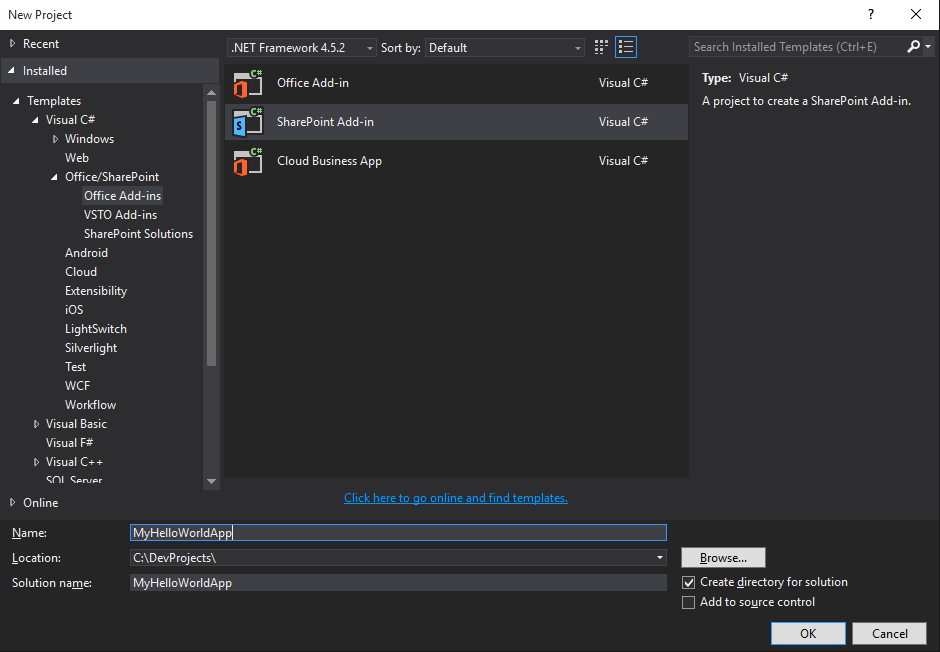

1. In the **New SharePoint Add-in** wizard, enter the URL for your Office 365 Developer site and select **SharePoint-hosted** for the Add-in hosting model. Click **Next**, In the **Specify the target SharePoint version** tab, select **SharePoint Online**. When done, complete the wizard by clicking the **Finish** button.

	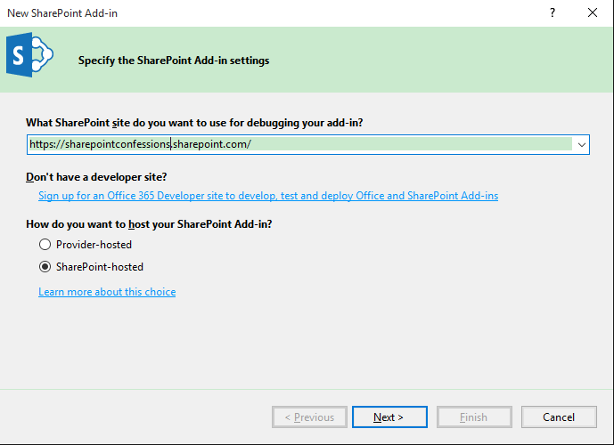

1. Examine the default project setup for a SharePoint-hosted Add-in . As you can see, it is like a traditional SharePoint solution-based project because you have a Features and Packages node.

	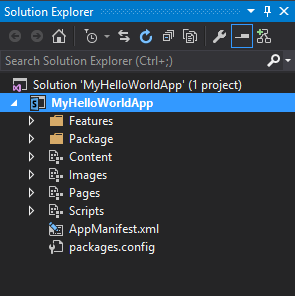

1. Note that there are project folders named Content, Images & Pages are actually SharePoint Project Items (SPI) that are Modules and will provision their contents to the respective folders in the Add-in web that will be generated upon installing the Add-in.
   - **Content/App.css**: main Cascading Style Sheet used for the Add-in.
   - **Images/AppIcon.png**: default image used for the Add-in.
   - **Pages/Default.aspx**: default start page for the Add-in.
   - **Scripts/App.js**: main JavaScript file which is referenced by Default.aspx.
   - **AppManifest.xml** Add-in manifest containing Add-in metadata such as its Name, Product ID, Add-in Version Number and minimum version for the SharePoint host environment.
1. Examine the Add-in's start page by right-clicking **Pages/Default.aspx** file and selecting **Open**.
   - Look at the links to other JavaScript libraries inside the PlaceHolderAdditionalPageHead placeholder.
   - There are references to the jQuery library and the App.js file.
   - There is a reference to the App.css file as well.  
1.	Using the Solution Explorer tool window, right-click the **Scripts/App.js** file and select **Open**.
   - This file has four functions and a few variables.
   - The ``function $(document).ready(function()){ ... }`` gets a reference to the client object model (CSOM) ClientContext object and then gets a reference to the current site.
   - The ``getUserName()`` function is one that will usually be deleted from the project when you get more experience with SharePoint-hosted Add-ins. It uses the CSOM to get the name of the current user logged in.
   - The last two functions are used as the success and failed callback when the CSOM request completes.
1. Now it is time to update the Add-in homepage. Using the Solution Explorer tool window, right-click the **Pages/Default.aspx** file and select Open. After the existing **div**, add the following markup <br />

	````html
	<input type="button" value="Push Me" onclick="hello();" />
	<div id="displayDiv"></div>
	````

1. Inside **default.aspx**, locate the **PlaceHolderPageTitleInTitleArea** placeholder control and replace the content inside with the title **My Hello World Add-in**.
1. In this step you will update the Add-in script file. Using the Solution Explorer tool window, right-click the **Scripts/App.js** file and select **Open**. Add the following function to the bottom of the file that will be called when you click the button.

	````javascript
	function hello() {
	  $get("displayDiv").innerHTML = "<p>Hello, Add-ins!</p>";
	}
	````

1.	Save all changes: **File > Save All**.
1.	Build and Test the Project by pressing **[F5]** or **Debug > Start Debugging**.
1.	The installation process for an Add-in will take a moment to complete. If you watch the lower-left corner of Visual Studio, it will tell you what it is currently doing. If you want more information, click the Output tab at the bottom of Visual Studio to see a log of what is going on. If the Output tab isn't present, select the window from the menu in Visual Studio 2015 using the menu command **View > Output**.
1.	Once the Add-in has been installed, Internet Explorer will launch and navigate to the Add-in's start page **default.aspx** page.
1.	When the page loads, click the **Push me** button to see your text get written to the page:

	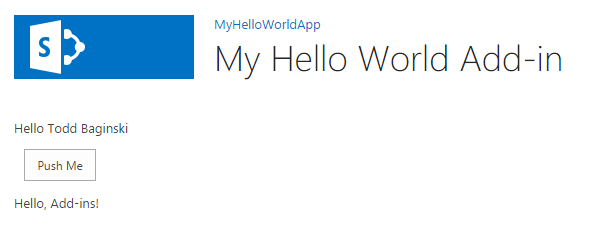
	
1.	Once you have tested the Add-in, close the browser to stop the debugging session and return to Visual Studio.
1.	In Visual Studio, save all changes using **File > Save All**.

## Exercise 2: Using jQuery in a SharePoint-hosted Add-in
*In this lab, you will continue working with the SharePoint-hosted Add-in project you created in the previous lab exercise. However, you will rewrite the JavaScript code to use the jQuery library to initialize the Add-in and create an event handler using best practice techniques.*

1. Open **default.aspx** and ensure that the HTML code inside the **PlaceHolderMain** content control looks exactly like the following code listing.

	````html
	<asp:content contentplaceholderid="PlaceHolderMain" runat="server">

		<div>
			<p id="message">
			<!-- The following content will be replaced with the user name when you run the Add-in - see App.js -->
			initializing...
			</p>
		</div>

		<input type="button" value="Push Me" onclick="hello();" />
		<div id="displayDiv"></div>

	</asp:content>
	````

1. Remove the ``onclick`` attribute from the input element and add an **id** of **cmdPushMe** so the element definition looks like this. <br />

	````html
	<input id="cmdPushMe" type="button" value="Push Me" />
	````

1. Save your changes and close **default.aspx**.
1. Right-click on **app.js** and select **Open** to open this JavaScript file in an editor window.
1. Delete all the code inside **app.js** except for the `'use strict';` statement at the top.
1. Inside **app.js**, add two new functions into **onPageLoad** and **onButtonClicked**.

	````javascript
	'use strict';

	function onPageLoad() {
	}

	function onButtonClicked() {
	}
	````

1. At the top of **App.js** right after the ``use strict`` statement, add a jQuery document ready event handler to execute the **onPageLoad** function once the page loads and the JavaScript DOM is available for access within the browser.

	````javascript
	'use strict';

	$(document).ready(onPageLoad);

	function onPageLoad() {
	}

	function onButtonClicked() {
	}
	````

1. Implement **onPageLoad** with the following code to display a text message on the page when the document ready event handle executes and to register the **onButtonClick** function as an event handler for the input control with the **id** of **cmdPushMe**.

	````c#
	function onPageLoad() {
		$("#message").text("Hello from the document ready event handler");
		$("#cmdPushMe").click(onButtonClicked);
	}
	````

1. Implement the **cmdPushMe** function to write the text message **"Hello Add-ins"** into the div element with the **id** of **displayDiv** and to use the jQuery `css` method to style thediv element with a margin div of 16px, a font color of green and a font-size of 32px.
		
	````javascript
	function onButtonClicked() {
		$("#displayDiv")
			.text("Hello Add-ins")
			.css({ "margin": "16px", "color": "green", "font-size": "32px" });
	}
	````

1. Once the code inside your **app.js** file looks like the following code listing, you are ready to test your work.

	````javascript
	'use strict';

	$(document).ready(onPageLoad);

	function onPageLoad() {
		$("#message").text("Hello from the document ready event handler");
		$("#cmdPushMe").click(onButtonClicked);
	}
	function onButtonClicked() {
		$("#displayDiv")
			.text("Hello Add-ins")
			.css({ "margin": "16px", "color": "green", "font-size": "32px" });
	}
	````

1. Save all changes by executing the **File > Save All** menu command.
1. Build and Test the Project by pressing **[F5]** or **Debug > Start Debugging**.
1. Once the Add-in has been installed, Internet Explorer will launch and navigate to the Add-in's start page **default.aspx** page.
1. When the page loads, you should see the message **"Hello from the document ready event handler"** on the page.
1. Click the **Push me** button to see your text get written to the page with your custom font styles.

	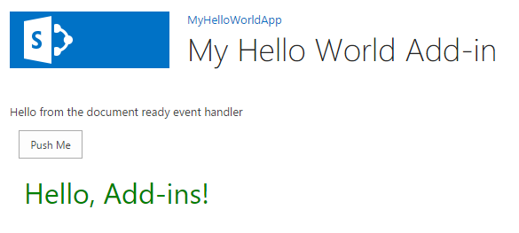

1.	Once you have tested the Add-in, close the browser to stop the debugging session and return to Visual Studio.
1.	In Visual Studio, save all changes using **File > Save All**.
1.	Close the **MyHelloWorldApp** project.

## Exercise 3: Creating and Debugging a Provider-hosted Add-in
*In this exercise you will create and test a simple Provider-hosted Add-in. This will give you opportunity to observe the basic differences between developing SharePoint-hosted Add-ins using Visual Studio 2015. Note that this lab will not involve security topics such as Add-in authentication. Instead, you will configure the Add-in to use Internal security so that you can get the Add-in up and running without worrying about how to configure Add-in authenhtication.*

1.	Launch Visual Studio 2015 as administrator if it is not already running.
1.	In Visual Studio select **File > New > Project**.
1.	In the New Project dialog select the **SharePoint Add-in** template under the **Templates > Visual C# > Office / SharePoint > Office Add-ins** section.
1.	Enter a **Name** of **MyFirstCloudHostedApp** and a **Location** of **C:\DevProjects\** and then click **OK** when you are done.

	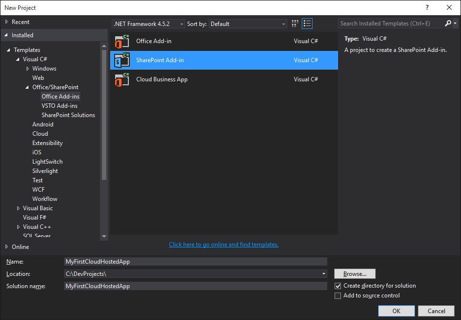

1.	Next, you will see the **New SharePoint Add-in wizard** which begins by prompting you with the **Specify the SharePoint Add-in settings** page. Enter the URL to your Office 365 developer site, configure the Add-in's hosting model to be **Provider-hosted** and click **Next**.

	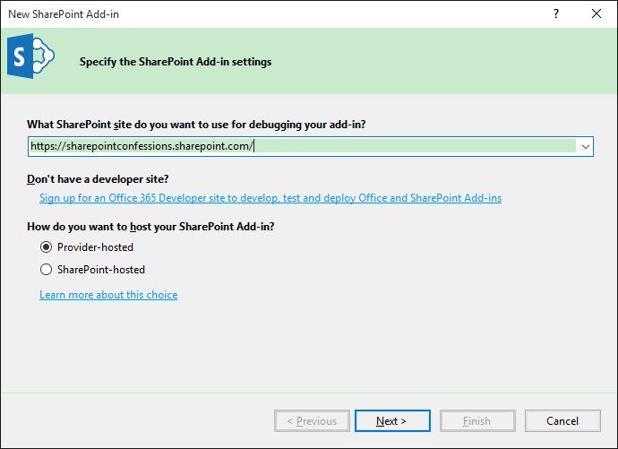

1. On the **Specify the target SharePoint version** page, select **SharePoint Online** setting and click **Next**.
    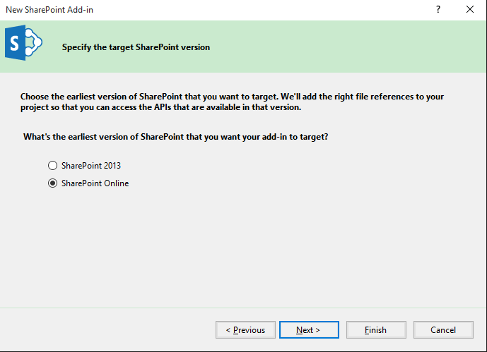 

1. On the **Specify the web project type** page, select the **ASP.NET Web Forms Application** setting and click **Next**.

	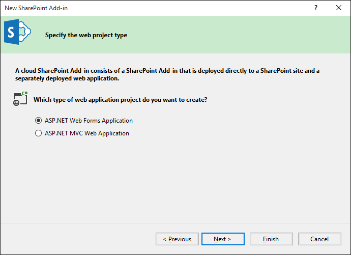

1.	On the **Configure authentication settings** page, accept the default settings and click **Finish**.

	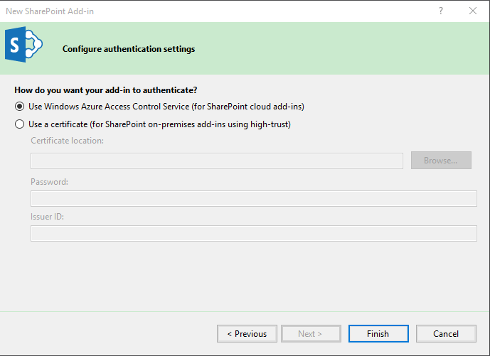

1.	Examine the structure of the Visual Studio solution that has been created. As you can see, the Visual Studio solution created for a Provider-hosted Add-in has two projects and is very different from the Visual Studio solution for a SharePoint-hosted Add-in which has only one project.

	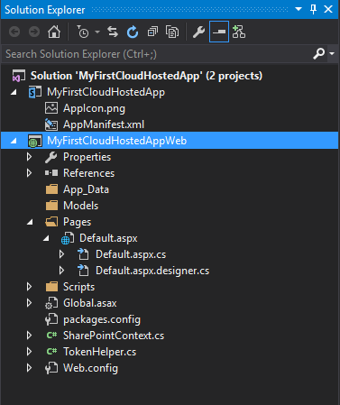

1. Observe that top project named **MyFirstCloudHostedApp** contains only two files: **AppManifest.xml** and **AppIcon.png**. This effectively means the Add-in will not install any resources into the SharePoint host such as pages. This project only contains Add-in metadata and an image file that get added to the SharePoint host when the Add-in gets installed.
1. Take a look at the project below named **MyFirstCloudHostedAppWeb** which will provide the implementation of the Add-in's remote web. This project is a standard ASP.NET Web application but it contains a little extra stuff in it:
 - **TokenHelper.cs**: This is a code file provided by Microsoft to make it easier to obtain the user identity, the OAuth token or the token provided by highly trusted Add-ins. You will ignore this for now.
 - **Default.aspx.cs**: (Inside the Pages folder expand out the Default.aspx file to see this) the code behind file for the page contains logic to call back into SharePoint to obtain the title of the host web. The code is written to assume this Add-in will use OAuth authentication.
 - **SharePointContext.cs**: This is a code file provided by Microsoft to encapsulate all the information from SharePoint. You will ignore this for now.
 - **Scripts**: A common folder to place JavaScript files.  
1. By default a provider-hosted Add-in is expecting to use external authentication with either OAuth or S2S which are topics covered in later modules. In the following steps you will disable the configuration for external authentication to eliminate security requirements which would complicate building and testing our first provider-hosted Add-in.
1.	In the Solution Explorer within the **MyFirstCloudHostedApp** project, right-click **AppManifest.xml** and select **View Code**.
1.	Inside **AppManifest.xml**, locate the ``<AppPrincipal>``	node.
1.	Now it's time to write a bit of server-side C# code which will run in the remote web of the Add-in which is something that isn't possible to do in a SharePoint-hosted Add-in. In the Solution Explorer tool window within the **MyFirstCloudHostedAppWeb** project, right-click **Default.aspx** and select **Open**.
1.	Replace the existing ``<body>`` element on the page with an ASP.NET literal control with an **id** of **Message** and a hyperlink control with an **id** of **HostWebLink** so the body of the page looks like the following markup:

	````html
	<body>
		<form id="form1" runat="server">
		<asp:Literal ID="Message" runat="server" />
		<p><asp:HyperLink ID="HostWebLink" runat="server" /></p>
		</form>
	</body>
	````

1. In the Solution Explorer within the **MyFirstCloudHostedAppWeb** project, right-click the code beind files named **Default.aspx.cs** file and select **Open** to open the file in a code editor window.
1. Delete the existing ``Page_PreInit`` method and all the code inside.
1. Replace the contents of the ``Page_Load`` method with the following code:

	````c#
	this.Message.Text = "My first SharePoint Provider-hosted Add-in!";

	var hostWeb = Page.Request["SPHostUrl"];
	this.HostWebLink.NavigateUrl = hostWeb;
	this.HostWebLink.Text = "Back to host web";
	````

1. Save all changes by using the **File > Save All** menu command.
1. Build and Test the Project by pressing **[F5]** or **Debug > Start Debugging**.
1. Visual Studio 2015 may prompt you with a Security Alert to trust a self-signed certificate. You are not using a certificate in this solution, so just click Yes (and again to get past the extra confirmation prompt) to continue.
1. Once the solution has been deployed, Internet Explorer will launch and navigate to the start page of the Add-in in the remote web.
1. Notice when the page loads it is just a plain white page with the text you added and a link back to the hosting site.

	

1. Test the **Back to host web** link to make sure it correctly redirects you back to the host web which should be your Office 365 developers site.
1. Close the browser to stop the debugger and go back to Visual Studio.

*In this exercise you created a simple SharePoint Provider-hosted Add-in. As in the last exercise, you didn't do much in this exercise beyond creating and testing the simplest cloud-hosted Add-in possible. In later labs you will build on this foundation to add more capabilities to SharePoint Add-ins.*
