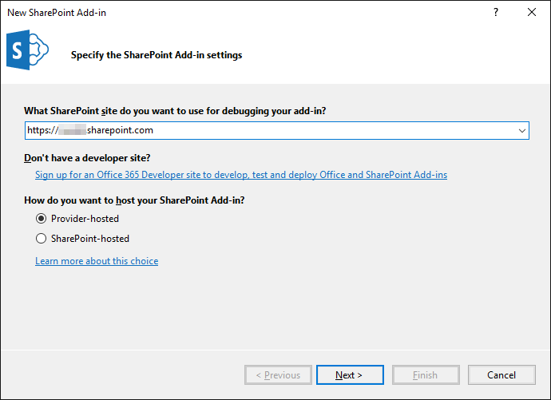
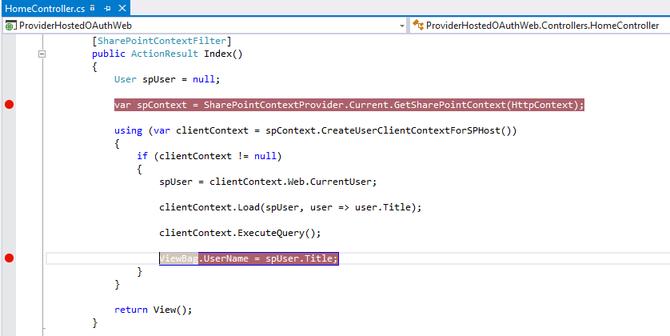
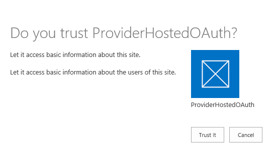
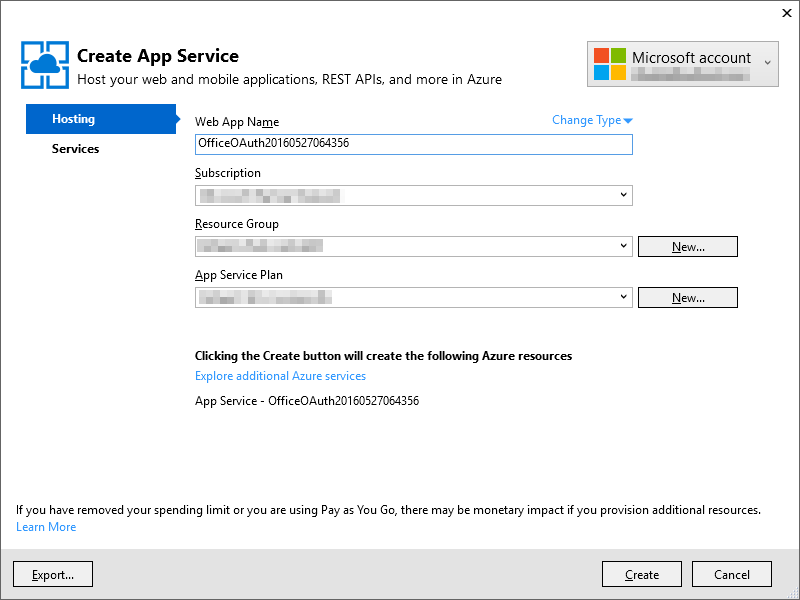
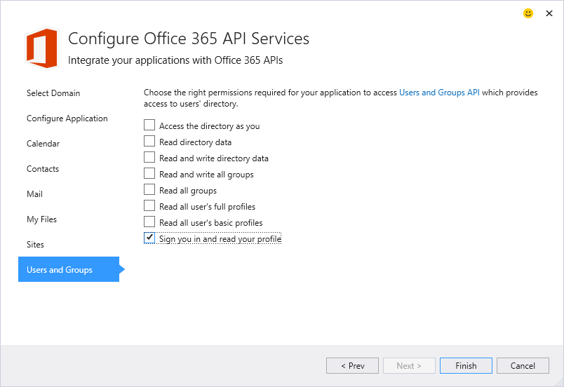
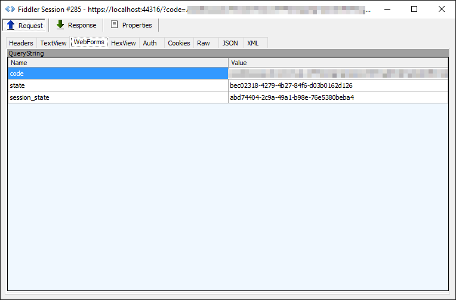

# Deep Dive into Security and OAuth
In this lab, you will create add-ins that use different approaches for OAuth security management and examine the process flow.

## Prerequisites
1. You must have an Office 365 tenant and Microsoft Azure subscription to complete this lab. If you do not have one, the lab for **O3651-7 Setting up your Developer environment in Office 365** shows you how to obtain a trial.
1. You must have [Fiddler](http://www.telerik.com/fiddler) installed.

## Exercise 1: OAuth in a Provider-Hosted Add-In 
In this exercise you create a new provider-hosted add-in and examine the OAuth flow.

1. Create the new solution in Visual Studio 2013:
  1. Launch **Visual Studio 2013** as administrator. 
  1. In Visual Studio select **File/New/Project**.
  1. In the New Project dialog:
    1. Select **Templates/Visual C#/Office/SharePoint/Apps**.
    1. Click **App for SharePoint 2013**.
    1. Name the new project **ProviderHostedOAuth** and click **OK**.

      

  1. In the **New App for SharePoint** wizard:
    1. Enter the address of a SharePoint site to use for testing the add-in (**NOTE:** The targeted site must be based on a Developer Site template)
    1. Select **Provider-Hosted** as the hosting model.
    1. Click **Next**.

      

    1. Select **ASP.NET MVC Web Application**.
    1. Click **Next**.

      

    1. Select the option labeled **Use Windows Azure Access Control Service (for SharePoint cloud add-ins)**.
    1. Click **Finish**.

      

    1. When prompted, log in using your Office 365 administrator credentials.
    1. After the new project is created, set breakpoints in **HomeController.cs** as shown.

      

1. Start **Fiddler** to capture web traffic from your add-in.
  1. In Fiddler click **Tools/Fiddler Options**.
  1. Click **HTTPS**.
  1. Check the box entitled **Decrypt HTTPS Traffic**.
  1. When warned, click **Yes** to trust the Fiddler root certificate.
  1. Confirm any additional dialog boxes to install the certificate.
  1. Click **OK** to close the options dialog.
1. Debug the add-in by pressing **F5** in Visual Studio 2013.
  1. When prompted, sign into Office 365.
  1. When prompted, click **Trust It**.

    

  1. When the first breakpoint is hit, look for the session in Fiddler near the bottom of the list.

    

  1. Right click the session and select **View in New Window**.
  1. Click the **Web Forms** tab.

    > Notice that SharePoint has included the SPHostUrl, SPLanguage, SPClientTag, and SPProductNumber query string parameters in the initial call. These are known as the **Standard Tokens**.

  1. Notice that the context token is included in the body as **SPAppToken**.
 
    
 
  1. Close the window.
  1. Return to Visual Studio, and press **F5** to continue debugging.
  1. When the second breakpoint is hit, look for the session in Fiddler near the bottom of the list.

    

  1. Right click the session and select **View in New Window**.
  1. Click the **Headers** tab and examine the access token in the **Cookies/Login** section.

    

  1. Return to Visual Studio, and press **F5** to continue debugging.
  1. With the add-in still running, open a new browser window to **/_layouts/15/AppPrincipals.aspx**.
  1. Look for **ProviderHostedOAuth** in the list of registered add-ins to confirm that the add-in was registered during debugging.
  1. Stop debugging.

## Exercise 2: OAuth with the O365 APIs 
In this exercise you create a new web application and examine the OAuth flow.

1. Create the new solution in Visual Studio 2013:
  1. Launch **Visual Studio 2013** as administrator. 
  1. In Visual Studio select **File/New/Project**.
  1. In the New Project dialog:
    1. Select **Templates/Visual C#/Web**.
    1. Click **ASP.NET Web Application**.
    1. Name the new project **OfficeOAuth** and click **OK**.

      

  1. In the **New ASP.NET Project** dialog, select **Web API**.
  1. Check **Host in the Cloud**.
  1. Click **Change Authentication**.
  1. In the **Change Authentication** dialog:
    1. Click **No Authentication**.
    1. Click **OK**.
  1. Click **OK**.

    

  1. If prompted, sign into **Windows Azure**.

    

  1. When the **Configure Windows Azure Sites Settings** dialog appears, make appropriate selections for your project.
  1. Click **OK**.
1. If you do not have the **Office 365 API Tools** installed:
  1. Click **Tools/Extensions and Updates**.
  1. In the **Extensions and Updates" dialog, click **Online**.
  1. Click **Visual Studio Gallery**.
  1. Type **Office 365** in the search box.
  1. Click **Office 365 API Tools - Preview**.
  1. Click **Install**.
1. Add an Office 365 connection
  1. Right click the **OfficeOAuth** project and select **Add/Connected Service**.
  1. In the **Services Manager** dialog, click **Sign In**.
  1. Sign in with your managed account.
  1. Click **Calendar**.
  1. Click **Permissions**.
  1. Check **Read user's calendar**.
  1. Click **Apply**.

    

  1. Click **OK**.
1. Update the Home Controller.
  1. Expand the **Controllers** folder and open **HomeController.cs**.
  1. Replace the **Index** method with the following code
  
    ````c#
    public async Task<ActionResult> Index()
    {
        IOrderedEnumerable<IEvent> events = await CalendarAPISample.GetCalendarEvents();
        ViewBag.Events = events;
        return View();
    }
    ````

1. Update the Index View.
  1. Expand the **Views/Home** folders and open **Index.cshtml**.
  1. Replace all of the code with the following:

    ````html
    <div style="margin:25px;">
      <table>
        <tr>
          <th>Start</th>
          <th>End</th>
          <th>Subject</th>
          <th>Location</th>
        </tr>
        @foreach (var Event in ViewBag.Events)
        {
          <tr>
            <td>
                <div style="width:200px;">@Event.Start.ToString()</div>
            </td>
            <td>
                <div style="width:200px;">@Event.End.ToString()</div>
            </td>
            <td>
                <div style="width:200px;">@Event.Subject</div>
            </td>
            <td>
                <div style="width:200px;">@Event.Location.DisplayName</div>
            </td>
        </tr>
        }
      </table>
    </div>
    ````

1. Debug the add-in.
  1. Start **Fiddler**.
  1. Press **F5** in Visual Studio 2013 to debug the application.
  1. When prompted, login to Office 365 with your managed account.
  1. Verify that the application displays your calendar information.
  1. In **Fiddler**, locate the session entry containing the query string parameter **code**. This is the Authorization Code returned from Azure Access Control Services.

    

  1. Right click the session and select **Inspect in New Window**.
  1. In the session window, click the **Web Forms** tab.
  1. Examine the authorization code.

    

  1. Close the window.
  1. Stop debugging.
1. Examine the Windows Azure configuration.
  1. Log into the [Windows Azure Portal](https://manage.windowsazure.com)
  1. Click **Active Directory**.
  1. Select your Azure Active Directory instance.
  1. Click on the add-in entitled **OfficeOAuth.Office365App**. This entry was made for you by the Office 365 tools in Visual Studio.
  1. Click **Configure**.
  1. Scroll to the section entitled **Permissions to Other Applications**.
  1. Examine the **Office 365 Exchange Online** permissions. These are the permissions you granted in Visual Studio.

    

**Congratulations! You have completed investigation OAuth in Office 365.**