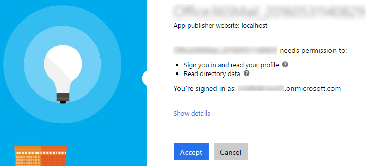
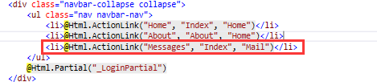

# Microsoft Graph APIs for Mail
In this lab, you will use Microsoft Graph APIs to program against an Office 365 mailbox as part of an ASP.NET MVC5 application.

## Prerequisites
<<<<<<< HEAD
<<<<<<< HEAD
<<<<<<< HEAD
1. You must have an Office 365 tenant and Windows Azure subscription to complete this lab. If you do not have one, the lab for **O3651-7 Setting up your Developer environment in Office 365** shows you how to obtain a trial. You must also have access to an Exchange mailbox within an Office 365 developer tenancy.
1. You must have the Office 365 API Tools version 1.2.41027.2 installed in Visual Studio 2013.
=======
1. You must have an Office 365 tenant and Windows Azure subscription to complete this lab. If you do not have one, the lab for **O3651-7 Setting up your Developer environment in Office 365** shows you how to obtain a trial. You must also have access to an Exchange inbox within an Office 365 developer tenancy.
=======
1. You must have an Office 365 tenant and Microsoft Azure subscription to complete this lab. If you do not have one, the lab for **O3651-7 Setting up your Developer environment in Office 365** shows you how to obtain a trial. You must also have access to an Exchange inbox within an Office 365 developer tenancy.
>>>>>>> o3653-2: updated lab to focus on Mail API
1. You must have the Office 365 API Tools version 1.3.41104.1 installed in Visual Studio 2013.
>>>>>>> updated HOL to (1) reference correct O365 tools in VS2013.4 & (2) updated screenshots to mask out author's email & tenant and (3) made sample more production ready

## Lab Setup: Setting up your Exchange account with Sample Mail Events for Testing
1. Using the browser, navigate to https://outlook.office365.com and log into your Office 365 mailbox.
1. Click the *waffle* icon in the top-left corner to open the App Launcher and click the **Mail** tile.
1. Add some Mail items to your Mail if you don't have any in your mailbox.
1. Once you have verified that you have a set of Mail events for testing, you can move on to the next exercise.
=======
1. You must have an Office 365 tenant and Microsoft Azure subscription to complete this lab. If you do not have one, the lab for **O3651-7 Setting up your Developer environment in Office 365** shows you how to obtain a trial. 
1. You must have Visual Studio 2015 with Update 1 installed.
>>>>>>> O3653-2: Updated VS Solution to 2015. Converted to Microsoft Graph API REST calls.  Created seperate projects correlating to each completed exercise.  Updated demo README.  Updated slide deck verbiage and added new section.  This commit addresses issues #152 and #117.

## Exercise 1: Create an ASP.NET MVC5 Application
In this exercise, you will create the ASP.NET MVC5 application and register it with Azure active Directory.

<<<<<<< HEAD
1. Launch **Visual Studio 2013** as administrator. 
<<<<<<< HEAD

1. In Visual Studio select **File/New/Project**.

1. In the **New Project** dialog, select **Templates/Visual C#/Web** and click **ASP.NET Web Application**. Name the new project **Office365Contacts** and then click **OK**.  

    

1. In the **New ASP.NET Project** dialog, click **MVC** and then click **Change Authentication**.

1. Select **No Authentication** and click **OK**.

  

1. Once the **New ASP.NET Project** dialog appears like the following screenshot, click **OK**. 

  

1. In the **Solution Explorer**, right click the **Office365Contacts** project and select **Add/Connected Service**.
  1. In the **Services Manager** dialog:
    1. Click **Register Your App**.
    1. When prompted, login with your **Organizational Account**.
    1. Click **Users and Groups**.
      1. Click **Permissions**.      
      1. Check **Enable sign-on and read users' profiles**.
      1. Click **Apply**.

        
    1. Click **Contacts**.
      1. Click **Permissions**.
      1. Check **Have full access to users' contacts**.
      1. Click **Apply**.

        
    1. Click **OK**.

        

1. Obtain and store the Azure AD tenant ID in the `web.config`.
  1. Browse to the [Azure Management Portal](https://manage.windowsazure.com) and sign in with your **Organizational Account**.
  2. In the left-hand navigation, click **Active Directory**.
  3. Select the directory you share with your Office 365 subscription.
  4. In the URL, find the first GUID and copy it to the clipboard. This is your **directory tenant ID**.
    > The URL will look like the following with the **BOLD** part being the GUID you are looking for: `https://manage.windowsazure.com/[..]#Workspaces/ActiveDirectoryExtension/Directory/[YOU WANT THIS GUID: ######-####-####-####-############]/users`
  5. Open the `web.config` file in the project.
  6. Add the following node to the `<appSettings>` section, setting the value equal to the **directory tenant ID** you acquired in the previous step:

    ````xml
    <add key="tenantId" value="######-####-####-####-############"/>
    ````


## Exercise 2: Configure the Project to use OWIN for Azure AD Authentication
1. Add the NuGet OWIN packages to enable OWIN OpenID Connect authentication on the application:
  1. Open the Package Manager Console: **View/Other Windows/Package Manager Console**.
  1. First restore all missing packages by clicking the **Restore** button in the top-right corner of the window.
  1. After that completes, enter each line below in the console, one at a time, pressing **ENTER** after each one. NuGet will install the package and all dependent packages:

    ````powershell
=======
=======
1. Launch **Visual Studio 2015** as an administrator. 
>>>>>>> O3653-2: Updated VS Solution to 2015. Converted to Microsoft Graph API REST calls.  Created seperate projects correlating to each completed exercise.  Updated demo README.  Updated slide deck verbiage and added new section.  This commit addresses issues #152 and #117.
1. In Visual Studio select **File/New/Project**.
1. In the **New Project** dialog, select **Templates/Visual C#/Web** and click **ASP.NET Web Application**. Name the new project **Office365Mail** and then click **OK**.  
    
    
    > NOTE: You need sign up for your Azure subscription.
    
1. In the **New ASP.NET Project** dialog, click **MVC** and then click **Change Authentication**.
1. Select **Work And School Accounts**, check **Read directory data** and click **OK**.

	

1. Once the **New ASP.NET Project** dialog appears like the following screenshot, click **OK**. 

	
    
<<<<<<< HEAD
1. Configure the project to always go to the homepage of the web application when debugging:
  1. In the **Solution Explorer** tool window & select **Properties**.
  1. Select the **Web** tab in the left margin.
  1. Find the section **Start Action**.
  1. Click the radio button **Start URL** and enter the SSL URL of the web project that you copied from the previous step.

1. In the **Solution Explorer**, right click the **Office365Mail** project and select **Add/Connected Service**.
	1. In the **Services Manager** dialog:
    1. Click **Register Your App**.
    1. When prompted, login with your **Organizational Account**.
    1. Click **App Properties**.
	    1. Verify the option **Single Organization** is selected.
	    1. Make sure there is only a single URL listed in the **Redirect URIs** and it is the HTTPS URL of the web project.
	    1. Click **Apply**.
    1. Click **Mail**.
      1. Click **Permissions**.
      1. Check **Read and write user calendars**.
      1. Check **Read user calendars**.
      1. Click **Apply**.
    1. Click **Users and Groups**.
      1. Click **Enable sign-on and read user' profiles**.
      1. Click **Apply**.
    1. Click **OK**.

## Exercise 3: Configure Web Application to use Azure AD and OWIN
In this exercise you will take the ASP.NET MVC web application you created in the previous exercise and configure it to use Azure AD & OpenID Connect for user & app authentication. You will do this by utilizing the OWIN framework. Once authenticated, you can use the access token returned by Azure AD to access the Office 365 APIs.

1. Obtain and store the Azure AD tenant ID in the `web.config`.
  1. Browse to the [Azure Management Portal](https://manage.windowsazure.com) and sign in with your **Organizational Account**.
  1. In the left-hand navigation, click **Active Directory**.
  1. Select the directory you share with your Office 365 subscription.
  1. Select the application you created for this lab. This is the name of the application in the **App Properties** dialog when you were adding the **Connected Service** in the last exercise.
  1. Select the **Quick Start** page for the in the top navigation... that's the left-most menu item that looks like a lightning bolt in a cloud:

    
 
  1. On the Quick Start page, expand the **Get Started** / **Enable Users to Sign On**. Locate the field **Federation Metadata Document URL**. Within that field value you will see a GUID immediately after the `login.windows.net` part of the URL. Copy just the GUID value to the clipboard.

    

  1. Open the `web.config` file in the project.
  1. Add the following node to the `<appSettings>` section, setting the value equal to the **directory tenant ID** you acquired in the previous step:

    ````xml
    <add key="ida:AadTenantId" value="######-####-####-####-############"/>
    ````

1. Now you need a few NuGet packages to enable OWIN OpenID Connect authentication & to create a secure token cache (using Entity Framework) in the application:
  1. Open the Package Manager Console: **View/Other Windows/Package Manager Console**.
  1. Enter each line below in the console, one at a time, pressing **ENTER** after each one. NuGet will install the package and all dependent packages:

    ````powershell
    PM> Install-Package -Id EntityFramework
    PM> Install-Package -Id Microsoft.IdentityModel.Clients.ActiveDirectory
>>>>>>> updated HOL to (1) reference correct O365 tools in VS2013.4 & (2) updated screenshots to mask out author's email & tenant and (3) made sample more production ready
    PM> Install-Package -Id Microsoft.Owin.Host.SystemWeb
    PM> Install-Package -Id Microsoft.Owin.Security.Cookies
    PM> Install-Package -Id Microsoft.Owin.Security.OpenIdConnect
    ````

<<<<<<< HEAD
1. Add a temp token cache. Notice the comments in the code as this is not intended to be used in production as it is exactly what it's name implies: naive.
  1. Right-click the project and select **Add/New Folder**.
  1. Name the folder **Utils**.
  1. Right-click the **Utils** folder and select **Add/Class**.
  1. Name the class **NaiveSessionCache**.
  1. Replace the code in the **NaiveSessionCache.cs** file with the following code (this file is also found in the [Lab Files](Lab Files) folder):

    ````c#
    // Copyright (c) Microsoft. All rights reserved. Licensed under the MIT license. See full license at the bottom of this file.
    using Microsoft.IdentityModel.Clients.ActiveDirectory;
    using System.Threading;
    using System.Web;

    namespace Office365Contacts.Utils {
      /// <summary>
      /// A basic token cache using current session
      /// ADAL will automatically save tokens in the cache whenever you obtain them.  
      /// More details here: http://www.cloudidentity.com/blog/2014/07/09/the-new-token-cache-in-adal-v2/
      /// !!! NOTE: DO NOT USE THIS IN PRODUCTION. A MORE PERSISTENT CACHE SUCH AS A DATABASE IS RECOMMENDED FOR PRODUCTION USE !!!!
      /// </summary>
      public class NaiveSessionCache : TokenCache {
        private static ReaderWriterLockSlim SessionLock = new ReaderWriterLockSlim(LockRecursionPolicy.NoRecursion);
        string UserObjectId = string.Empty;
        string CacheId = string.Empty;

        public NaiveSessionCache(string userId) {
          UserObjectId = userId;
          CacheId = UserObjectId + "_TokenCache";

          this.AfterAccess = AfterAccessNotification;
          this.BeforeAccess = BeforeAccessNotification;
          Load();
        }

        public void Load() {
          SessionLock.EnterReadLock();
          this.Deserialize((byte[])HttpContext.Current.Session[CacheId]);
          SessionLock.ExitReadLock();
        }

        public void Persist() {
          SessionLock.EnterWriteLock();

          // Optimistically set HasStateChanged to false. We need to do it early to avoid losing changes made by a concurrent thread.
          this.HasStateChanged = false;

          // Reflect changes in the persistent store
          HttpContext.Current.Session[CacheId] = this.Serialize();
          SessionLock.ExitWriteLock();
        }

        public override void DeleteItem(TokenCacheItem item) {
          base.DeleteItem(item);
          Persist();
        }

        // Empties the persistent store.
        public override void Clear() {
          base.Clear();
          System.Web.HttpContext.Current.Session.Remove(CacheId);
        }

        // Triggered right before ADAL needs to access the cache.
        // Reload the cache from the persistent store in case it changed since the last access.
        void BeforeAccessNotification(TokenCacheNotificationArgs args) {
          Load();
        }

        // Triggered right after ADAL accessed the cache.
        void AfterAccessNotification(TokenCacheNotificationArgs args) {
          // if the access operation resulted in a cache update
          if (this.HasStateChanged) {
            Persist();
          }
        }
      }
    }
    //*********************************************************  
    //  
    //O365 APIs Starter Project for ASPNET MVC, https://github.com/OfficeDev/Office-365-APIs-Starter-Project-for-ASPNETMVC
    // 
    //Copyright (c) Microsoft Corporation 
    //All rights reserved.  
    // 
    //MIT License: 
    // 
    //Permission is hereby granted, free of charge, to any person obtaining 
    //a copy of this software and associated documentation files (the 
    //""Software""), to deal in the Software without restriction, including 
    //without limitation the rights to use, copy, modify, merge, publish, 
    //distribute, sublicense, and/or sell copies of the Software, and to 
    //permit persons to whom the Software is furnished to do so, subject to 
    //the following conditions: 
    // 
    //The above copyright notice and this permission notice shall be 
    //included in all copies or substantial portions of the Software. 
    // 
    //THE SOFTWARE IS PROVIDED ""AS IS"", WITHOUT WARRANTY OF ANY KIND, 
    //EXPRESS OR IMPLIED, INCLUDING BUT NOT LIMITED TO THE WARRANTIES OF 
    //MERCHANTABILITY, FITNESS FOR A PARTICULAR PURPOSE AND 
    //NONINFRINGEMENT. IN NO EVENT SHALL THE AUTHORS OR COPYRIGHT HOLDERS BE 
    //LIABLE FOR ANY CLAIM, DAMAGES OR OTHER LIABILITY, WHETHER IN AN ACTION 
    //OF CONTRACT, TORT OR OTHERWISE, ARISING FROM, OUT OF OR IN CONNECTION 
    //WITH THE SOFTWARE OR THE USE OR OTHER DEALINGS IN THE SOFTWARE. 
    //  
    //********************************************************* 
    ````
=======
1. Add a new model that will be used by our persistent token cache:
  1. Right-click **Models** folder in the project and select **Add/Class**.
  1. Name the class **PerWebUserCache.cs**.
  1. When the file has been created, add the following code to the class:

    ````c#
    [Key]
    public int EntryId { get; set; }
    public string webUserUniqueId { get; set; }
    public byte[] cacheBits { get; set; }
    public DateTime LastWrite { get; set; }
    ````

  1. At the top of the file, add the following `using` statement:

    ````c#
    using System.ComponentModel.DataAnnotations;
    ````

1. Add a new persistent data store that will be used for the token cache:
  1. Right-click the project and select **Add/New Folder**.
  1. Name the folder **Data**.
  1. Locate the [Lab Files](Lab Files) folder provided with this lab & find two files: `Office365MailContextOffice365MailContext.cs` & `Office365MailInitializer.cs`. Copy these two files to the **Data** folder you just created.

1. Add a token cache that leverages Entity Framework to store the user specific tokens in persistent storage:
  1. Right-click the project and select **Add/New Folder**.
  2. Name the folder **Utils**.
  1. Locate the [Lab Files](Lab Files) folder provided with this lab & find the file `EDADALTokenCache.cs`. Copy that file to the **Utils** folder.
  
    > Take a moment to examine this file. It uses the `DbContext` you added in the previous step to implement a `TokenCache` which you will use in a moment. This will store the token received from a successful authentication in a persistent store.

1. Add a helper class that will be used to harvest settings out of the `web.config` and create the necessary strings that will be used for authentication:
  1. Locate the [Lab Files](Lab Files) folder provided with this lab & find the file `SettingsHelper.cs`. Copy that file to the **Utils** folder.
>>>>>>> updated HOL to (1) reference correct O365 tools in VS2013.4 & (2) updated screenshots to mask out author's email & tenant and (3) made sample more production ready

1. Configure the app to run startup code when the OWIN libraries startup:
  1. Right-click the project and select **Add/Class**.
  1. Name the class **Startup.cs**.
  1. Add the following `using` statements after the existing `using` statements:

    ````c#
    using Owin;
    using Microsoft.Owin;
    ````

  1. Add the following assembly directive to call the `Startup.Configuration()` method when OWIN starts up. Note that you will only point to the class:

    ````c#
<<<<<<< HEAD
<<<<<<< HEAD
    [assembly:OwinStartup(typeof(Exercise2.Startup))]
=======
    [assembly:OwinStartup(typeof(Office365Contacts.Startup))]
>>>>>>> updated HOL to (1) reference correct O365 tools in VS2013.4 & (2) updated screenshots to mask out author's email & tenant and (3) made sample more production ready
=======
    [assembly:OwinStartup(typeof(Office365Mail.Startup))]
>>>>>>> o3653-2: updated lab to focus on Mail API
    ````

  1. Update the signature of the `Startup` class to be a partial class as you will create another in the next step. Do this by adding the `partial` keyword after the `public` statement so it looks like the following:

    ````c#
    public partial class Startup {}
    ````

  1. Add the following `Confguration()` to the `Startup` class. This calls a method you will create in a moment:

    ````c#
    public void Configuration(IAppBuilder app)
    {
      ConfigureAuth(app);
    }
    ````

  1. Save your changes.
1. Create an authentication process when a user hits the website:
  1. Right-click the **App_Start** folder and select **Add/Class**.
  1. Name the class **Startup.Auth.cs**.
  1. When the file opens make the following two changes:
<<<<<<< HEAD
<<<<<<< HEAD
    1. Modify the namespace to just be `Exercise2`.
=======
    1. Modify the namespace to just be `Office365Contacts`.
>>>>>>> updated HOL to (1) reference correct O365 tools in VS2013.4 & (2) updated screenshots to mask out author's email & tenant and (3) made sample more production ready
=======
    1. Modify the namespace to just be `Office365Mail`.
>>>>>>> o3653-2: updated lab to focus on Mail API
    1. Modify the class declaration to be a `partial` class named `Startup` so it looks like the following:

      ````c#
      public partial class Startup {}
      ````

  1. Add the following `using` statements after the existing `using` statements:

    ````c#
    using Microsoft.IdentityModel.Clients.ActiveDirectory;
    using Microsoft.Owin.Security;
    using Microsoft.Owin.Security.Cookies;
    using Microsoft.Owin.Security.OpenIdConnect;
    using Owin;
    using System.Configuration;
    using System.Threading.Tasks;
<<<<<<< HEAD
<<<<<<< HEAD
    ````

  1. Add the following variables and constants to the class for later use:

    ````c#
    private static string CLIENT_ID = ConfigurationManager.AppSettings["ida:ClientID"];
    private static string CLIENT_SECRET = ConfigurationManager.AppSettings["ida:Password"];
    private static string TENANT_ID = ConfigurationManager.AppSettings["tenantId"];
    private static string GRAPH_RESOURCE_ID = "https://graph.windows.net";
=======
    using Exercise2.Utils;
>>>>>>> updated HOL to (1) reference correct O365 tools in VS2013.4 & (2) updated screenshots to mask out author's email & tenant and (3) made sample more production ready
=======
    using Office365Mail.Utils;
>>>>>>> o3653-2: updated lab to focus on Mail API
    ````

  1. Add the following method to the `Startup` class:

    ````c#
    public void ConfigureAuth(IAppBuilder app) {}
    ````

<<<<<<< HEAD
  1. Create a variable to store the tenant authority for later use when logging in:

    ````c#
    // create the authority for user login by concatenating the 
    //  URI added by O365 API tools in web.config 
    //  & user's tenant ID provided in the claims when the logged in
    var tenantAuthority = string.Format("{0}/{1}",
      ConfigurationManager.AppSettings["ida:AuthorizationUri"],
      TENANT_ID);
    ````

=======
>>>>>>> updated HOL to (1) reference correct O365 tools in VS2013.4 & (2) updated screenshots to mask out author's email & tenant and (3) made sample more production ready
  1. Configure the authentication type and settings for the app:

    ````c#
    app.SetDefaultSignInAsAuthenticationType(CookieAuthenticationDefaults.AuthenticationType);
    app.UseCookieAuthentication(new CookieAuthenticationOptions());
    ````

  1. Now configure the OWIN authentication process, force the user to go through the login process and collect the result returned from Azure AD:

    ````c#
    app.UseOpenIdConnectAuthentication(new OpenIdConnectAuthenticationOptions {
<<<<<<< HEAD
      ClientId = CLIENT_ID,
      Authority = tenantAuthority,
=======
      ClientId = SettingsHelper.ClientId,
      Authority = SettingsHelper.AzureADAuthority,
<<<<<<< HEAD
>>>>>>> updated HOL to (1) reference correct O365 tools in VS2013.4 & (2) updated screenshots to mask out author's email & tenant and (3) made sample more production ready
=======
      PostLogoutRedirectUri = HttpContext.Current.Request.Url.GetLeftPart(UriPartial.Authority),
>>>>>>> o3653-2: updated lab to focus on Mail API
      Notifications = new OpenIdConnectAuthenticationNotifications() {
        // when an auth code is received...
        AuthorizationCodeReceived = (context) => {
          // get the OpenID Connect code passed from Azure AD on successful auth
          string code = context.Code;

          // create the app credentials & get reference to the user
<<<<<<< HEAD
          ClientCredential creds = new ClientCredential(CLIENT_ID, CLIENT_SECRET);
          string userObjectId = context.AuthenticationTicket.Identity.FindFirst(System.IdentityModel.Claims.ClaimTypes.NameIdentifier).Value;

          // use the OpenID Connect code to obtain access token & refresh token...
          //  save those in a persistent store... for now, use the simplistic NaiveSessionCache
          //  NOTE: read up on the links in the NaieveSessionCache... should not be used in production
          Utils.NaiveSessionCache sampleCache = new Utils.NaiveSessionCache(userObjectId);
          AuthenticationContext authContext = new AuthenticationContext(tenantAuthority, sampleCache);

          // obtain access token for the AzureAD graph
          Uri redirectUri = new Uri(HttpContext.Current.Request.Url.GetLeftPart(UriPartial.Path));
          AuthenticationResult authResult = authContext.AcquireTokenByAuthorizationCode(
            code, redirectUri, creds, GRAPH_RESOURCE_ID);

          // successful auth
          return Task.FromResult(0);
        }

=======
          ClientCredential creds = new ClientCredential(SettingsHelper.ClientId, SettingsHelper.ClientSecret);
          string userObjectId = context.AuthenticationTicket.Identity.FindFirst(System.IdentityModel.Claims.ClaimTypes.NameIdentifier).Value;

          // use the OpenID Connect code to obtain access token & refresh token...
          //  save those in a persistent store...
          EFADALTokenCache sampleCache = new EFADALTokenCache(userObjectId);
          AuthenticationContext authContext = new AuthenticationContext(SettingsHelper.AzureADAuthority, sampleCache);

          // obtain access token for the AzureAD graph
          Uri redirectUri = new Uri(HttpContext.Current.Request.Url.GetLeftPart(UriPartial.Path));
          AuthenticationResult authResult = authContext.AcquireTokenByAuthorizationCode(code, redirectUri, creds, SettingsHelper.AzureAdGraphResourceId);

          // successful auth
          return Task.FromResult(0);
        },
        AuthenticationFailed = (context) =>
        {
          context.HandleResponse();
          return Task.FromResult(0);
        }
      },
      TokenValidationParameters = new System.IdentityModel.Tokens.TokenValidationParameters
      {
        ValidateIssuer = false
>>>>>>> updated HOL to (1) reference correct O365 tools in VS2013.4 & (2) updated screenshots to mask out author's email & tenant and (3) made sample more production ready
      }
    });
    ````

  1. Save your changes.
<<<<<<< HEAD
=======
1. With the authentication process wired up into the OWIN startup process, now implement a login controller to provide sign in & sign out functionality:
  1. Right-click the **Controllers** folder and select **Add/Controller**.
    1. In the **Add Scaffold** dialog, select **MVC 4 Controller - Empty**.
    1. Click **Add**.
    1. When prompted for a name, enter **AccountController**.
    1. Click **Add**.
  1. Within the **AccountController** file, add the following `using` statements to the top of the file:
  
    ````c#
    using Office365Mail.Utils;
    using Microsoft.IdentityModel.Clients.ActiveDirectory;
    using Microsoft.Owin.Security;
    using Microsoft.Owin.Security.Cookies;
    using Microsoft.Owin.Security.OpenIdConnect;
    using System.Security.Claims;
    ````

  1. Delete the default `Index()` method from the `AcountController` class.
  1. Add a new function to provide a sign in route. This will simply initiate a login challenge using the OWIN framework that will take the user to the Azure AD login page. When this runs, if the user has not already given the app consent to access their Office 365 data, they will be prompted to grant the app consent at this time.

    ````c#
    public void SignIn() {
      if (!Request.IsAuthenticated) {
        HttpContext.GetOwinContext().Authentication.Challenge(new AuthenticationProperties { RedirectUri = "/" }, OpenIdConnectAuthenticationDefaults.AuthenticationType);
      }
    }
    ````

  1. Add a new function to provide a sign out route. This will log the user out of the site & clear the local cache of tokes: 

    ````c#
    public void SignOut() {
      // Remove all cache entries for this user and send an OpenID Connect sign-out request.
      string usrObjectId = ClaimsPrincipal.Current.FindFirst(SettingsHelper.ClaimTypeObjectIdentifier).Value;
      AuthenticationContext authContext = new AuthenticationContext(SettingsHelper.AzureADAuthority, new EFADALTokenCache(usrObjectId));
      authContext.TokenCache.Clear();

      HttpContext.GetOwinContext().Authentication.SignOut(
          OpenIdConnectAuthenticationDefaults.AuthenticationType, CookieAuthenticationDefaults.AuthenticationType);
    }
    ````

  1. Add a pair of functions to handle requesting consent for the application.

    ````c#
    public ActionResult ConsentApp() {
      string strResource = Request.QueryString["resource"];
      string strRedirectController = Request.QueryString["redirect"];

      string authorizationRequest = String.Format(
          "{0}oauth2/authorize?response_type=code&client_id={1}&resource={2}&redirect_uri={3}",
              Uri.EscapeDataString(SettingsHelper.AzureADAuthority),
              Uri.EscapeDataString(SettingsHelper.ClientId),
              Uri.EscapeDataString(strResource),
              Uri.EscapeDataString(String.Format("{0}/{1}", this.Request.Url.GetLeftPart(UriPartial.Authority), strRedirectController))
              );

      return new RedirectResult(authorizationRequest);
    }

    public ActionResult AdminConsentApp() {
      string strResource = Request.QueryString["resource"];
      string strRedirectController = Request.QueryString["redirect"];

      string authorizationRequest = String.Format(
          "{0}oauth2/authorize?response_type=code&client_id={1}&resource={2}&redirect_uri={3}&prompt={4}",
              Uri.EscapeDataString(SettingsHelper.AzureADAuthority),
              Uri.EscapeDataString(SettingsHelper.ClientId),
              Uri.EscapeDataString(strResource),
              Uri.EscapeDataString(String.Format("{0}/{1}", this.Request.Url.GetLeftPart(UriPartial.Authority), strRedirectController)),
              Uri.EscapeDataString("admin_consent")
              );

      return new RedirectResult(authorizationRequest);
    }
    ````

  1. Add one more function to the `AccountController` class to refresh the session and reissue the OWIN authentication challenge:
      
    ````c#
    public void RefreshSession() {
      string strRedirectController = Request.QueryString["redirect"];

      HttpContext.GetOwinContext().Authentication.Challenge(new AuthenticationProperties { RedirectUri = String.Format("/{0}", strRedirectController) }, OpenIdConnectAuthenticationDefaults.AuthenticationType);
    }
    ````

  1. Now that the **AccountController** is setup, the last step is to implement the user interface components to provide sign in and sign out capabilities.
    1. Locate the **Views/Shared** folder in the project.
    1. Right-click the folder and select **Add/View**.
    1. Complete the **Add View** dialog as shown in the following picture, then click **Add**:
      
      

    1. Add the following code to the **_LoginPartial.cshtml** file:

      ````asp
      @if (Request.IsAuthenticated) {
        <text>
          <ul class="nav navbar-nav navbar-right">
            <li class="navbar-text">
              Hello, @User.Identity.Name!
            </li>
            <li>
              @Html.ActionLink("Sign out", "SignOut", "Account")
            </li>
          </ul>
        </text>
      } else {
        <ul class="nav navbar-nav navbar-right">
          <li>@Html.ActionLink("Sign in", "SignIn", "Account", routeValues: null, htmlAttributes: new { id = "loginLink" })</li>
        </ul>
      }
      ````

    1. Open the **_Layout.cshtml** file found in the **Views/Shared** folder.
      1. Locate the part of the file that includes a few links at the top of the page... it should look similar to the following code:
      
        ````asp
        <div class="navbar-collapse collapse">
          <ul class="nav navbar-nav">
            <li>@Html.ActionLink("Home", "Index", "Home")</li>
            <li>@Html.ActionLink("About", "About", "Home")</li>
            <li>@Html.ActionLink("Contact", "Contact", "Home")</li>
          </ul>
        </div>
        ````

      1. Update that navigation so the Messages link points to the Mail controller (the **Messages** link added below) as well as a reference to the login control you just created:

        ````asp
        <div class="navbar-collapse collapse">
          <ul class="nav navbar-nav">
            <li>@Html.ActionLink("Home", "Index", "Home")</li>
            <li>@Html.ActionLink("About", "About", "Home")</li>
            <li>@Html.ActionLink("Messages", "Index", "Mail")</li>
          </ul>
          @Html.Partial("_LoginPartial")
        </div>
        ````

      > The **Messages** link will not work yet... you will add that in the next exercise.

=======
>>>>>>> O3653-2: Updated VS Solution to 2015. Converted to Microsoft Graph API REST calls.  Created seperate projects correlating to each completed exercise.  Updated demo README.  Updated slide deck verbiage and added new section.  This commit addresses issues #152 and #117.
1. At this point you can test the authentication flow for your application.
  1. In Visual Studio, press **F5**. The browser will automatically launch taking you to the HTTPS start page for the web application.
  1. To sign in, click the **Sign In** link in the upper-right corner.
  1. Login using your **Organizational Account**.
  1. Upon a successful login, since this will be the first time you have logged into this app, Azure AD will present you with the common consent dialog that looks similar to the following image:

    
  1. Click **OK** to approve the app's permission request on your data in Office 365.
  1. You will then be redirected back to your web application. However notice in the upper right corner, it now shows your email address & the **Sign Out** link.

Congratulations... at this point your app is configured with Azure AD and leverages OpenID Connect and OWIN to facilitate the authentication process!
>>>>>>> updated HOL to (1) reference correct O365 tools in VS2013.4 & (2) updated screenshots to mask out author's email & tenant and (3) made sample more production ready

## Grant App Necessary Permissions
1. Browse to the [Azure Management Portal](https://manage.windowsazure.com) and sign in with your **Organizational Account**.
2. In the left-hand navigation, click **Active Directory**.
3. Select the directory you share with your Office 365 subscription.
4. Search for this app with the **ida:ClientId** that was created in exercise 1.

    
5. Select the application. 
6. Open the **Configure** tab.
7. Scroll down to the **permissions to other applications** section. 
8. Click the **Add Application** button.
9. In the **Permissions to other applications** dialog, click the **PLUS** icon next to the **Microsoft Graph** option.
10. Click the **Check mark** icon in the lower right corner.
11. For the new **Microsoft Graph** application permission entry, select the **Delegated Permissions** dropdown on the same line and then select the following permissions:
    * **Read and write access to user mail**
    * **Send mail as a user**
12. Click the **Save** button at the bottom of the page.

## Exercise 2: Code the Mail API
In this exercise, you will create a repository object for wrapping CRUD operations associated with the Mail API.

<<<<<<< HEAD
1. In the **Solution Explorer**, locate the **Models** folder in the **Office365Mail** project.
1. Right-click the **Models** folder and select **Add/Class**.
<<<<<<< HEAD
1. In the **Add New Item** dialog, name the new class **MyContact** and click **Add** to create the new source file for the class.  

<<<<<<< HEAD
  

1. At the top of the course file **MyContact.cs**, add the following using statement just after the using statements that are already there.

  ````c#
  using System.ComponentModel;
  ````

1. Implement the new class **MyContact** using the following class definition.
    
  ````c#
  public class MyContact {
    public string Id { get; set; }
    [DisplayName("First Name")]
    public string GivenName { get; set; }
    [DisplayName("Last Name")]
    public string Surname { get; set; }
    [DisplayName("Company")]
    public string CompanyName { get; set; }
    [DisplayName("Work Phone")]
    public string BusinessPhone { get; set; }
    [DisplayName("Home Phone")]
    public string HomePhone { get; set; }
    [DisplayName("Email Address")]
    public string EmailAddress { get; set; }
  }
  ````

1. Right-click the **Models** folder and select **Add/Class**. 
  1. In the **Add New Item** dialog, name the new class `MyContactRepository`.
  1. Click **Add** to create the new source file for the class.    

    

1. **Add** the following `using` statements to the top of the `MyContactRepository` class.

  ````c#
  using Microsoft.IdentityModel.Clients.ActiveDirectory;
  using Microsoft.Office365.Discovery;
  using Microsoft.Office365.OAuth;
  using Microsoft.Office365.OutlookServices;
  using Office365Contacts.Utils;
  using System.Configuration;
  using System.IO;
  using System.Security.Claims;
  using System.Threading.Tasks;
  ````

1. **Add** the following statements to the `MyContactRepository` class:

  ````c#
  private static string CLIENT_ID = ConfigurationManager.AppSettings["ida:ClientID"];
  private static string CLIENT_SECRET = ConfigurationManager.AppSettings["ida:Password"];
  private static string TENANT_ID = ConfigurationManager.AppSettings["tenantId"];
  const string DISCOVERY_ENDPOINT = "https://api.office.com/discovery/v1.0/me/";
  const string DISCOVERY_RESOURCE = "https://api.office.com/discovery/";
  ````

1. **Add** a method named `EnsureClientCreated()` to the `MyContactRepository` class with the following implementation to create and return an **OutlookServicesClient** object.
    
  ````c#
  private async Task<OutlookServicesClient> EnsureClientCreated() {
    // fetch from stuff user claims
    var signInUserId = ClaimsPrincipal.Current.FindFirst(ClaimTypes.NameIdentifier).Value;
    var userObjectId =
      ClaimsPrincipal.Current.FindFirst("http://schemas.microsoft.com/identity/claims/objectidentifier").Value;

    // create the authority by concatenating the URI added by O365 API tools in web.config 
    //  & user's tenant ID provided in the claims when the logged in
    var tenantAuthority = string.Format("{0}/{1}",
      ConfigurationManager.AppSettings["ida:AuthorizationUri"],
      TENANT_ID);

    // discover contact endpoint
    var clientCredential = new ClientCredential(CLIENT_ID, CLIENT_SECRET);
    var userIdentifier = new UserIdentifier(userObjectId, UserIdentifierType.UniqueId);

    // create auth context
    AuthenticationContext authContext = new AuthenticationContext(tenantAuthority, new Utils.NaiveSessionCache(signInUserId));

    // create O365 discovery client 
    DiscoveryClient discoveryClient = new DiscoveryClient(new Uri(DISCOVERY_ENDPOINT),
      async () => {
        var authResult = await authContext.AcquireTokenSilentAsync(DISCOVERY_RESOURCE, clientCredential, userIdentifier);
=======
	

1. At the top of the course file **MyContact.cs**, add the following using statement just after the using statements that are already there.
=======
1. In the **Add New Item** dialog, name the new class **MyMessage** and click **Add** to create the new source file for the class.  
1. At the top of the course file **MyMessage.cs**, add the following using statement just after the using statements that are already there.
>>>>>>> o3653-2: updated lab to focus on Mail API

	````c#
	using System.ComponentModel;
	````

1. Implement the new class **MyMessage** using the following class definition.
		
  ````c#
  public class MyMessage {
    public string Id { get; set; }
    public string ConversationId { get; set; }
    public string Subject { get; set; }
    [DisplayName("From Name")]
    public string FromName { get; set; }
    [DisplayName("From Email Address")]
    public string FromEmailAddress { get; set; }
    [DisplayName("Sent")]
    [DisplayFormat(DataFormatString = "{0:dddd MMMM d, yyyy}")]
    public DateTimeOffset? DateTimeSent { get; set; }
    [DisplayName("Received")]
    [DisplayFormat(DataFormatString = "{0:dddd MMMM d, yyyy}")]
    public DateTimeOffset? DateTimeReceived { get; set; }
    [DisplayName("Has Attachments")]
    public bool? HasAttachments { get; set; }
    public string Importance { get; set; }
    public bool? IsDraft { get; set; }
    [DisplayName("To Name")]
    public string ToName { get; set; }
    [DisplayName("To Email Address")]
    public string ToEmailAddress { get; set; }
    public string Body { get; set; }
  }
  ````

1. Right-click the **Models** folder and select **Add/Class**. In the **Add New Item** dialog, name the new class **MyMessagesRespository** and click **Add** to create the new source file for the class.    
1. **Add** the following using statements to the top of the **MyMessagesRespository** class.
		
	````c#
	using System.Security.Claims;
	using System.Threading.Tasks;
	using Microsoft.IdentityModel.Clients.ActiveDirectory;
	using Microsoft.Office365.Discovery;
	using Microsoft.Office365.OutlookServices;
	using Office365Mail.Utils;
  using Office365Mail.Models;
	````

1. **Add** a function named **EnsureClientCreated** to the **MyMessagesRespository** class with the following implementation to create and return an **OutlookServicesClient** object.
		
  ````c#
  private async Task<OutlookServicesClient> EnsureClientCreated() {
    // fetch from stuff user claims
    var signInUserId = ClaimsPrincipal.Current.FindFirst(ClaimTypes.NameIdentifier).Value;
    var userObjectId = ClaimsPrincipal.Current.FindFirst(SettingsHelper.ClaimTypeObjectIdentifier).Value;

    // discover endpoint
    var clientCredential = new ClientCredential(SettingsHelper.ClientId, SettingsHelper.ClientSecret);
    var userIdentifier = new UserIdentifier(userObjectId, UserIdentifierType.UniqueId);

    // create auth context
    AuthenticationContext authContext = new AuthenticationContext(SettingsHelper.AzureADAuthority, new EFADALTokenCache(signInUserId));

    // create O365 discovery client 
    DiscoveryClient discovery = new DiscoveryClient(new Uri(SettingsHelper.O365DiscoveryServiceEndpoint),
      async () => {
        var authResult = await authContext.AcquireTokenSilentAsync(SettingsHelper.O365DiscoveryResourceId, clientCredential, userIdentifier);
>>>>>>> updated HOL to (1) reference correct O365 tools in VS2013.4 & (2) updated screenshots to mask out author's email & tenant and (3) made sample more production ready

        return authResult.AccessToken;
      });

<<<<<<< HEAD
    // query discovery service for endpoint for 'calendar' endpoint
<<<<<<< HEAD
    CapabilityDiscoveryResult dcr = await discoveryClient.DiscoverCapabilityAsync("Contacts");
=======
    CapabilityDiscoveryResult dcr = await discovery.DiscoverCapabilityAsync("Contacts");
>>>>>>> updated HOL to (1) reference correct O365 tools in VS2013.4 & (2) updated screenshots to mask out author's email & tenant and (3) made sample more production ready
=======
    // query discovery service for endpoint for 'Mail' endpoint
    CapabilityDiscoveryResult dcr = await discovery.DiscoverCapabilityAsync("Mail");
>>>>>>> o3653-2: updated lab to focus on Mail API

    // create an OutlookServicesclient
    return new OutlookServicesClient(dcr.ServiceEndpointUri,
      async () => {
        var authResult =
          await
            authContext.AcquireTokenSilentAsync(dcr.ServiceResourceId, clientCredential, userIdentifier);
        return authResult.AccessToken;
      });
  }
<<<<<<< HEAD
<<<<<<< HEAD
  ````

1. **Add** a method named `GetContactCount()` to the `MyContactRepository` class to retrieve a count of contacts.

  ````c#
  public async Task<int> GetContactCount() {
    var client = await EnsureClientCreated();
    var contactResults = await client.Me.Contacts.ExecuteAsync();
    return contactResults.CurrentPage.Count();
  }
  ````

1. **Add** a method named `GetContacts()` to the `MyContactRepository` class to retrieve and return a list of **MyContact** objects.

  ````c#
  public async Task<List<MyContact>> GetContacts(int pageIndex, int pageSize) {
    // acquire a O365 client to retrieve contacts
    OutlookServicesClient client = await EnsureClientCreated();

    // get contacts, sort by their last name and only one page of content
    var contactsResults = await client.Me.Contacts.ExecuteAsync();
    var contacts = contactsResults.CurrentPage
                                    .OrderBy(e => e.Surname)
                                    .Skip(pageIndex * pageSize)
                                    .Take(pageSize);

    // convert response from Office 365 API > internal class
    var myContactsList = new List<MyContact>();
    foreach (var contact in contacts) {
      myContactsList.Add(new MyContact {
        Id = contact.Id,
        GivenName = contact.GivenName,
        Surname = contact.Surname,
        CompanyName = contact.CompanyName,
        EmailAddress = contact.EmailAddresses[0] != null ? contact.EmailAddresses[0].Address : string.Empty,
        BusinessPhone = contact.BusinessPhones[0] ?? string.Empty,
        HomePhone = contact.HomePhones[0] ?? string.Empty
      });
    }

    // return collection oc contacts
    return myContactsList;
  }
  ````

1. Add a `DeleteContact()` method  to the `MyContactRepository` class to delete a contact.

  ````c#
  public async Task DeleteContact(string id) {
    // acquire a O365 client to retrieve contacts
    var client = await EnsureClientCreated();

    // get the contact to be deleted
    var contact = await client.Me.Contacts.GetById(id).ExecuteAsync();

    // delete the contact
    await contact.DeleteAsync();
  }
  ````

1. Add a `AddContact()` function  to the `MyContactRepository` class to create a new contact.

  ````c#
  public async Task AddContact(MyContact myContact) {
    // acquire a O365 client to retrieve contacts
    var client = await EnsureClientCreated();

    // create new contact record
    var newContact = new Microsoft.Office365.OutlookServices.Contact {
      GivenName = myContact.GivenName,
      Surname = myContact.Surname,
      CompanyName = myContact.CompanyName
    };

    // add email address
    newContact.EmailAddresses.Add(new EmailAddress() {
      Address = myContact.EmailAddress,
      Name = myContact.EmailAddress
    });

    // add phone numbers to collections
    newContact.HomePhones.Add(myContact.HomePhone);
    newContact.BusinessPhones.Add(myContact.BusinessPhone);

    // create the contact in O365
    await client.Me.Contacts.AddContactAsync(newContact);
  }
  ````

## Exercise 4: Code the MVC Application
In this exercise, you will code the **Home** controller of the MVC application to display contacts as well as adding behavior for adding and deleting contacts.

1. In the **Solution Explorer**, expand the **Controllers** folder and open the **HomeController.cs** file.
1. **Add** the following using statements to the top of the file.

  ````c#
  using Microsoft.Office365.OAuth;
  using System.Threading.Tasks;
  using Office365Contacts.Models;
  ````

1. **Replace** the `Index()` method with the following code to read contacts.

  ````c#
=======
	````

1. **Add** a function named **GetContactCount** to the **MyContactsRepository** class to retrieve a count of contacts.

	````c#
	public async Task<int> GetContactCount() {
		var client = await EnsureClientCreated();
		var contactsResults = await client.Me.Contacts.ExecuteAsync();
		return contactsResults.CurrentPage.Count();
	}
	````
=======
  ````
>>>>>>> o3653-2: updated lab to focus on Mail API

1. **Add** a function named **GetMessages** to the **MyMessagesRespository** class to retrieve and return a list of **MyMessage** objects.
		
  ````c#
  public async Task<List<MyMessage>> GetMessages(int pageIndex, int pageSize) {

    var client = await EnsureClientCreated();

    var messageResults = await (from message in client.Me.Messages
                                orderby message.DateTimeSent descending
                                select message)
                              .Skip(pageIndex * pageSize)
                              .Take(pageSize)
                              .ExecuteAsync();

    MorePagesAvailable = messageResults.MorePagesAvailable;

    var messageList = new List<MyMessage>();

    foreach (IMessage message in messageResults.CurrentPage) {
      var myMessage = new MyMessage {
        Id = message.Id,
        Subject = message.Subject,
        DateTimeReceived = message.DateTimeReceived,
        FromName = message.From.EmailAddress.Name,
        FromEmailAddress = message.From.EmailAddress.Address,
        ToName = message.ToRecipients[0].EmailAddress.Name,
        ToEmailAddress= message.ToRecipients[0].EmailAddress.Address,
        HasAttachments = message.HasAttachments
      };

      messageList.Add(myMessage);
    }
    return messageList;
  }
  ````

1. Add a **GetMessage** function to the **MyMessagesRespository** class to get a specific message:

  ````c#
  public async Task<MyMessage> GetMessage(string id) {
    var client = await EnsureClientCreated();
    var existingMessage = await client.Me.Messages.GetById(id).ExecuteAsync();

    var newMessage = new MyMessage {
      Id = existingMessage.Id,
      ConversationId = existingMessage.ConversationId,
      Subject = existingMessage.Subject,
      DateTimeSent = existingMessage.DateTimeSent,
      DateTimeReceived = existingMessage.DateTimeReceived,
      FromName = existingMessage.From.EmailAddress.Name,
      FromEmailAddress = existingMessage.From.EmailAddress.Address,
      Body = existingMessage.Body.Content ?? string.Empty,
      HasAttachments = existingMessage.HasAttachments,
      ToName = existingMessage.ToRecipients[0].EmailAddress.Name,
      ToEmailAddress = existingMessage.ToRecipients[0].EmailAddress.Address
    };
=======
1. In the **Solution Explorer**, create a new folder named **Util**.

    
>>>>>>> O3653-2: Updated VS Solution to 2015. Converted to Microsoft Graph API REST calls.  Created seperate projects correlating to each completed exercise.  Updated demo README.  Updated slide deck verbiage and added new section.  This commit addresses issues #152 and #117.

2. Right-click the **Util** folder and select **Add/Class**, in the **Add New Item** dialog, name the new class **JsonExtensions** and click **Add** to create the new source file for the class. 
3. At the top of the **JsonExtensions.cs** file, remove all the using statements and add the following using statements.

	```c#
    using System;
    using Newtonsoft.Json.Linq;
	```

4. Implement the new class **JsonExtensions** using the following class definition.

    ```c#
    public static class JsonExtensions
    {
        public static bool IsNullOrEmpty(this JToken token)
        {
            return (token == null) ||
                   (token.Type == JTokenType.Array && !token.HasValues) ||
                   (token.Type == JTokenType.Object && !token.HasValues) ||
                   (token.Type == JTokenType.String && token.ToString() == String.Empty) ||
                   (token.Type == JTokenType.Null);
        }
    }
    ```

    
5. In the **Solution Explorer**, locate the **Models** folder in the **Office365Mail** project.
6. Right-click the **Models** folder and select **Add/Class**, in the **Add New Item** dialog, name the new class **MyMessage** and click **Add** to create the new source file for the class. 
7. At the top of the **MyMessage.cs** file, add the following using statements just after the using statements that are already there.

	```c#
	using System.ComponentModel;
    using System.ComponentModel.DataAnnotations;
	```

8. Implement the new class **MyMessage** using the following class definition.
		
      ```c#
      public class MyMessage
      {
        public string Id { get; set; }
        public string ConversationId { get; set; }
        public string Subject { get; set; }
        [DisplayName("From Name")]
        public string FromName { get; set; }
        [DisplayName("From Email Address")]
        public string FromEmailAddress { get; set; }
        [DisplayName("Sent")]
        [DisplayFormat(DataFormatString = "{0:dddd MMMM d, yyyy}")]
        public DateTimeOffset? DateTimeSent { get; set; }
        [DisplayName("Received")]
        [DisplayFormat(DataFormatString = "{0:dddd MMMM d, yyyy}")]
        public DateTimeOffset? DateTimeReceived { get; set; }
        [DisplayName("Has Attachments")]
        public bool? HasAttachments { get; set; }
        public string Importance { get; set; }
        public bool? IsDraft { get; set; }
        [DisplayName("To Name")]
        public string ToName { get; set; }
        [DisplayName("To Email Address")]
        public string ToEmailAddress { get; set; }
        public string Body { get; set; }
      }
      ```

9. Right-click the **Models** folder and select **Add/Class**. In the **Add New Item** dialog, name the new class **MyMessagesRespository** and click **Add** to create the new source file for the class.    
10. **Add** the following using statements to the top of the **MyMessagesRespository** class.
		
	```c#
    using System.Text;
	using System.Net.Http;
	using System.Net.Http.Headers;
	using System.Diagnostics;
	using Newtonsoft.Json;
	using Newtonsoft.Json.Linq;
	using System.Threading.Tasks;
	using System.Configuration;
	using System.Security.Claims;
	using Microsoft.IdentityModel.Clients.ActiveDirectory;
	using Office365Mail.Util;
	```

11. **Add** the following definition to **MyMessagesRespository** class.

     ```c#
     private string GraphResourceUrl = "https://graph.microsoft.com/V1.0/";
     public bool MorePagesAvailable = false;
     ```

<<<<<<< HEAD
1. Right-click the **Controllers** folder and select **Add/Controller**.
  1. In the **Add Scaffold** dialog, select **MVC 4 Controller - Empty**.
  1. Click **Add**.
  1. When prompted for a name, enter **MailController**.
  1. Click **Add**.
1. Within the **MailController** file, add the following `using` statements to the top of the file:

  ````c#
  using System;
  using System.Collections.Generic;
  using System.Linq;
  using System.Threading.Tasks;
  using System.Web;
  using System.Web.Mvc;
  using System.Web.UI;
  using Office365Mail.Models;
  ````

1. Within the `MailController` class, add the following field to get a reference to the repository you previously created:

  ````c#
  MyMessagesRespository _repo = new MyMessagesRespository();
  ````

1. In the **Solution Explorer**, expand the **Controllers** folder and open the **MailController.cs** file.
1. **Add** the following using statements to the top of the file.

  ````c#
  using System.Threading.Tasks;
  using Office365Mail.Models;
  ````

<<<<<<< HEAD
1. **Replace** the **Index** method with the following code to read files.
		
	````c#
>>>>>>> updated HOL to (1) reference correct O365 tools in VS2013.4 & (2) updated screenshots to mask out author's email & tenant and (3) made sample more production ready
  [Authorize]
  public async Task<ActionResult> Index(int? pageNumber) {
    // setup paging control
    int pageSize = 8;
    int pageIndex = (pageNumber != null) ? (int)pageNumber - 1 : 0;
    ViewBag.pageIndex = pageIndex;
    ViewBag.pageSize = pageSize;

    // get a list of all contacts
    List<MyContact> contacts = null;
    MyContactRepository contactRepository = new MyContactRepository();
    ViewBag.ContactCount = await contactRepository.GetContactCount();
    contacts = await contactRepository.GetContacts(pageIndex, pageSize);

    // pass the collection of contacts to the view in the model
    return View(contacts);
  }
<<<<<<< HEAD
  ````

1. In the **Solution Explorer**, expand the **Views/Home** folder and open the **Index.cshtml** file.
1. Delete all existing content from **Index.cshtml** and replace it with the following code to display a table of contacts:
    
  ````asp
  @model IEnumerable<Office365Contacts.Models.MyContact>

  @{ ViewBag.Title = "My Contacts"; }

  <h2>My Contacts</h2>

  <p>@Html.ActionLink("Create New", "Create")</p>

  <table id="contactsTable" class="table table-striped table-bordered">
    <tr>
      <th>@Html.DisplayNameFor(model => model.GivenName)</th>
      <th>@Html.DisplayNameFor(model => model.Surname)</th>
      <th>@Html.DisplayNameFor(model => model.CompanyName)</th>
      <th>@Html.DisplayNameFor(model => model.BusinessPhone)</th>
      <th>@Html.DisplayNameFor(model => model.HomePhone)</th>
      <th>@Html.DisplayNameFor(model => model.EmailAddress)</th>
      <th></th>
    </tr>
    @foreach (var item in Model) {
      <tr>
        <td>@Html.DisplayFor(modelItem => item.GivenName)</td>
        <td>@Html.DisplayFor(modelItem => item.Surname)</td>
        <td>@Html.DisplayFor(modelItem => item.CompanyName)</td>
        <td>@Html.DisplayFor(modelItem => item.BusinessPhone)</td>
        <td>@Html.DisplayFor(modelItem => item.HomePhone)</td>
        <td>@Html.DisplayFor(modelItem => item.EmailAddress)</td>
        <td>@Html.ActionLink("Delete", "Delete", new { id = item.Id })</td>
      </tr>
    }
  </table>
  ````

1. Enter the following code into **Index.cshtml** at the bottom under the table element you created in the previous step. Note that this code is being added at the bottom of the page to support paging.

  ````asp
  <div class="row">
    <h4>Paging Control</h4>
    <div class="btn btn-group-sm">
      @{
        int pageIndex = ViewBag.pageIndex;
        int pageSize = ViewBag.pageSize;
        int contactCount = ViewBag.contactCount;

        int pageCount = (int)System.Math.Ceiling((double)contactCount / (double)pageSize);

        for (int i = 1; i <= pageCount; i++) {
          Dictionary<string, object> attributes = new Dictionary<string, object>();
          attributes.Add("class", "btn btn-default");
          RouteValueDictionary routeValues = new RouteValueDictionary();
          routeValues.Add("pageNumber", i.ToString());
          @Html.ActionLink("Page " + i.ToString(), "Index", "Home", routeValues, attributes);
        }
      }
    </div>
  </div>
  ````

1. In **Visual Studio**, hit **F5** to begin debugging.
1. When prompted, log in with your **Organizational Account**.
1. Once the application has initialized and displayed its home page, you should be able to verify that your application displays contacts from your Office 365 account.  

  

  Try using the paging controls at the bottom of the page. As long as you have nine or more contacts, you should have at least two pages. Test the paging buttons to verify that they can be used to navigate from page to page.
1. Close the browser window, terminate the debugging session and return to Visual Studio.
1. In the **HomeController.cs** file, add an action method named `Delete()` using the following code to delete a contact.

  ````c#
  [Authorize]
  public async Task<ActionResult> Delete(string id) {
    MyContactRepository contactRepository = new MyContactRepository();
    if (id != null) {
      await contactRepository.DeleteContact(id);
    }
    return Redirect("/");
  }
  ````

1. Now add the ability to create an item. 
  1. In the **HomeController.cs** file, add an action method named `Create()` using the following code to create a new contact.

    ````c#
    [Authorize]
    public async Task<ActionResult> Create(MyContact myContact) {
      // if a contact was submitted, create it
      if (Request.HttpMethod == "POST") {
        MyContactRepository contactRepository = new MyContactRepository();
        await contactRepository.AddContact(myContact);
        return Redirect("/");
      // else create a empty model & return to the create page view
      } else {
        return View(myContact);
      }
    }
    ````

  1. Now you must create a new MVC view for the **Create** action method. You can accomplish this right-clicking on the white space inside the the **Create** action method in the **HomeController.cs** and selecting **Add View**.
  1. In the **Add View** dialog, select **Create** as the **Template** and select **MyContact** as the model class. When the **Add View** dialog matches the following screenshot, click add to generate the view.  

    

  1. Take a moment to look through the code that has been added into the new view file **Create.cshtml**. 
    > Note there is no need to modify anything because it should provide the needed behavior without any changes. However notice that it includes the following statement:
 
    ````asp
    @Html.AntiForgeryToken()
    ````

    > This is a standard security validation technique you can read about on [MSDN - HtmlHelper.AntiForgeryToken](http://msdn.microsoft.com/en-us/library/dd470175(v=vs.118).aspx). 

    > When claims based authentication is used, as in this lab, the **AntiForgeryToken** uses a claim from the user's claims as the unique key for this user's session. However that assumes the default claim type used by the **AntiForgeryToken** is in the user's claim. That may not be the case. It is a good practice to tell the **AntiForgeryToken** what claim type to use, using a claim you know will be present in the user's claim.

    Open the **Global.asax.cs** file and add the following code to the end of the `Application_Start()` method:

      ````c#
      // configure antiforgery token to use specific claim in the 
      //  case default claim type it uses isn't in the user's claim...
      //  specify it to something you know is present in their claim
      AntiForgeryConfig.UniqueClaimTypeIdentifier = ClaimTypes.NameIdentifier;
      ````

    Then add the following two `using` statements after the existing `using` statements at the top of the file:

      ````c#
      using System.IdentityModel.Claims;
      using System.Web.Helpers;
      ````

1. In **Visual Studio**, hit **F5** to begin debugging.

1. When prompted, log in with your **Organizational Account**.

1. Test the delete functionality of the app by clicking on the **Delete** link for a contact in the table of contacts.

1. Test the create functionality of the app by clicking the **Create New** link on the home page and navigating to the **Create** page. Fill in the input controls with a sample contact and click **Create**.  

  

1. After clicking **Create**, you should be able to verify that the contact was properly created.  

  

Congratulations! You have completed working with the the Exchange Client APIs.
=======
	````
=======
1. Add a field to the class to indicate if there are more items beyond what was returned in the last query:
>>>>>>> o3653-2: updated lab to focus on Mail API

  ````c#
  MyMessagesRespository _repo = new MyMessagesRespository();
  ````

1. Add a route handler and view to list all the events:
  1. **Replace** the **Index** method with the following code to read files.
      
    ````c#
    [Authorize]
    public async Task<ActionResult> Index(int? pageNumber) {
      // setup paging
      const int pageSize = 2;
      if (pageNumber == null)
        pageNumber = 1;
=======
12. **Add** a function named **GetGraphAccessTokenAsync** to the **MyMessagesRespository** class to retrieve an Access Token.
>>>>>>> O3653-2: Updated VS Solution to 2015. Converted to Microsoft Graph API REST calls.  Created seperate projects correlating to each completed exercise.  Updated demo README.  Updated slide deck verbiage and added new section.  This commit addresses issues #152 and #117.

    ```c#
    public static async Task<string> GetGraphAccessTokenAsync()
    {
        var AzureAdGraphResourceURL = "https://graph.microsoft.com/";
        var Authority = ConfigurationManager.AppSettings["ida:AADInstance"] + ConfigurationManager.AppSettings["ida:TenantId"];

        var signInUserId = ClaimsPrincipal.Current.FindFirst(ClaimTypes.NameIdentifier).Value;
        var userObjectId = ClaimsPrincipal.Current.FindFirst("http://schemas.microsoft.com/identity/claims/objectidentifier").Value;
        var clientCredential = new ClientCredential(ConfigurationManager.AppSettings["ida:ClientId"], ConfigurationManager.AppSettings["ida:ClientSecret"]);
        var userIdentifier = new UserIdentifier(userObjectId, UserIdentifierType.UniqueId);

        // create auth context
        AuthenticationContext authContext = new AuthenticationContext(Authority, new ADALTokenCache(signInUserId));
        var result = await authContext.AcquireTokenSilentAsync(AzureAdGraphResourceURL, clientCredential, userIdentifier);

        return result.AccessToken;
    }
    ```

13. **Add** a function named **GetJsonAsync** to the **MyMessagesRespository** class.

    ```c#
    public static async Task<string> GetJsonAsync(string url)
    {
        string accessToken = await GetGraphAccessTokenAsync();
        using (HttpClient client = new HttpClient())
        {
            client.DefaultRequestHeaders.Add("Accept", "application/json");
            client.DefaultRequestHeaders.Authorization = new AuthenticationHeaderValue("Bearer", accessToken);

            using (var response = await client.GetAsync(url))
            {
                if (response.IsSuccessStatusCode)
                    return await response.Content.ReadAsStringAsync();
                return null;
            }
        }
    } 
    ```

14. **Add** a function named **GetMessages** to the **MyMessagesRespository** class to retrieve and return a list of **MyMessage** objects.
		
      ```c#
	   public async Task<List<MyMessage>> GetMessages(int pageIndex, int pageSize)
	    {
	
	        List<MyMessage> messageList = new List<MyMessage>();
	        try
	        {
	            string restURL = string.Format("{0}/me/messages?$orderby=SentDateTime desc&$skip={1}&$top={2}", GraphResourceUrl, pageIndex * pageSize, pageSize);
	            string responseString = await GetJsonAsync(restURL);
	            if (responseString != null)
	            {
	                MorePagesAvailable = !JObject.Parse(responseString)["@odata.nextLink"].IsNullOrEmpty();
	                var jsonresult = JObject.Parse(responseString)["value"];
	                foreach (var item in jsonresult)
	                {
	                    var msg = new MyMessage();
	                    msg.Id = item["id"].IsNullOrEmpty() ? string.Empty : item["id"].ToString();
	                    msg.Subject = item["subject"].IsNullOrEmpty() ? string.Empty : item["subject"].ToString();
	                    msg.DateTimeReceived = item["receivedDateTime"].IsNullOrEmpty() ? new DateTime() : DateTime.Parse(item["receivedDateTime"].ToString());
	                    if (!item["from"].IsNullOrEmpty() && !item["from"]["emailAddress"].IsNullOrEmpty())
	                    {
	                        msg.FromName = item["from"]["emailAddress"]["name"].IsNullOrEmpty() ? string.Empty : item["from"]["emailAddress"]["name"].ToString();
	                        msg.FromEmailAddress = item["from"]["emailAddress"]["address"].IsNullOrEmpty() ? string.Empty : item["from"]["emailAddress"]["address"].ToString();
	                    }
	                    if (!item["toRecipients"].IsNullOrEmpty())
	                    {
	                        var to = item["toRecipients"].ToArray();
	                        if (!to[0]["emailAddress"].IsNullOrEmpty())
	                        {
	                            msg.ToName = to[0]["emailAddress"]["name"].IsNullOrEmpty() ? string.Empty : to[0]["emailAddress"]["name"].ToString();
	                            msg.ToEmailAddress = to[0]["emailAddress"]["address"].IsNullOrEmpty() ? string.Empty : to[0]["emailAddress"]["address"].ToString();
	                        }
	                    }
	
	                    messageList.Add(msg);
	                }
	            }
	        }
	
	        catch (Exception el)
	        {
	            Debug.WriteLine("GetMessages error: " + el.ToString());
	        }
	        return messageList;
	    }
      ```

15. Add a function named **GetMessage** to the **MyMessagesRespository** class to get a specific message:
   
    ```c#
	public async Task<MyMessage> GetMessage(string id)
    {
        try
        {
            var restURL = string.Format("{0}/me/messages/{1}", GraphResourceUrl, id);
            string responseString = await GetJsonAsync(restURL);

            if (responseString != null)
            {
                var jsonresult = JObject.Parse(responseString);
                var msg = new MyMessage();
                msg.Id = jsonresult["id"].IsNullOrEmpty() ? string.Empty : jsonresult["id"].ToString();
                msg.Subject = jsonresult["subject"].IsNullOrEmpty() ? string.Empty : jsonresult["subject"].ToString();
                msg.DateTimeReceived = jsonresult["receivedDateTime"].IsNullOrEmpty() ? new DateTime() : DateTime.Parse(jsonresult["receivedDateTime"].ToString());
                msg.DateTimeSent = jsonresult["sentDateTime"].IsNullOrEmpty() ? new DateTime() : DateTime.Parse(jsonresult["sentDateTime"].ToString());

                if (!jsonresult["from"].IsNullOrEmpty() && !jsonresult["from"]["emailAddress"].IsNullOrEmpty())
                {
                    msg.FromName = jsonresult["from"]["emailAddress"]["name"].IsNullOrEmpty() ? string.Empty : jsonresult["from"]["emailAddress"]["name"].ToString();
                    msg.FromEmailAddress = jsonresult["from"]["emailAddress"]["address"].IsNullOrEmpty() ? string.Empty : jsonresult["from"]["emailAddress"]["address"].ToString();
                }
                if (!jsonresult["toRecipients"].IsNullOrEmpty())
                {
                    var to = jsonresult["toRecipients"].ToArray();
                    if (!to[0]["emailAddress"].IsNullOrEmpty())
                    {
                        msg.ToName = to[0]["emailAddress"]["name"].IsNullOrEmpty() ? string.Empty : to[0]["emailAddress"]["name"].ToString();
                        msg.ToEmailAddress = to[0]["emailAddress"]["address"].IsNullOrEmpty() ? string.Empty : to[0]["emailAddress"]["address"].ToString();
                    }
                }
                if (!jsonresult["body"].IsNullOrEmpty())
                {
                    msg.Body = jsonresult["body"]["content"].IsNullOrEmpty() ? string.Empty : jsonresult["body"]["content"].ToString();
                }

                return msg;
            }
        }

        catch (Exception el)
        {
            Debug.WriteLine("GetMessage error: " + el.ToString());
        }
        return null;
    }
    ```

16. Add a function named **DeleteMessage** to the **MyMessagesRespository** class to delete a message.

    ```c#
    public async Task<bool> DeleteMessage(string id)
    {
        var restURL = string.Format("{0}/me/messages/{1}", GraphResourceUrl, id);

        string accessToken = await GetGraphAccessTokenAsync();
        using (HttpClient client = new HttpClient())
        {
            client.DefaultRequestHeaders.Add("Accept", "application/json");
            client.DefaultRequestHeaders.Authorization = new AuthenticationHeaderValue("Bearer", accessToken);

            using (var response = await client.DeleteAsync(restURL))
            {
                if (response.IsSuccessStatusCode)
                    return true;
                else
                    Debug.WriteLine("DeleteMessage error: " + response.StatusCode);
            }
        }
        
        return false;
    }
    ```

17. Add a function named **SendMessage** to the **MyMessagesRespository** class to send an email message.

    ```c#
    public async Task SendMessage(MyMessage myMessage)
    {
        var restURL = string.Format("{0}/me/Microsoft.Graph.sendMail", GraphResourceUrl);
        string accessToken = await GetGraphAccessTokenAsync();
        using (HttpClient client = new HttpClient())
        {
            client.DefaultRequestHeaders.Add("Accept", "application/json");
            client.DefaultRequestHeaders.Authorization = new AuthenticationHeaderValue("Bearer", accessToken);
            var to = new { EmailAddress = new { Name = myMessage.ToName, Address = myMessage.ToEmailAddress } };
            var msg = new
            {
                Message = new
                {
                    Subject = myMessage.Subject,
                    Body = new
                    {
                        ContentType = "TEXT",
                        Content = myMessage.Body
                    },
                    ToRecipients = new[] { to }
                },
                SaveToSentItems = true
            };
            string postBody = JsonConvert.SerializeObject(msg);
            using (var response = await client.PostAsync(restURL, new StringContent(postBody, Encoding.UTF8, "application/json")))
            {
                if (response.IsSuccessStatusCode)
                    return;
                else
                    Debug.WriteLine("SendMessage error: " + response.StatusCode);
            }
        }
    }
    ```

At this point you have created the repository that will be used to talk to Microsoft Graph API.

## Exercise 3: Code the MVC Application
In this exercise, you will code the **MailController** of the MVC application to display messages as well as add behavior for sending and deleting messages.

1. Right-click the **Controllers** folder and select **Add/Controller**.
  1. In the **Add Scaffold** dialog, select **MVC 5 Controller - Empty**, click **Add**.
  1. When prompted for a name, enter **MailController**, click **Add**.

2. Within the **MailController** file, add the following `using` statements to the top of the file:

    ```c#
    using System.Threading.Tasks;
    using Office365Mail.Models;
    ```

3. Add **[Authorize]** on the top **MailController**.

    

4. Within the `MailController` class, add the following field to get a reference to the repository you previously created:

    ```c#
    MyMessagesRespository _repo = new MyMessagesRespository();
    ```

7. Add a route handler and view to list all the messages:
  1. **Replace** the **Index** method with the following code to read files.
          
     ```c#
     public async Task<ActionResult> Index(int? pageNumber)
     {
         const int pageSize = 10;
         if (pageNumber == null)
             pageNumber = 1;
         var messages = await _repo.GetMessages((int)pageNumber - 1, pageSize);
         ViewBag.pageNumber = pageNumber;
         ViewBag.morePagesAvailable =_repo.MorePagesAvailable;
         return View(messages);

     }
     ```
     > Notice how the route handler takes in an optional parameter for the page number. This will be used to implement paging for the controller. Right now the page size is small, set to 10, for demonstration purposes. Also notice how the repository has a public property `ModePagesAvailable` that indicates if there are more pages of results as reported by Microsoft Graph API.

  2. Update the view to display the messages list.
    1. Within the `MailController` class, right click the `View()` at the end of the `Index()` method and select **Add View**.
    2. Within the **Add View** dialog, set the following values:
       1. View Name: **Index**.
       2. Template: **Empty (without model)**.
         > Leave all other fields blank & unchecked.
       3. Click **Add**.<br/>

          

       4. Within the **Views/Mail/Index.cshtml** file, delete all the code in the file and replace it with the following code:
            
	      ```html
	      @model IEnumerable<Office365Mail.Models.MyMessage>
	
	      @{
			  ViewBag.Title = "Index";
		   }
			
		  <h2>Index</h2>
			
		  <p>
			  @Html.ActionLink("Create New Message", "Send")
		  </p>
          <table class="table">
		    <tr>
		        <th>@Html.DisplayNameFor(model => model.Subject)</th>
		        <th>@Html.DisplayNameFor(model => model.DateTimeReceived)</th>
		        <th>From</th>
		        <th>To</th>
		        <th></th>
		    </tr>
			
		    @foreach (var item in Model)
		    {
		        <tr>
		            <td>@Html.DisplayFor(modelItem => item.Subject)</td>
		            <td>@Html.DisplayFor(modelItem => item.DateTimeReceived)</td>
		            <td>
		                @Html.DisplayFor(modelItem => item.FromName)<br />
		                @Html.DisplayFor(modelItem => item.FromEmailAddress)
		            </td>
		            <td>
		                @Html.DisplayFor(modelItem => item.ToName)<br />
		                @Html.DisplayFor(modelItem => item.ToEmailAddress)
		            </td>
		            <td>
		                @Html.ActionLink("Details", "Details", new { id = item.Id }) |
		                @Html.ActionLink("Delete", "Delete", new { id = item.Id })
		            </td>
		        </tr>
		    }
			</table>
	        ```
            
       5. Now at the bottom of the **Index.cshtml** file, add the following code that will implement paging for the index page:
       
           ```html
           <div class="row">
		    <h4>Paging Control</h4>
		    <div class="btn btn-group-sm">
		        @{
		            var pageLinkAttributes = new Dictionary<string, object> { { "class", "btn btn-default" } };
		            int pageNumber = ViewBag.pageNumber;
		            // do prev link if not on first page
		            if (pageNumber > 1)
		            {
		                var routeValues = new RouteValueDictionary { { "pageNumber", pageNumber - 1 } };
		                @Html.ActionLink("Previous Page", "Index", "Mail", routeValues, pageLinkAttributes);
		            }
		            // do next link if current page = max page size
		            if (ViewBag.morePagesAvailable)
		            {
		                var routeValues = new RouteValueDictionary { { "pageNumber", pageNumber + 1 } };
		                @Html.ActionLink("Next Page", "Index", "Mail", routeValues, pageLinkAttributes);
		            }
		        }
		    </div>
		   </div>  
           ```
       6. Open **_Layout.cshtml**, and find **Contact**, use the following **Messages** instead of **Contact**.
    
	      ```html
	      <li>@Html.ActionLink("Messages", "Index", "Mail")</li>
	      ```
	      

    3. Test the new view.
       1. In **Visual Studio**, hit **F5** to begin debugging.
       2. When prompted, log in with your **Organizational Account**.
       3. Once the application has initialized and displays the home page, click the **Messages** menu option and verify that your application displays Mail from your Office 365 account.  
         
       4. Close the browser window, terminate the debugging session, and return to Visual Studio.

6. Add a route handler to view a message:
  1. In the **MailController.cs** file, add the action method named **Details** that uses the following code to delete a message.
  
     ```c#
     public async Task<ActionResult> Details(string id)
     {
        MyMessage myMessage = null;
        myMessage = await _repo.GetMessage(id);
        return View(myMessage);
     }
     ```
  2. Update the view to display the message detail.
    1. Within the `MailController` class, right click the `View()` at the end of the `Details` method and select **Add View**.
    2. Within the **Add View** dialog, set the following values:
      1. View Name: **Details**.
      2. Template: **Empty (without model)**.
         Leave all other fields blank & unchecked.
      3. Click **Add**.<br/>
      4. Within the **Views/Mail/Details.cshtml** file, delete all the code in the file and replace it with the following code:
         
         ```html
		@model Office365Mail.Models.MyMessage
		@{ ViewBag.Title = "Message Details";}
		<h2>Message Details</h2>
		<div>
		    <h4>MyMessage</h4>
		    <hr />
		    <dl class="dl-horizontal">
		        <dt>@Html.DisplayNameFor(model => model.Subject)</dt>
		        <dd>@Html.DisplayFor(model => model.Subject)</dd>
		        <dt>@Html.DisplayNameFor(model => model.DateTimeSent)</dt>
		        <dd>@Html.DisplayFor(model => model.DateTimeSent)</dd>
		        <dt>@Html.DisplayNameFor(model => model.DateTimeReceived)</dt>
		        <dd>@Html.DisplayFor(model => model.DateTimeReceived)</dd>
		        <dt>From</dt>
		        <dd>
		            @Html.DisplayFor(model => model.FromName)<br />
		            @Html.DisplayFor(model => model.FromEmailAddress)
		        </dd>
		
		        <dt>To</dt>
		        <dd>
		            @Html.DisplayFor(model => model.ToName)<br />
		            @Html.DisplayFor(model => model.ToEmailAddress)
		        </dd>
		    </dl>
		
		    <h4>Message Body</h4>
		    <hr />
		    <div style="overflow-y: auto; max-height: 300px;">
		        @Html.Raw(HttpUtility.HtmlDecode(Model.Body))
		    </div>
		</div>
		<p>
		    @Html.ActionLink("Back to Message List", "Index")
		</p>
         ```

  3. Test the new view:
     1. In **Visual Studio**, press **F5** to begin debugging.
     2. When prompted, log in with your **Organizational Account**.
     3. On the **Messages** list, click the **Details** menu option.  
        
     4. Close the browser window, terminate the debugging session, and return to Visual Studio.

7. Add a route handler delete a message:
  1. In the **MailController.cs** file, add an action method named **Delete** that uses the following code to delete a message.

    ```c#
    public async Task<ActionResult> Delete(string id)
    {
        if (id != null)
        {
            await _repo.DeleteMessage(id);
        }

        return Redirect("/Mail");
    }
    ```

  2. Test **Delete** function:
    1. In **Visual Studio**, press **F5** to begin debugging.
    2. When prompted, log in with your **Organizational Account**.
    3. On the **Messages** list, the message can be deleted by clicking the **Delete** menu option.
    4. Close the browser window, terminate the debugging session, and return to Visual Studio.

8. Add a route handler and views to handle sending messages:
  1. In the **MailController.cs** file, add an action method named **Send** using the following code to create a new event. Notice how you are adding two items, when the create form is requested (the `HttpGet` option) and one for when the form is submitted (the `HttpPost` option).

    ```c#
    [HttpGet]
    public ActionResult Send()
    {
        return View(new MyMessage());
    }

    [HttpPost]
    public async Task<ActionResult> Send(MyMessage myEvent)
    {
        myEvent.FromName = User.Identity.Name;
        myEvent.FromEmailAddress = User.Identity.Name;

        await _repo.SendMessage(myEvent);
        return Redirect("/Mail");
    }
    ```

  2. Update the view to send the message.
    1. Within the `MailController` class, right click the `Send()` at the end of the `Send` method and select **Add View**.
    2. Within the **Add View** dialog, set the following values:
      1. View Name: **Send**.
      2. Template: **Empty (without model)**.
         Leave all other fields blank & unchecked.
      3. Click **Add**.<br/>
      4. Within the **Views/Mail/Send.cshtml** file, delete all the code in the file and replace it with the following code:
      
	     ```html
		@model Office365Mail.Models.MyMessage
		@{
		    ViewBag.Title = "Send";
		}
		<h2>Send Message</h2>
		@using (Html.BeginForm())
		{
		    @Html.AntiForgeryToken()
		
		    <div class="form-horizontal">
		        <div class="form-group">
		            @Html.LabelFor(model => model.ToName, htmlAttributes: new { @class = "control-label col-md-2" })
		            <div class="col-md-10">
		                @Html.EditorFor(model => model.ToName, new { htmlAttributes = new { @class = "form-control" } })
		                @Html.ValidationMessageFor(model => model.ToName, "", new { @class = "text-danger" })
		            </div>
		        </div>
		        <div class="form-group">
		            @Html.LabelFor(model => model.ToEmailAddress, htmlAttributes: new { @class = "control-label col-md-2" })
		            <div class="col-md-10">
		                @Html.EditorFor(model => model.ToEmailAddress, new { htmlAttributes = new { @class = "form-control" } })
		                @Html.ValidationMessageFor(model => model.ToEmailAddress, "", new { @class = "text-danger" })
		            </div>
		        </div>
		        <div class="form-group">
		            @Html.LabelFor(model => model.Subject, htmlAttributes: new { @class = "control-label col-md-2" })
		            <div class="col-md-10">
		                @Html.EditorFor(model => model.Subject, new { htmlAttributes = new { @class = "form-control" } })
		                @Html.ValidationMessageFor(model => model.Subject, "", new { @class = "text-danger" })
		            </div>
		        </div>
		        <div class="form-group">
		            @Html.LabelFor(model => model.Body, htmlAttributes: new { @class = "control-label col-md-2" })
		            <div class="col-md-10">
		                @Html.EditorFor(model => model.Body, new { htmlAttributes = new { @class = "form-control", @style = "width=100%" } })
		                @Html.ValidationMessageFor(model => model.Body, "", new { @class = "text-danger" })
		            </div>
		        </div>
		        <div class="form-group">
		            <div class="col-md-offset-2 col-md-10">
		                <input type="submit" value="Create" class="btn btn-default" />
		            </div>
		        </div>
		    </div>
		}
		<div>
		    @Html.ActionLink("Back to List", "Index")
		</div>
	     ```

      5. Open the **Global.asax** file.
      6. Add the following `using` statements to the top of the **Global.asax** file:  
      
        ```c#
		using System.IdentityModel.Claims;
		using System.Web.Helpers;
        ```
      6. On the **Global.asax** file, add the following code to function **Application_Start**.
         
         ```c#
        // configure antiforgery token to use specific claim in the 
        // case default claim type it uses isn't in the user's claim...
        // specify it to something you know is present in their claim
        AntiForgeryConfig.UniqueClaimTypeIdentifier = ClaimTypes.NameIdentifier;
         ```
  3. Test **Send** view:
     1. In **Visual Studio**, press **F5** to begin debugging.
     2. When prompted, log in with your **Organizational Account**.
     3. In the **Messages** list, create a new message by clicking the **Create New Message** menu option.
        
     4. Fill the form out, and click the **Create** button to send the message.
        
11. Close the browser window, terminate the debugging session, and return to Visual Studio.

<<<<<<< HEAD
<<<<<<< HEAD
Congratulations! You have completed working with the the Contacts API.
>>>>>>> updated HOL to (1) reference correct O365 tools in VS2013.4 & (2) updated screenshots to mask out author's email & tenant and (3) made sample more production ready
=======
Congratulations! You have completed working with the the Mail API.
>>>>>>> o3653-2: updated lab to focus on Mail API
=======
**Congratulations! You have completed working with the Mail API.**
>>>>>>> O3653-2: Updated VS Solution to 2015. Converted to Microsoft Graph API REST calls.  Created seperate projects correlating to each completed exercise.  Updated demo README.  Updated slide deck verbiage and added new section.  This commit addresses issues #152 and #117.
