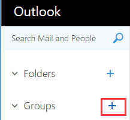
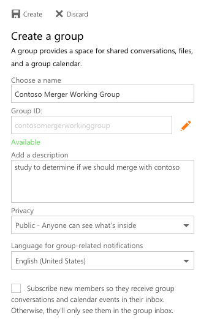
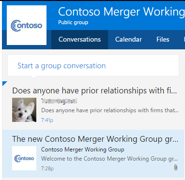
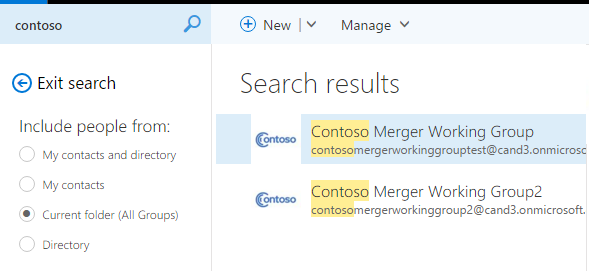
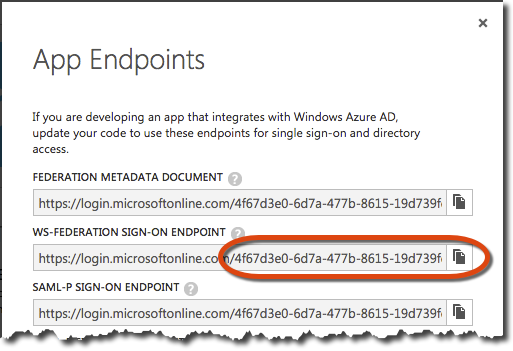
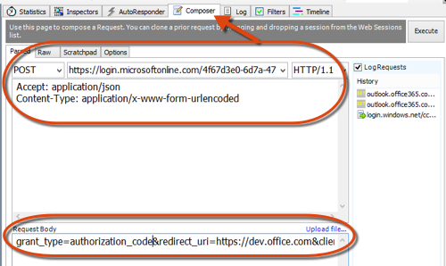

# Deep Dive into the Office 365 Groups API
In this lab, you will use the Groups API to access & program against Office 365 data using the raw REST API for the Office 365 Groups API.

## Prerequisites
1. You must have an Office 365 tenant and Microsoft Azure subscription to complete this lab. If you do not have one, the lab for **O3651-7 Setting up your Developer environment in Office 365** shows you how to obtain a trial.
1. You must have access to an Exchange mailbox within an Office 365 developer tenancy.
1. You must have Fiddler (http://www.telerik.com/fiddler) or another HTTP debugging proxy tool installed to complete exercise 3.

## Exercise 1: Create and Interact with Groups using the Browser
In this exercise, you will use the browser to create & interact with Office 365 groups. You'll want to ensure you have a few users in your Office 365 tenant that you can use. For this lab we've created the following users ahead of time:

	- Janice Galvin (janice.galvin@<tenantid>.onmicrosoft.com)
	- Ken Sanchez (ken.sanchez@<tenantid>.onmicrosoft.com)
	- Maria Anders (maria.anders@<tenantid>.onmicrosoft.com)
	- Rob Walters (rob.walters@<tenantid>.onmicrosoft.com)
	- Thomas Hardy (thomas.hardy@<tenantid>.onmicrosoft.com) 

Using these accounts, create and interact with some groups using the web interface.

### Create a New Group 
1. Within a browser, navigate to the **https://mail.office365.com** site & login using a valid account *(in this step, we will use **Rob Walters**)*.
1. Create a new group named **Contoso Merger Working Group**.
	1. In the left navigation, locate & click the link **Create Group**:

		
	
	1. Set the name to **Contoso Merger Working Group** & give it a description as shown in the following figure.

			

	1. Click the **Create** button at the top to create the group.

1. After creating the group, you will be prompted to add a user as a member to the group. Add one of your test users to the group *(in this step we used **Janice Galvin**)*.
1. After creating the group it will appear in the left-hand navigation and indicated with a tile that contains letters from the group's name. 
	1. Update the logo for the group to be more descriptive. Click the pencil icon in the lower-right of the group title.

			

	1. Select the **contoso.png** file in the [Lab Files](Lab Files) folder within this lab as the new icon for the group.
	
1. With the icon set, start up a conversation in the group that other members can participate in.
	1. Click the **Start a group conversation** link in the middle-pane and enter the following message:
	
		````
		Does anyone have prior relationships with firms that do corporate valuations?
		````
	
	1. Once you save the message, you will see the message appear in the list of conversations:

			

1. At this point the current user (*Rob Walters*) is not subscribed to the group. Ideally all messages to this group should show up in his mailbox. To do this, click the **Subscribe** link at the top of the group.

	> Conversations are just one of the features available in groups. In addition to conversations there is a shared calendar, files, notebook and other options. Feel free to explore and add additional content.

### Interact with the Group as a Member
1. In the last section you added another user (*Janice Galvin*) as a member when you created the group. Login as this user on the same **https://mail.office365.com** site.
1. Once you login, you will see the **Contoso Merger Working Group** listed in the left-hand navigation. Select the group.
1. Locate the conversation that was created in the previous step & click the **reply all** link to leave a comment:

	````
	I used to work for a valuation firm... let me dig up a contact and get back to you.
	````

1. You will see the conversation update with the message you just added.
1. Logout of **https://mail.office365.com** and login as the original user (*Rob Walters*).

	

1. Notice that when you login, the message will appear in their email inbox, not just in the group's conversations view. This is because you subscribed to the conversations.

### Search & Join a Group as another User
1. Now let's try to find the group as another user. Login as a new user (*in this step we used **Thomas Hardy**).
1. Once logged in, click the **Browse groups** link in the left-hand navigation.
1. Enter **contoso** as the search term and press **ENTER**.

	

1. Select the group **Contoso Merger Working Group** & click the **Join** button in the right-hand navigation to join the group.
1. You should now be able to go back to main page for your inbox and see the group listed in the left-hand pane. Notice that you can see all the conversations and other aspects of the group.

In this exercise you created and interacted with Office 365 Groups using the browser interface. 

## Exercise 2: Create an Azure AD Application with Necessary Permissions for the Groups API 
In this exercise, you will create an Azure AD application using the Azure Management portal and grant the application the necessary permissions to work with the Groups API.

1. Within a browser, navigate to the **Azure Management Portal**: https://manage.windowsazure.com
1. Enter the email address and password of an account that have permissions to manage the directory of the Azure AD tenant (e.g. admin@sample.onmicrosoft.com).
1. In the left-hand navigation, scroll down to and click on Active Directory.
1. Click on the name of a directory to select it and display. Depending on the state of your portal, you will see the Quick Start page, or the list of Users. On either page, click **Applications** in the toolbar. 

	

1. Click the **Add** button at the bottom of the display.
1. On the **What do you want to do** page, click **Add an application my organization is developing**. This will start the **Add Application** wizard.
1. In the **Add Application** wizard, enter a name of **My First Groups API App** and choose the type **Web Application and/or Web API**. Click the arrow to advance to the next page of the wizard.
1. In the **App Properties** page, enter a **SIGN-ON URL** of **https://dev.office.com**
1. Enter an **App ID Uri** of **http://[your-O365-tenant-id].onmicrosoft.com/GroupsApiApp**.
	> NOTE: The App ID Uri must be unique within the Azure tenancy. Using a host name that matches your tenant name helps to prevent confusion, and using a value for the path that matches the app name helps to enforce uniqueness. This value can be changed if the app name or purpose changes.
1. Click the **check** image in the lower right of the wizard to create the application. The application Quick Start page will display once the application is created.

	

1. On the application Quick Start page, click on **CONFIGURE** in the toolbar.
1. Scroll down to the **Keys** section. 
	1. In the **Select Duration** dropdown, select **1 year**. 
	1. Then click the **Save** button at the bottom of the page.

	*The page will refresh and include the value of the key. In addition, a message is displayed advising that the key will not be shown a second time.*

1. For both the **Client ID** and **Key**, copy these values to a text file as you will need them later in this lab.

	

### Grant App Necessary Permissions to the Unified API
1. Scroll down to the **permissions to other applications** section. 
	1. Click the **Add Application** button.
	1. In the **Permissions to other applications** dialog, click the **PLUS** icon next to the **Office 365 Unified API** option.
	1. Click the **CHECK** icon in the lower left corner.
	1. For the new **Office 365 Unitied API** application permission entry, select the **Delegated Permissions** dropdown on the same line and then select the following permissions:
		- Read and write all groups (preview)
		- Read all groups (preview)
	1. Click the **Save** button at the bottom of the page.

### Get the Azure AD Tenant ID
1. Click on the **View Endpoints** button in the gutter at the bottom of the page.
1. The dialog that appears you will see a list of a number of different endpoints. All of them contain a GUID which is the unique ID of the Azure AD tenant for the application as shown in the following figure:

	

	Copy the GUID from any of the URLs and save them to a text file, just like you did for the client ID & key earlier, as you will need this later. 

In this exercise you created an Azure AD application using the Azure Management portal and granted the application the necessary permissions to work with the Groups API.

## Exercise 3: Use the Raw REST API Interface of the Groups API
In this exercise, you will use the raw REST API interface of the Groups API to interact with the different capabilties. The Groups API is part of the Unified API. In order to call the Unified API, you must pass along a valid OAuth2 access token. To obtain an access token you must first authenticate with Azure AD and obtain an authorization code.

### Authenticate & Obtain an Authorization Code from Azure AD 
*Use the Azure AD authorization endpoint to authenticate & obtain an authorization code.*

1. Take the following URL and replace the `{tenant-id}` & `{client-id}` tokens with values obtained / set on the Azure AD application.

	````
	https://login.microsoftonline.com/{tenant-id}/oauth2/authorize?
	client_id={client-id}
	&resource=https://graph.microsoft.com/
	&redirect_uri=https://dev.office.com
	&response_type=code
	````

1. Open Fiddler.
1. Open a browser navigate to the above URL after you replaced the tokens. Be sure to remove any line breaks from the above URL that were added for readability.
	1. You will be prompted to login using the same account you used to create the Azure AD application.
	1. After logging in you will be taken to a non-existant page. This is not an error, there is just no site setup for this application yet. The important information is in the actual data sent to the page.
1. Open Fiddler and find the last session that took you to the current page after logging into Azure AD. The following figure shows what Fiddlier will likely look like for you, with the highlighted session you are interested in. Specifically, you are looking for a session that has a `/?code=` in the URL:

	

	> NOTE: To simplify the screenshot, session requests for script & image files have been removed.

1. With the session selected in Fiddler, click the **Inspector** tab and then click the **WebForms** button. This will show a list of all the values submitted to the current page.
1. Copy the value for the **code** to the text file; this is the authorization code that can be used to obtain an access token.

## Obtain an OAuth2 Access Token for the Unified API
*Use the Azure AD token endpoint to obtain an access token for the Unified API using the authorization code you just obtained.*

1. Take the following URL and replace the `{tenant-id}` token with the values obtained in the previous exercise:

	````
	https://login.microsoftonline.com/{tenant-id}/oauth2/token
	```` 

1. Within Fiddler, click the **Composer** tab.
1. Set the HTTP action to **POST** and copy the URL above with the replaced token into the address path.
1. Within the box just below the HTTP action & URL, add the following HTTP headers:

	````
	Accept: application/json
	Content-Type: application/x-www-form-urlencoded
	````

1. Now, take the following and replace the `{client-id}` token with the value from the first exercise. Replace the `{url-encoded-client-secret}` token with the URL encoded value of the client secret from the first exercise in the lab.

	> To get the URL encoded value, search for the phrase *url encode* on [http://www.bing.com]. It will display a utility to paste the value you obtained in the first exercise and conver it to the URL encoded version.
	
	Lastly, replace the `{authorization-code}` token with the code that you got from the previous step, using Fiddler.

	````
	grant_type=authorization_code
	&redirect_uri=https://dev.office.com
	&client_id={client-id}
	&client_secret={url-encoded-client-secret}
	&resource=https://graph.microsoft.com
	&code={authorization-code}
	````

1. Take the resulting string from all the previous changes and paste it into the **Request Body** box within the **Composer** tab. Be sure to remove all line breaks form the string so you are left with something that looks like the following:

	  

1. Click the **Execute** button to make the request.
1. Select the session that was just created and click the **Inspectors** tab. Here you see the all the values that were submitted in the request.
1. Click the **JSON** button in the lower part of the **Inspector** tab. This contains the access and refresh tokens from the successful request. 
1. Copy & save the access token just like you've done with the client ID, secret & tenant ID in the previous exercise.

	  

### Issue Requests to the Group API's REST Endpoint via the Unified API
*Now that you have an access token, create a few requests to the Unified API's REST endpoint.*

1. First get information about the currently logged in user from the Unified API. Within Fiddler's **Composer** tab, do the following:
	1. Set the HTTP action to **GET**.
	1. Set the endpoint URL to **https://graph.microsoft.com/beta/me**
	1. Set the HTTP headers to the following values, replacing the `{access-token}` token to the actual token you just obtained in the last step:
	
		````
		Accept: application/json
		Authorization: Bearer {access-token}
		````

	1. Clear the box for the **Request Body**.
	1. Click the **Execute** button.
	1. Select the session you just created and click the **Inspectors** tab. Look at the results that came back to find information about you, the currently logged in user.

1. Get a list of all the groups that exist within your organization.
	1. Within the Fiddler **Composer** tab...
	1. Set the endpoint URL to **https://graph.microsoft.com/beta/myorganization/groups**
	1. Leave the same HTTP headers in place & click the **Execute** button.
	1. Select the session you just created and click the **Inspectors** tab. Look at the results that came back to find a list of all the groups in your organization.
	
1. Check the groups you are currently a member of. *This assumes you are logged in as a user that's a member of at least one group.*
	1. Within the Fiddler **Composer** tab...
	1. Set the endpoint URL to **https://graph.microsoft.com/beta/me/joinedGroups**
	1. Leave the same HTTP headers in place & click the **Execute** button.
	1. Select the session you just created and click the **Inspectors** tab. Look at the results that came back to find information about the groups you are a member of.
	
1. You can also search for a specific group using the OData query syntax:	
	1. Within the Fiddler **Composer** tab...
	1. Set the endpoint URL to **https://graph.microsoft.com/beta/myorganization/groups?$filter=startswith(displayName,'Contoso')**
	1. Leave the same HTTP headers in place & click the **Execute** button.
	1. Select the session you just created and click the **Inspectors** tab. Look at the results that came back to find information about the group that was created in a previous exercise.

1. Now, look at the conversations within the specified group. *For this step, you need to get the ID (aka: objectId) of the group you found in the previous step*: 
	1. Within the Fiddler **Composer** tab...
	1. Set the endpoint URL to **https://graph.microsoft.com/beta/myorganization/groups/{replace-with-group-object-id}/conversations**
	1. Leave the same HTTP headers in place & click the **Execute** button.
	1. Select the session you just created and click the **Inspectors** tab. Look at the results that came back to find a list of all conversations in the group.

1. You can also look at the conversations as threads...
	1. Within the Fiddler **Composer** tab...
	1. Set the endpoint URL to **https://graph.microsoft.com/beta/myorganization/groups/{replace-with-group-object-id}/threads**
	1. Leave the same HTTP headers in place & click the **Execute** button.
	1. Select the session you just created and click the **Inspectors** tab. Look at the results that came back to find a list of all threads in the group.

1. ... and see all the posts within a thread...
	1. Within the Fiddler **Composer** tab...
	1. Set the endpoint URL to **https://graph.microsoft.com/beta/myorganization/groups/{replace-with-group-object-id}/threads/{replace-with-thread-id}/posts**
	1. Leave the same HTTP headers in place & click the **Execute** button.
	1. Select the session you just created and click the **Inspectors** tab. Look at the results that came back to find a list of all messages within a thread.
	
1. The Groups API also allows you to look at the events and files associated with the group:
	1. Within the Fiddler **Composer** tab...
	1. Set the endpoint URL to **https://graph.microsoft.com/beta/myorganization/groups/{replace-with-group-object-id}/events**
	1. Leave the same HTTP headers in place & click the **Execute** button.
	1. Select the session you just created and click the **Inspectors** tab. Look at the results that came back to find a list of all the events within the group.
	1. Set the endpoint URL to **https://graph.microsoft.com/beta/myorganization/groups/{replace-with-group-object-id}/files**
	1. Leave the same HTTP headers in place & click the **Execute** button.
	1. Select the session you just created and click the **Inspectors** tab. Look at the results that came back to find a list of all the files within the group.
	
	> Note: this part of the Groups API is leveraging the capabilities of the Files and Events API endpoints in the Unified API. These specific endpoints are covered in more depth in other modules within these courses.
	
In this exercise, you used the raw REST API interface of the Groups API to interact with the different capabilties.