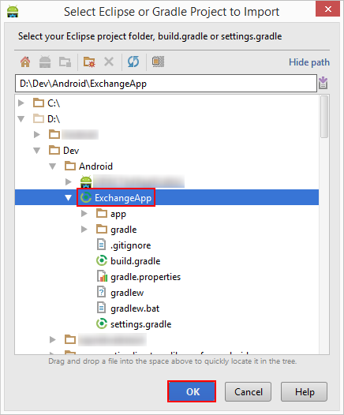
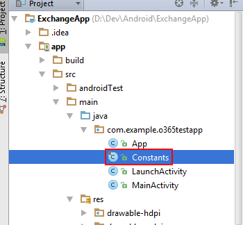
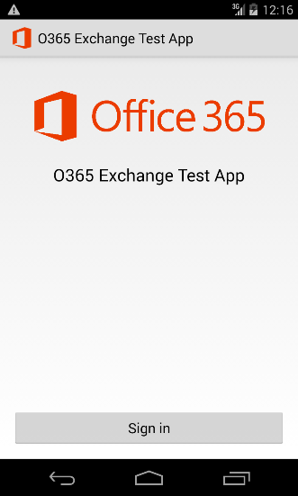
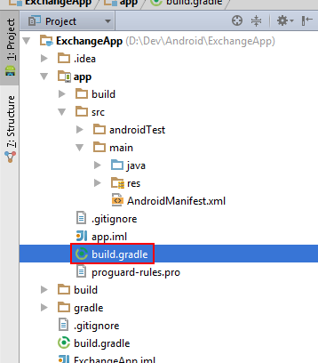
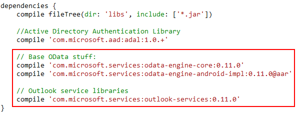
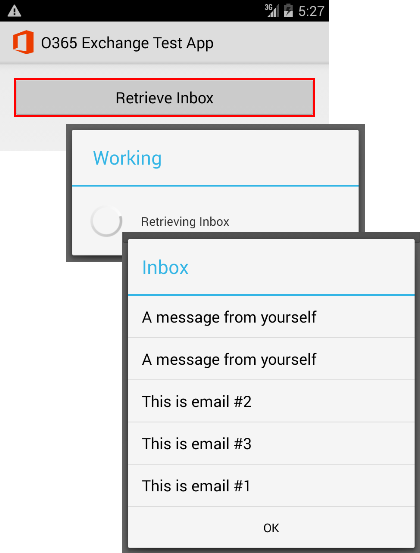
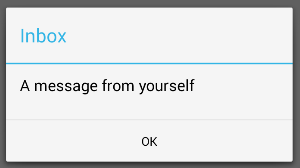
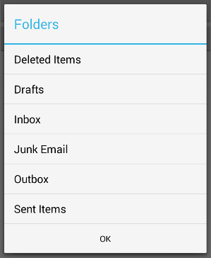
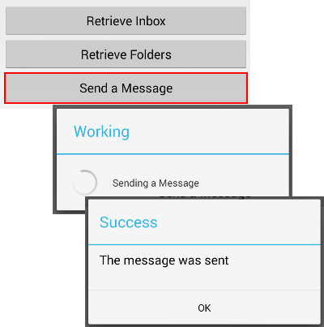
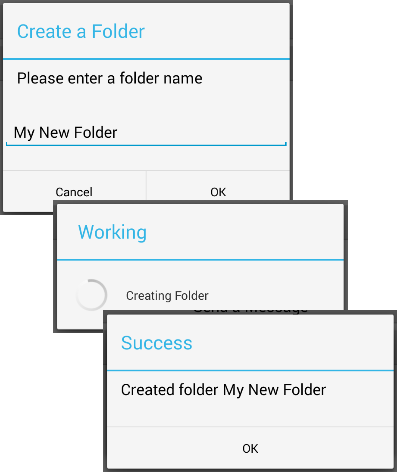

Calling the Exchange API with Android
=====================================

##Overview

O365 Exchange exposes a RESTful HTTP API which we can consume using the O365
Exchange SDK for Android.

The SDK provides asynchronous access to the Exchange API using strongly-typed
objects and opearations.

For more information on the API being consumed in this lab, see 
[the API documentation][docs-mail-contacts-calendar].

[docs-mail-contacts-calendar]: http://msdn.microsoft.com/en-us/office/office365/api/complex-types-for-mail-contacts-calendar

##Objectives

-   Learn how to communicate with the O365 Exchange REST API using the
    **O365 Exchange SDK for Android**


##Prerequisites

-   [Git version control tool][git-scm]
-   [Android Studio][android-studio]
-   Android API Level 19 installed [using the Android SDK Manager][sdk-manager]
-   Complete the [Prerequisites](../01 Azure AD Auth Prerequisites) module.
-   Complete the [Authentication](../02 Active Directory Authentication Library) module.

[git-scm]: http://git-scm.com
[android-studio]: http://developer.android.com/sdk/installing/studio.html
[sdk-manager]: http://developer.android.com/tools/help/sdk-manager.html

##Exercises

The hands-on lab includes the following exercises:

-   [**Exercise 1**](#exercise1) Prepare the Android test application and add
    the O365 Exchange SDK
-   [**Exercise 2**](#exercise2) Learn some of the operations the Exchange SDK
    exposes to you


<a name="exercise1"></a>
##Exercise 1: Prepare the Android test application

In this exercise we will add the Exchange SDK for Android to the included
"O365 Test App".

###Task 1 - Preparing the test app

In this task we'll get the test application up and running.

01. Make a copy of the Android lab test app template, found in the 
    `O365TemplateApp/src` directory.

    Name this copy "ExchangeApp". E.g. in PowerShell

    ```powershell
    PS C:\> $lab_dir = ".\path\to\the\lab"
    PS C:\> $work_dir = ".\path\to\your\projects\dir"
    PS C:\> cp -Recurse "$lab_dir\O365TemplateApp\src\" "$work_dir\ExchangeApp"
    ```

01. Launch Android Studio

02. From the **File** menu, select **Import Project**.

    **Note:** if this is your first time launching Android Studio, you may
    select **Import Project** from the Android Studio launcher.

03. Find and select the "ExchangeApp" folder.
    
04. Click **OK** to import the project.

    

    Wait for Android Studio to finish importing the test project

05. Open the `app/src/res/values/strings.xml` resource file.

06. Find the string resource named "app_name", and change it to "O365 Exchange
    Test App".

    
    
    This resource is used in a number of places, including as the App's name
    in the Launcher.

07. Open the `Constants` class. It can be found under `app/src/main/java`.

    

08. This class hosts a number of static constants which we must update.
    
    - **RESOURCE:** Set this to "https://outlook.office365.com"

    - **CLIENT_ID:** Set to the Client ID obtained in the Prerequisites module

    - **REDIRECT_URI:** Set to the Redirect URI configured in AD in the
        Prerequisites module

    E.g.

    

09. Finally, let's test out the app and your changes. 
    Start up the application in the Emulator with **Run > Debug App**.

    

10. Tap the **Sign in** button. Sign in using credentials for a user in your
    O365 Tenant. If successful, the blank `MainActivity` will be launched.


In this task you have created and configured the O365 Test App - this will
serve as the base on which you will build out the rest of the lab.

###Task 2 - Add the O365 Exchange SDK to the test app

In this task you will add the **O365 Exchange SDK** to the app, and then
configure it.

01. Open the `app/build.gradle` file.

    

02. Find the `dependencies` section. Currently it has a reference to the ADAL.

03. Add the following block of code to the `dependencies` section:

    ```groovy
    // Base OData stuff
    compile 'com.microsoft.services:odata-engine-core:0.11.0'
    compile 'com.microsoft.services:odata-engine-android-impl:0.11.0@aar'

    // Outlook SDK
    compile 'com.microsoft.services:outlook-services:0.11.0'
    ```

    This adds a dependency on version `0.11.0` of the Outlook part of the O365 
    SDK for Android.

    E.g.
    
    

    [semver]: http://semver.org/

04. Click **Sync Now**.
    
    

05. Open the `MainActivity` class. It can be found under `app/src/main/java`.

06. Add the following member fields to the top of the class:

    ```java
    private DefaultDependencyResolver mDependencyResolver;
    private OutlookClient mOutlookClient;
    ```

07. Add the following code to the end of the `onCreate` function.

    ```java
        //Configure the depencency resolver
        mDependencyResolver = new DefaultDependencyResolver(mAccessToken);

        //Create the client
        mOutlookClient = new OutlookClient(
            "https://outlook.office365.com/api/v1.0",
            mDependencyResolver
        );
    ```

    The first argument to the `OutlookClient` is the URL for your O365 Exchange
    endpoint. Generally, this will be "https://outlook.office365.com/api/v1.0".
    The "api/v1.0" path component is required.


<a name="exercise2"></a>
##Exercise 2: Learn some of the operations the Exchange SDK exposes to you

In this exercise we will examine some of the functions the O365 Exchange SDK
exposes to us, and how to call them correctly within the context of an Android
app.


###Task 1 - Getting the user's Inbox

In this task we will make a call to the O365 Exchange API to retrieve the
contents of the user's **Inbox**.

01. Open the MainActivity layout file found at `app/src/main/res/layout/activity_main.xml`.

    This layout file contains an empty `LinearLayout` view, configured to stack
    its child views vertically.

02. Add the following element to `activity_main.xml`:

    ```xml
    <Button
        android:id="@+id/retrieve_inbox_button"
        android:layout_width="match_parent"
        android:layout_height="wrap_content"
        android:text="Retrieve Inbox" />
    ```

03. Return to the `MainActivity` class, and add the following code to the
    `onCreate` method:

    ```java
    findViewById(R.id.retrieve_inbox_button).setOnClickListener(
        new View.OnClickListener() {
            @Override
            public void onClick(View view) {
                startRetrieveInbox();
            }
        }
    );
    ```


04. Add the following methods to the `MainActivity` class.

    ```java
    private void showErrorDialog(Throwable t) {
        new AlertDialog.Builder(this)
                .setTitle("Whoops!")
                .setMessage(t.toString())
                .setPositiveButton("OK", null)
                .show();
    }

    private void startRetrieveInbox() {

        //Show a "work-in-progress" dialog
        final ProgressDialog progress = ProgressDialog.show(
            this, "Working", "Retrieving Inbox"
        );
        
        //Get a reference to the users Inbox
        FolderFetcher inboxFetcher = mOutlookClient.getMe().getFolders()
                                                           .getById("Inbox");

        //Retrieve the messages from the inbox
        ListenableFuture<List<Message>> messagesFuture =
            inboxFetcher.getMessages()
                        .read();

        //Attach a callback to handle the eventual result
        Futures.addCallback(messagesFuture,new FutureCallback<List<Message>>() {
            @Override
            public void onSuccess(List<Message> result) {
                //Transform the results into a collection of strings
                final String[] items = new String[result.size()];
                for (int i = 0; i < result.size(); i++) {
                    items[i] = result.get(i).getSubject();
                }
                //Launch a dialog to show the results to the user
                runOnUiThread(new Runnable() {
                    @Override
                    public void run() {
                        progress.dismiss();
                        new AlertDialog.Builder(MainActivity.this)
                            .setTitle("Inbox")
                            .setPositiveButton("OK", null)
                            .setItems(items, null)
                            .show();
                    }
                });
            }
            
            @Override
            public void onFailure(final Throwable t) {
                runOnUiThread(new Runnable() {
                    @Override
                    public void run() {
                        progress.dismiss();
                        showErrorDialog(t);
                    }
                });
            }
        });
    }
    ```

05. Launch the app in the debugger with **Run > Debug App**. Sign in with a
    user from your O365 Tenant, and click "Retrieve Inbox"

    

In this task we made a call to the O365 Exchange API to retrieve the contents
of the user's Inbox. There is a lot of boilerplate code here, so let's review
the interesting parts:

```java
FolderFetcher inboxFetcher = mOutlookClient.getMe()
                                           .getFolders()
                                           .getById("Inbox");
```

Here we are using `getById()` to retrieve a single item from a collection by
its Id. All collections have this function, e.g. Folders, Messages,
ItemAttachments and Users.

The Id passed here is **"Inbox"** which is a well-known name - other well-known
names for Folders are **"Drafts"**, **"SentItems"** and **"DeletedItems"**.
Alternatively, you would retrieve the Id from an entity using its `getId()`
function.

Note that no query has been executed yet - the `FolderFetcher` instance
represents a potential query to the API. We can call additional functions to
modify the query (e.g. add filters to a collection query), or further
"navigate" the API.

```java
ListenableFuture<List<Message>> messagesFuture = inboxFetcher.getMessages()
                                                             .read();
```

Here the `getMessages()` function modifies the query to retrieve messages in
the Inbox folder. The `read()` function executes the query asynchronously and
returns a **Future**, which is a handle to the eventual result of the API call.

We can use the `Futures` helper class to attach a callback to the future which
will handle the **Success** or **Failure** of the call. E.g.

```java
Futures.addCallback(messagesFuture, new FutureCallback<List<Message>>() {
    @Override
    public void onSuccess(List<Message> result) {
            //Handle success (e.g. 200, 201)
    }
    @Override
    public void onFailure(Throwable t) {
            //Handle failure (e.g. 404, 500)
    }
});
```

Note that the callback will be executed on a background thread. If your code
needs to update the User Interface (e.g. update a view or print a warning),
then you must dispatch a **Runnable** back to the UI thread using 
`Activity.runOnUiThread`:

```java    
runOnUiThread(new Runnable() {
    @Override
    public void run() {
        //this code runs on the UI thread
    }
});
```

Alternatively, we could use the `get()` function on the **Future** object.
This will block the thread until the underlying API call completes and the
result is returned. 

**Warning: do not do this on the UI thread!** You could use an `AsyncTask` to
run this code on a background thread.

```java
try {
    List<Message> messages = messagesFuture.get();
}
catch (InterruptedException e) {
    //handle error
}
catch (ExecutionException e) {
    //handle error
}
```


###Task 2 - Filtering queries

In this task we will modify the previous code to retrieve a filtered view of
the user's **Inbox**.

01. Return to the `MainActivity` class and find the following line:
    
    ```java
    ListenableFuture<List<Message>> messagesFuture = inboxFetcher.getMessages()
                                                                 .read();
    ```

02. We're going to modify it to filter the returned collection of messages to
    only those which were received today. Replace that line with the following
    code:

    ```java
    //Get a timestamp for today at midnight
    Calendar calendar = Calendar.getInstance();
    calendar.set(Calendar.HOUR_OF_DAY, 0);
    calendar.set(Calendar.MINUTE, 0);
    calendar.set(Calendar.SECOND, 0);
    calendar.set(Calendar.MILLISECOND, 0);

    //Create a filter string
    DateFormat iso8601 = new SimpleDateFormat("yyyy-MM-dd'T'HH:mm:ss'Z'");
    iso8601.setTimeZone(TimeZone.getTimeZone("UTC"));
    String odataFilter = String.format(
        "DateTimeReceived gt %s",
        iso8601.format(calendar.getTime())
    );

    //Retrieve the messages in the inbox
    ListenableFuture<List<Message>> messagesFuture =
        inboxFetcher.getMessages()
                    .filter(odataFilter)
                    .read();
    ```

    There are a few things going on here:

    -   First, we create a `Calendar` instance which refers to midnight tonight
        in the UTC timezone.

    -   Second, we format that date as ISO8601 into an "OData" filter string,
        comparing it to the `DateTimeReceived` field.

    -   Third, we add that filter to our query using the `filter()` function

03. Launch the app in the debugger with **Run > Debug App**. Sign in and click
    "Retrieve Inbox".

    
    
    If there aren't any messages in your inbox for today, try sending yourself
    an email!


In this task we made a **filtered** call to the O365 Exchange API to retrieve
the contents of the user's Inbox which were received today.

Filtering with the O365 Exchange SDK is done using OData filter expressions.
See [the API documentation][docs-mail-contacts-calendar] for more information on
writing these expressions.

The supported OData query parameters are:

- **$filter** to filter for specific criteria - use `filter()`
- **$select** to request specific properties - use `select()`
- **$top** and $skip to page results - use `top()`
- **$take** and $take to page results - use `take()`
- **$expand** to expand message attachments and event attachments - use `expand()`

By default, a request for Messages or ChildFolders returns ten entries (up to a
maximum of 50). Use `top` to override this. You can also use `top` and `skip`
for paging results. E.g.

```java
// Retrieve the first page of 10 results
int pageSize = 10, pageIndex = 0;
  
ListenableFuture<List<Message>> messagesFuture = 
    inboxFetcher.getMessages()
                .top(pageSize)
                .skip(pageSize * pageIndex)
                .read();
```


###Task 3 - Enumerating folders

In this task we will enumerate the user's top-level Folders. The technique used
is identical to that for enumerating Messages.

01. Open the MainActivity layout file found at `app/src/main/res/layout/activity_main.xml`.

02. Add the following element to `activity_main.xml`:

    ```xml
    <Button
        android:id="@+id/retrieve_folders_button"
        android:layout_width="match_parent"
        android:layout_height="wrap_content"
        android:text="Retrieve Folders" />
    ```

03. Return to the `MainActivity` class, and add the following code to the
    `onCreate` method:

    ```java
    findViewById(R.id.retrieve_folders_button).setOnClickListener(
        new View.OnClickListener() {
            @Override
            public void onClick(View view) {
                startRetrieveFolders();
            }
        }
    );
    ```

04. Add the following method to the `MainActivity` class. Be sure to add an
    `import` statement for the `Folder` class.

    ```java
    private void startRetrieveFolders() {

        //Show a "work-in-progress" dialog
        final ProgressDialog progress = ProgressDialog.show(
            this, "Working", "Retrieving Folders"
        );

        //Retrieve the top-level folders
        ListenableFuture<List<Folder>> foldersFuture =
            mOutlookClient.getMe()
                          .getFolders()
                          .read();

        //Attach a callback to handle the eventual result
        Futures.addCallback(foldersFuture,new FutureCallback<List<Folder>>() {
            @Override
            public void onSuccess(List<Folder> result) {
                //Transform the results into a collection of strings
                final String[] items = new String[result.size()];
                for (int i = 0; i < result.size(); i++) {
                    items[i] = result.get(i).getDisplayName();
                }
                //Launch a dialog to show the results to the user
                runOnUiThread(new Runnable() {
                    @Override
                    public void run() {
                        progress.dismiss();
                        new AlertDialog.Builder(MainActivity.this)
                            .setTitle("Folders")
                            .setPositiveButton("OK", null)
                            .setItems(items, null)
                            .show();
                    }
                });
            }
            @Override
            public void onFailure(final Throwable t) {
                runOnUiThread(new Runnable() {
                    @Override
                    public void run() {
                        progress.dismiss();
                        showErrorDialog(t);
                    }
                });
            }
        });
    }
    ```

05. Launch the app in the debugger with **Run > Debug App**. Sign in with a
    user from your O365 Tenant, and click "Retrieve Folders"

    

The interesting code in the `startRetrieveInbox` function is the following
snippet:

```java
//Retrieve the top-level folders
ListenableFuture<List<Folder>> foldersFuture =
    mOutlookClient.getMe()
                  .getFolders()
                  .read();
```

We could add filtering and paging like this:

```java
//Retrieve the top-level folders which have child folders
int pageSize = 10, pageIndex = 0;
ListenableFuture<List<Folder>> filteredFoldersFuture =
    mOutlookClient.getMe()
                  .getFolders()
                  .filter("ChildFolderCount gt 0")
                  .top(pageSize)
                  .skip(pageSize * pageIndex)
                  .read();
```

As you can see here, the pattern for querying for folders is identical to the
pattern for querying for messages. This holds true for all other entities
available through the API:

-   Calendars
-   CalendarGroups
-   Contacts
-   ContactFolders
-   Events
-   FileAttachments
-   Folders
-   ItemAttachments
-   Messages
-   Users

See [the API documentation][docs-mail-contacts-calendar] for more information.

###Task 4 - sending messages

This task will step you through sending a message through the O365 Exchange API.

01. Again, open the MainActivity layout file found at `app/src/main/res/layout/activity_main.xml`.

02. Add the following element to `activity_main.xml`:

    ```xml
    <Button
        android:id="@+id/send_message_button"
        android:layout_width="match_parent"
        android:layout_height="wrap_content"
        android:text="Send a Message" />
    ```

03. Return to the `MainActivity` class, and add the following code to the
    `onCreate` method:

    ```java
    findViewById(R.id.send_message_button).setOnClickListener(
        new View.OnClickListener() {
            @Override
            public void onClick(View view) {
                startSendMessage();
            }
        }
    );
    ```

04. Add the following method to the `MainActivity` class. Be sure to add
    `import` statements for any types not already imported.

    ```java
    private void startSendMessage() {

        //Show a "work-in-progress" dialog
        final ProgressDialog progress = ProgressDialog.show(
                this, "Working", "Sending a Message"
        );

        //Create an example message
        ItemBody body = new ItemBody();
        body.setContentType(BodyType.Text);
        body.setContent("This is a message body");

        EmailAddress recipientAddress = new EmailAddress();
        recipientAddress.setAddress(PLACEHOLDER_ADDRESS);
        recipientAddress.setName(PLACEHOLDER_NAME);

        Recipient recipient = new Recipient();
        recipient.setEmailAddress(recipientAddress);

        Message message = new Message();
        message.setToRecipients(Arrays.asList(recipient));
        message.setSubject("This is a test message");
        message.setBody(body);

        //Send the message through the API
        boolean saveToSentItems = true;
        ListenableFuture future =
            mOutlookClient.getMe()
                          .getOperations()
                          .sendMail(message, saveToSentItems);

        Futures.addCallback(future, new FutureCallback() {
            @Override
            public void onSuccess(Object result) {
                runOnUiThread(new Runnable() {
                    @Override
                    public void run() {
                        progress.dismiss();
                        new AlertDialog.Builder(MainActivity.this)
                                .setTitle("Success")
                                .setMessage("The message was sent")
                                .setPositiveButton("OK", null)
                                .show();
                    }
                });
            }

            @Override
            public void onFailure(final Throwable t) {
                runOnUiThread(new Runnable() {
                    @Override
                    public void run() {
                        progress.dismiss();
                        showErrorDialog(t);
                    }
                });
            }
        });
    }
    ```

05. In the previous code block, replace the two placeholder tokens with values
    for your test user:

    - `PLACEHOLDER_ADDRESS` - The email address of your O365 tenant user
    - `PLACEHOLDER_NAME` - The name of your O365 tenant user

06. Launch the app in the debugger with **Run > Debug App**. Sign in and click
    "Send a Message"

    

07. You can then click "Retrieve Inbox" to see the new message in your Inbox.

In this task we built and sent an email message. Lets take a look at the 
interesting bits of the code:

```java
//Create an example message
ItemBody body = new ItemBody();
body.setContentType(BodyType.Text);
body.setContent("This is a message body");

EmailAddress recipientAddress = new EmailAddress();
recipientAddress.setAddress("someuser@somedomain.com");
recipientAddress.setName("Some User");

Recipient recipient = new Recipient();
recipient.setEmailAddress(recipientAddress);

Message message = new Message();
message.setToRecipients(Arrays.asList(recipient));
message.setSubject("This is a test message");
message.setBody(body);
```

This block of code is building the actual email Message. Here we can also add
attachments, add CC and BCC recipients, etc. We can also set an HTML message
body, instead of just text.

```java
//Send the message through the API
boolean saveToSentItems = true;
ListenableFuture future =
    mOutlookClient.getMe()
                  .getOperations()
                  .sendMail(message, saveToSentItems);
```

This call sends the actual message to the API. As usual, the call is
asynchronous and must be awaited using the `Futures` class.

The `saveToSentItems` flag controls whether the message will be automatically
saved to the user's "Sent Items" folder.

Also interesting here is the use of the `getOperations()` function. This method
exists on all entities and entity collections, and is used to do things like
`delete()` entities, or (as in this case) perform other non-CRUD operations
like `sendMail()`.


###Task 4 - creating folders (and other CRUD operations)

Finally, lets take a look at a basic [CRUD operation][crud-ops] - creating
a folder.

[crud-ops]: http://en.wikipedia.org/wiki/Create,_read,_update_and_delete

You can use the same pattern for any other creatable, updatable or deletable
entity on the API. See [the documentation][docs-mail-contacts-calendar] for more details.

01. Open the MainActivity layout file found at `app/src/main/res/layout/activity_main.xml`.

02. Add the following element to `activity_main.xml`:

    ```xml
    <Button
        android:id="@+id/create_folder_button"
        android:layout_width="match_parent"
        android:layout_height="wrap_content"
        android:text="Create a Folder" />
    ```

03. Return to the `MainActivity` class, and add the following code to the
    `onCreate` method:

    ```java
    findViewById(R.id.create_folder_button).setOnClickListener(
        new View.OnClickListener() {
            @Override
            public void onClick(View view) {
                promptUserForFolderName();
            }
        }
    );
    ```

04. Add the following methods to the `MainActivity` class. Be sure to add
    `import` statements for any types not already imported.

    ```java
    private void promptUserForFolderName() {

        final EditText input = new EditText(this);

        //Prompt the user for a new folder name
        new AlertDialog.Builder(this)
                .setTitle("Create a Folder")
                .setMessage("Please enter a folder name")
                .setView(input)
                .setPositiveButton("OK", new DialogInterface.OnClickListener() {
                    @Override
                    public void onClick(DialogInterface dialogInterface, int i) {
                        String newFolderName = input.getText().toString();
                        startCreateFolder(newFolderName);
                    }
                })
                .setNegativeButton("Cancel", null)
                .show();

    }

    private void startCreateFolder(String newFolderName) {

        //Show a "work-in-progress" dialog
        final ProgressDialog progress = ProgressDialog.show(
            this, "Working", "Creating Folder"
        );

        Folder newFolder = new Folder();
        newFolder.setDisplayName(newFolderName);

        //Create the folder via the API
        ListenableFuture<Folder> newFolderFuture =
            mOutlookClient.getMe()
                          .getFolders()
                          .getById("Inbox")
                          .getChildFolders()
                          .add(newFolder);

        Futures.addCallback(newFolderFuture, new FutureCallback<Folder>() {
            @Override
            public void onSuccess(final Folder result) {
                runOnUiThread(new Runnable() {
                    @Override
                    public void run() {
                        progress.dismiss();
                        new AlertDialog.Builder(MainActivity.this)
                                .setTitle("Success")
                                .setMessage("Created folder " + result.getDisplayName())
                                .setPositiveButton("OK", null)
                                .show();
                    }
                });
            }

            @Override
            public void onFailure(final Throwable t) {
                runOnUiThread(new Runnable() {
                    @Override
                    public void run() {
                        progress.dismiss();
                        showErrorDialog(t);
                    }
                });
            }
        });
    }
    ```

05. Launch the app in the debugger with **Run > Debug App**. Sign in and click
    "Create a Folder"

06. Enter a new folder name and click "OK".

    


In this task we created a new folder within the user's Inbox. There are two
methods at work in the code above. The first method (`promptUserForFolderName()`)
is just Android boilerplate to prompt the user for a new folder name.

The second method (`startCreateFolder()`) does the actual work, and has the
following interesting snippet:

```java
Folder newFolder = new Folder();
newFolder.setDisplayName(newFolderName);

ListenableFuture<Folder> newFolderFuture =
            mOutlookClient.getMe()
                          .getFolders()
                          .getById("Inbox")
                          .getChildFolders()
                          .add(newFolder);
```

Here we are creating a new folder model, then sending it to the API using a
chain of calls which build up the request.

- `.getFolders().getById("Inbox")` - get a reference to the user's Inbox
- `.getChildFolders()` - get a reference to the Inbox's child folder collection
- `.add(newFolder)` - start a query to add the new folder to that child collection.

As usual, the `add()` operation is asynchronous, and we must wait on the result
using the `Futures` helper class.


##Conclusion

By completing this hands-on lab you have learnt:

1. How to add the O365 Exchange SDK to an Android project
2. How to query for Messages
3. How to query for Folders
4. How to send new Messages
5. How to create a new Folder

As an exercise, try using Android Studio's built-in autocompletion functionality
to explore the `OutlookClient` API and implement other functionality like:

-   Creating a message in the user's Drafts folder. *Hint - try just saving the 
    message, rather than sending it.*

-   Enumerating the user's Calendars and Events. You can also create, update
    and delete them. *E.g.*

    ```java
    mOutlookClient.getMe().getCalendar() //...
    ```

-   Enumerating the user's Contacts and Contact Folders. You can also create,
    update and delete them. *E.g.*

    ```java
    mOutlookClient.getMe().getContacts() //...
    ```
