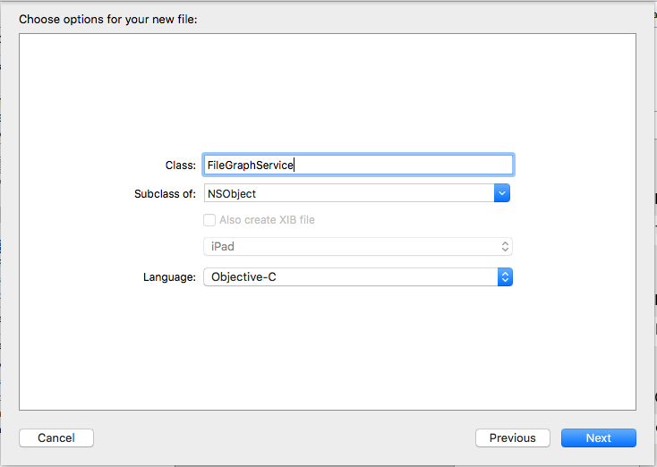
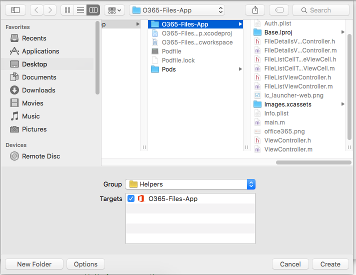
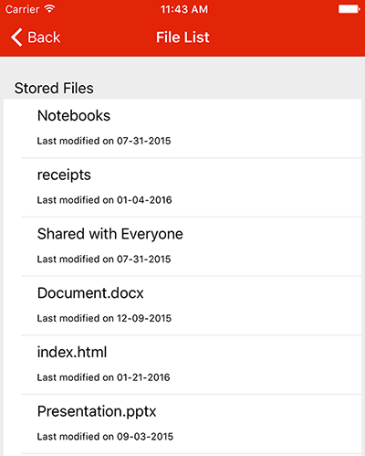
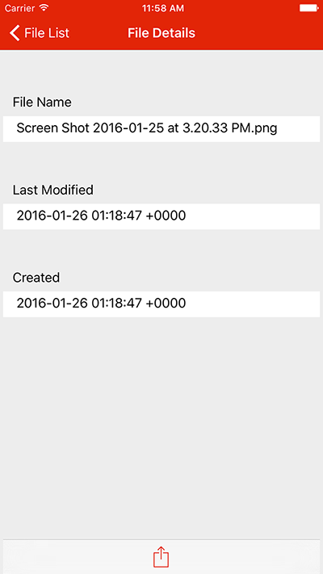
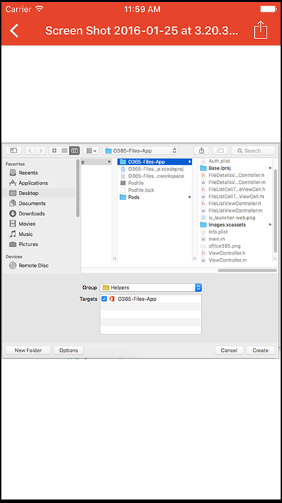

Calling Microsoft Graph for OneDrive with iOS
==============================================

## Overview

The lab lets students use an AzureAD account to manage files in a Office 365 SharePoint tenant with an iOS app.

## Objectives

- Learn how to create a Microsoft Graph client for Office 365 to list files,  them to local storage to then show it in a preview page.

## Prerequisites

- OSX 10.X environment
- [XCode 7][xcode-7]
- [Cocoapods dependency manager][cocoapods]
- Complete the  [\\\O3654\O3654-5\01 Azure AD Auth Prerequisites](../01 Azure AD Auth Prerequisites) module.

[xcode-7]: https://itunes.apple.com/nz/app/xcode/id497799835?mt=12
[cocoapods]: https://cocoapods.org

## Exercises

The hands-on lab includes the following exercises:

- [Add Office 365 iOS Microsoft Graph SDK library to the project](#exercise1)
- [Create a FileGraphService to get access to OneDrive](#exercise2)
- [Connect actions in the view to Microsoft Graph for OneDrive](#exercise3)

<a name="exercise1"></a>
## Exercise 1: Add Microsoft Graph SDK library to a project
In this exercise you will use an existing application with the AzureAD  included, to add the Microsoft Graph SDK library in the project.

### Open the Project and importing the library
01. Clone this git repository in your machine

02. In Finder, open the **[\\\O3654\O3654-5\03 O365 OneDrive SDK\src\O365-Files-App\Podfile](./src/O365-Files-App/Podfile)** file under the root folder of the project and add the lines inside the **target ... do ... end** statement:

    ```ruby
    pod 'orc'
    pod 'MSGraphSDK'
    ```
    
02. Open a Terminal and navigate to the `src/O365-Files-App/` folder of the project.

    Execute the following:

    ```bash
    pod install
    ```

03. Open the **.xcworkspace** file in **src/O365-Files-App/**

04. Find and Open the **Auth.plist**

05. Fill the AzureAD account settings with the following configuration values:

    > **Note:** You can find the clientId/redirectUriString in [\\\O3654\O3654-5\01 Azure AD Auth Prerequisites\hands-on-lab.md](../01 Azure AD Auth Prerequisites/hands-on-lab.md)
    
    -   **graphResourceUrl** - The URL of the Microsoft Graph service, it is  https://graph.microsoft.com/v1.0"
    -   **resourceId**              - The root URL of the Microsoft Graph service, it  is "https://graph.microsoft.com"
    -   **authority**               - "https://login.microsoftonline.com/common"
    -   **redirectUriString**       - The redirect URL configured in Azure AD, e.g. "http://example.com/redirect"
    -   **clientId**                - The client Id obtained from Azure AD
    
    

06. Build and Run the project in an iOS Simulator to check the views

    Application:
    You will se a login page with buttons to access the application and to clear credentials.
    Once authenticated, a File list will appear with one fake entry. Also there is a File 
    Details screen (selecting a row in the table) with the name, last modified and created dates.
    Finally, there is an action button to download the File.

    Environment:
    To access the files, in the Office 365 Sharepoint tenant there is a Default space to store documents called "Shared Documents". We will use the o365-files-sdk to access these files, download them, and show a preview in the iOS application.

    

<a name="exercise2"></a>
## Exercise 2: Create a FileGraphService to get access to OneDrive

01. On the XCode files explorer, make a right click in the group **Helpers** and 
select **New File**. You will see the **New File wizard**. Click on the **iOS** 
section, select **Cocoa Touch Class** and click **Next**.

    

02. In this section, configure the new class giving it a name (**FileGraphService**), and make it a subclass of **NSObject**. Make sure that the language dropdown is set with **Objective-C** because our o365-lists library is written in that programming language. Finally click on **Next**.

        

03. Now we are going to select where the new class sources files (.h and .m) will be stored. In this case we can click on **Create** directly. This will create a **.h** and **.m** files for our new class.

    

04. Open the **FileGraphService.h** and add the header for the **getGraphServiceClient** method to get **MSGraphServiceClient**.

    ```objc
    -(void)getGraphServiceClient:(void (^)(MSGraphClient * client, NSError *error))getClientCallBack;
    ```

    Add the import sentence

    ```objc
	#import <MSGraphSDK.h>
    #import <ADAL.h>
    #import <MSBlockAuthenticationProvider.h>
    ```

05. In **FileGraphService.m** add the method body:

    ```objc
    -(void)getGraphServiceClient:(void (^)(MSGraphClient* client, NSError *error))callback{
    
    [self getGraphServiceAccessToken:^(ADAuthenticationResult *result) {
        if(result != nil && result.status == AD_SUCCEEDED){
            NSString *accessToken = result.accessToken;
            MSBlockAuthenticationProvider *provider = [MSBlockAuthenticationProvider 				providerWithBlock:^(NSMutableURLRequest *request, MSAuthenticationCompletion completion) {
                NSString *oauthAuthorizationHeader = [NSString stringWithFormat:@"bearer %@", accessToken];
                [request setValue:oauthAuthorizationHeader forHTTPHeaderField:@"Authorization"];
                completion(request, nil);
            }];
            [MSGraphClient setAuthenticationProvider:provider];
            
            callback([MSGraphClient client], nil);
        }
        else{
            callback(nil, nil);
        }
    }];
	} 
	
	-(void)getGraphServiceAccessToken:(void (^)(ADAuthenticationResult* result))callback{
    
    NSString* plistPath = [[NSBundle mainBundle] pathForResource:@"Auth" ofType:@"plist"];
    NSDictionary *content = [NSDictionary dictionaryWithContentsOfFile:plistPath];
    NSString *clientId = [content objectForKey:@"clientId"];
    NSString *graphResourceId = [content objectForKey:@"resourceId"];
    NSString *authority = [content objectForKey:@"authority"];
    NSString *redirectUriString = [content objectForKey:@"redirectUriString"];
    ADAuthenticationError *error;
    ADAuthenticationContext* context = [ADAuthenticationContext authenticationContextWithAuthority:authority error:&error];
    if (!context)
    {
        //here need
        callback(nil);
        return;
    }
    
    [context acquireTokenWithResource:graphResourceId clientId:clientId redirectUri:[NSURL URLWithString:redirectUriString] completionBlock:^(ADAuthenticationResult *result) {
        callback(result);
    }];
    
	}	
    ```


06. Open the **FileGraphService.h** and add the header for the **getFiles** method to get files.

    ```objc
    -(void)getFiles:(void (^)(NSArray *files,NSError *error))getFilesCallBack;
    ```

07. In **FileGraphService.m** add the method body:
    
    ```objc
    -(void)getFiles: (void (^)(NSArray *files, NSError *error))getFilesCallBack{
    
    [self getGraphServiceClient:^(MSGraphClient *client, NSError *error) {
        if(client != nil){
            [[[[[[client me] drive] root] children] request]  getWithCompletion:^(MSCollection *response, 			MSGraphDriveItemChildrenCollectionRequest *nextRequest, NSError *error) {
                if(error != nil){
                    getFilesCallBack(nil, error);
                }
                else{
                    getFilesCallBack(response.value, nil);
                }
            }];
        }}];
	}
    ```
08. Open the **FileGraphService.h** and add the header for the **getFolderFiles** method to get files for specific folder.

    ```objc
    -(void)getFolderFiles:(NSString *)folderItemId callback:(void (^)(NSArray *files,NSError *error))getFilesCallBack;
    ```

09. In **FileGraphService.m** add the method body:
    
    ```objc
	-(void)getFolderFiles:(NSString *)folderItemId callback:(void (^)(NSArray *files,NSError *error))getFilesCallBack{
    
    [self getGraphServiceClient:^(MSGraphClient *client, NSError *error) {
        NSString* plistPath = [[NSBundle mainBundle] pathForResource:@"Auth" ofType:@"plist"];
        NSDictionary *content = [NSDictionary dictionaryWithContentsOfFile:plistPath];
        NSString *graphResourceUrl = [content objectForKey:@"graphResourceUrl"];
        
        MSGraphDriveItemsCollectionRequestBuilder *builder = [[MSGraphDriveItemsCollectionRequestBuilder alloc] initWithURL:[NSURL URLWithString:[NSString stringWithFormat:@"%@/me/drive/items/%@/children",graphResourceUrl,folderItemId]] client:client];
        [[builder request] getWithCompletion:^(MSCollection *response, MSGraphDriveItemsCollectionRequest *nextRequest, NSError *error) {
            if(error != nil){
                getFilesCallBack(nil, error);
            }
            else{
                getFilesCallBack(response.value, nil);
            }
        }];
    }];
	}
    ```
    
10. Open the **FileGraphService.h** and add the header for the **getFileContent** method to get file content.

    ```objc
    -(void)getFileContent:(NSString *)itemId callback:(void (^)(NSData *content,NSError *error))getFileContentCallBack;
    ```

11. In **FileGraphService.m** add the method body:
    
    ```objc
	-(void)getFileContent:(NSString *)itemId callback:(void (^)(NSData *content,NSError *error))getFileContentCallBack{
    
    [self getGraphServiceClient:^(MSGraphClient *client, NSError *error) {
        NSString* plistPath = [[NSBundle mainBundle] pathForResource:@"Auth" ofType:@"plist"];
        NSDictionary *content = [NSDictionary dictionaryWithContentsOfFile:plistPath];
        NSString *graphResourceUrl = [content objectForKey:@"graphResourceUrl"];
        
        MSGraphDriveItemRequestBuilder *builder = [[MSGraphDriveItemRequestBuilder alloc] initWithURL:[NSURL URLWithString:[NSString stringWithFormat:@"%@/me/drive/items/%@", graphResourceUrl,itemId]] client:client];
        [[builder contentRequest] downloadWithCompletion:^(NSURL *location, NSURLResponse *response, NSError *error) {
            if(error != nil){
               
                getFileContentCallBack(nil, error);
            }
            else{
                 NSData *dateContent = [NSData dataWithContentsOfURL:location];
                getFileContentCallBack(dateContent, nil);
            }
        }];
    }];

	}
    ```
    
<a name="exercise3"></a>
## Exercise 3: Connect actions in the view to Microsoft Graph for OneDrive
In this exercise you will navigate in every controller class of the project, in order to connect each action (from buttons, lists and events) with one Office365-Files-sdk command.

The Application has every event wired up with their respective controller classes. 
We need to connect this event methods to the o365-files-sdk.

### Task1 - Wiring up FileListView

01. Open **FileListViewController.h** class header and add a property to store the files and current folder.

    ```objc
	@property (nonatomic) NSArray *files;
	@property (nonatomic) MSGraphDriveItem *currentFolder;
    ```

    And add the import sentence

    ```objc
    #import <MSGraphSDK.h>
    #import "FileGraphService.h"
    ```

02. Open **FileListViewController.m** class implementation, add the **loadData** method:

    ```objc
	-(void) loadData{
	    //Create and add a spinner
	
	    [self.spinner startAnimating];
	    
	    FileGraphService * fileService =[[FileGraphService alloc] init];
	    [fileService getFiles:^(NSArray *files, NSError *error) {
	        self.files = files;
	        dispatch_async(dispatch_get_main_queue(), ^{
	            [self.tableView reloadData];
	            [self.spinner stopAnimating];
	        });
	    }];
	}
    ```
    Add the **loadCurrentFolder** method
    
    ```objc
	-(void) loadCurrentFolder{
	    [self.spinner startAnimating];
	    FileGraphService * fileService =[[FileGraphService alloc] init];
	    [fileService getFolderFiles:self.currentFolder.entityId callback:^(NSArray *files, NSError *error) {
	        self.files = files;
	        dispatch_async(dispatch_get_main_queue(), ^{
	            [self.tableView reloadData];
	            [self.spinner stopAnimating];
	        });
	    }];
	
	}
    ```
    Now call them from the **viewWillAppear** method. Also add the initialization  for **files**

    ```objc
	- (void)viewWillAppear:(BOOL)animated{
		[self initView];

	    if (!self.currentFolder){
	        self.navigationController.title = @"File List";
	        if (self.files == nil) {
	            [self loadData];
	        }
	    }else{
	        self.navigationController.title = self.currentFolder.name;
	        if (self.files == nil) {
	            [self loadCurrentFolder];
	        }
	    }
	}
    ```
    
03. Add the table methods, replace old methods if exist.

    ```objc
	- (NSInteger)tableView:(UITableView *)tableView numberOfRowsInSection:(NSInteger)section{
	    return self.files.count;
	}
	
	- (UITableViewCell *)tableView:(UITableView *)tableView cellForRowAtIndexPath:(NSIndexPath *)indexPath{
	    NSString* identifier = @"fileListCell";
	    FileListCellTableViewCell *cell =[tableView dequeueReusableCellWithIdentifier: identifier ];
	    
	    MSGraphDriveItem *file = [self.files objectAtIndex:indexPath.row];
	    
	    NSString *lastModifiedString = [formatter stringFromDate:file.lastModifiedDateTime];
	    
	    cell.fileName.text = file.name;
	    cell.lastModified.text = [NSString stringWithFormat:@"Last modified on %@", lastModifiedString];
	    
	    return cell;
	}
	
	- (void)tableView:(UITableView *)tableView didSelectRowAtIndexPath:(NSIndexPath *)indexPath{
	    MSGraphDriveItem *currentEntity = [self.files objectAtIndex:indexPath.row];
	    
	    if ([currentEntity folder]!=nil){
	        FileListViewController *controller = [[UIStoryboard storyboardWithName:@"Main" bundle:nil] instantiateViewControllerWithIdentifier:@"fileList"];
	        controller.currentFolder = currentEntity;
	        
	        [self.navigationController pushViewController:controller animated:YES];
	    }
	    else{
	        FileDetailsViewController *controller = [[UIStoryboard storyboardWithName:@"Main" bundle:nil] instantiateViewControllerWithIdentifier:@"fileDetail"];
	        //controller.file = [self.files objectAtIndex:indexPath.row];
	        [self.navigationController pushViewController:controller animated:YES];
	    }
	}
    ```
    
04. Build and Run the application. Check everything is OK. Now you will be able to see the Files list from the Office 365 SharePoint tenant and navigate the folders

    


### Task2 - Wiring up FilesDetailsView

01. On **FileListViewController.m**, uncomment the lines in the **tableView:didSelectRowAtIndexPath:indexPath** to allow passing the selected file to the next screen.

    ```objc
    //controller.file = [self.files objectAtIndex:indexPath.row];
    ```

02. Open **FilesDetailsViewController.h** and add properties for the token, the selected file and the document handler

    ```objc
	@property MSGraphDriveItem *file;
	@property (nonatomic, strong) UIDocumentInteractionController *docInteractionController;
    ```

    Also add the **UIDocumentInteractionControllerDelegate** to **FileDetailsViewController**
    
    ```objc
    @interface FileDetailsViewController : ViewController<UIDocumentInteractionControllerDelegate>
     ```
    Add the import sentence:

    ```objc
    #import "FileGraphService.h"
    ```

03. Open the **FilesDetailsViewController.m** class implementation and add the **loadFile** method

    ```objc
    - (void) loadFile{

    [self.spinner startAnimating];
    
    FileGraphService * fileService =[[FileGraphService alloc] init];
    [fileService getFileContent:self.file.entityId callback:^(NSData *content, NSError *error) {
        NSArray       *paths = NSSearchPathForDirectoriesInDomains(NSDocumentDirectory, NSUserDomainMask, YES);
        NSString  *documentsDirectory = [paths objectAtIndex:0];
        
        NSString  *filePath = [NSString stringWithFormat:@"%@/%@", documentsDirectory,self.file.name];
        [content writeToFile:filePath atomically:YES];
        
        NSURL *fileUrl = [NSURL fileURLWithPath:filePath];
        
        self.docInteractionController = [UIDocumentInteractionController interactionControllerWithURL:fileUrl];
        self.docInteractionController.delegate = self;
        dispatch_async(dispatch_get_main_queue(), ^{
            [self.spinner stopAnimating];
        });
    }];
}
    ```

04. Add the download button action and the documents handler methods, replace the old methods if exist.

    ```objc
    - (UIViewController *) documentInteractionControllerViewControllerForPreview: (UIDocumentInteractionController *) controller
    {
        return [self navigationController];
    }

    - (IBAction)downloadAction:(id)sender {
        [self.docInteractionController presentPreviewAnimated:YES];
    }
    ```

    To handle the files, first we have to download and store it in the device local storage.
    Using the UIDocumentInteractionController we can access to this file url and show a preview of the file within the app. Also we have actions to open the file in other applications.

05. Now in the **viewDidLoad** method, add the labels value and call the **loadFile** method:

    ```objc
    self.fileName.text = self.file.name;
    self.lastModified.text = [self.file.lastModifiedDateTime description];
    self.created.text = [self.file.createdDateTime description];
    
    [self loadFile];
    ```

06. Build and Run the app, and check everything is ok. Now you can see the File details and when tapping the action button, you can see a preview of the document.

    File details                                                                        
    

    File preview                                                                      
    


## Summary

By completing this hands-on lab you have learned:

01. The way to connect an iOS application with an Office 365 tenant.

02. How to retrieve information from SharePoint files.

03. How to download a SharePoint file, store it in the local storage and preview inside the iOS App.

