# Module 10-4 — Replacement of web parts with app parts #

## Lab Environment ##

During this lab, you will work in your own environment with your own SharePoint On-Premises VM. The following prerequisites should be completed or be available before you start the lab.


### Before You Begin ###

To complete the labs in this course you need to install or configure the following items.
 
- Access to a SharePoint 2013 server with the Contoso.Intranet solution deployed and a site collection provisioned using the **WTContosoPublishing Web Template**. (The PowerShell for site creation is available in the [Patterns & Practice reference materials](https://github.com/OfficeDev/PnP/tree/master/Reference%20Material/Contoso.Intranet) .)
  + You should be logged in as an administrator of the site collection to ensure that you have all the necessary permissions for this lab  

- The server needs to be configured for App development. The sample code expects a **self-signed certificate** at ``C:\Certs\HighTrustSampleCert.cer`` with a **password** of ``password`` which has the corresponding certificate file installed as a Trusted Security Token Issuer with the **IssueId** of ``11111111-1111-1111-1111-111111111111`` as per the [MSDN Article](http://msdn.microsoft.com/library/office/fp179901(v=office.15)#Cert2) 

- Visual Studio 2013 Ultimate

- Download and unzip the 54403-Student folder. Note the unzipped location of these files. You will need these files to complete the labs.  The following graphic shows the unzipped file structure.

  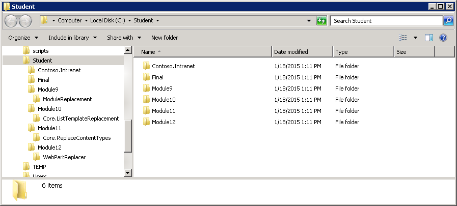


## Lab Overview ##

### Abstract ###

In this lab you will learn how to replace existing web parts by deploying a SharePoint Provider hosted app and updating the content to use an App Part hosted in the Provider hosted app in place of Web Parts using Full Trust Code.

### Learning Objectives ###

After completing the exercises in this lab, you will be able to:

- Locate specific web part instances using CSOM
- Create a new app part instances in an existing page using CSOM
- Remove web parts from a page using CSOM

**Estimated time to complete this lab: *30 minutes*.**


## Exercise 1: Replace web parts with app parts via CSOM ##

### Open the pre-created structure and test the initial deployment. ###

0. Start **Visual Studio 2013.**

0. Click **File | Open Project.**  
  
  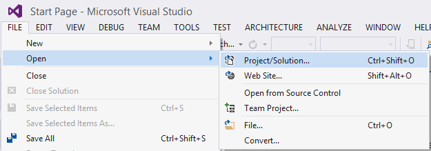

0. Move to the **Module12/WebPartReplacer** folder and open the existing solution named  **WebPartReplacer.sln.**
  * Note: The actual folder location is dependent on where you copied the files to in your local computer. 
  
0. Ensure that the **Site URL** property is correct for the app project by first activating the **WebPartReplacer** project.

0. Confirm the **Site URL** from the property window. This this should be pointing to the existing site collection for the lab, in the pre-configured environment this is **http://w15-sp/sites/ftclab**.

  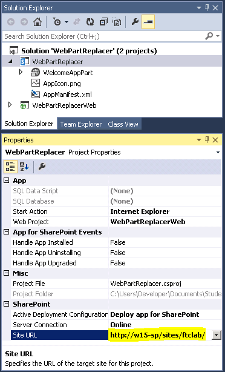

0. Open **AppManifest.xml** from the App project.

  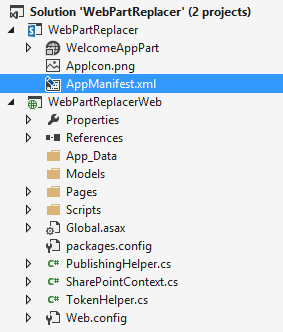

0. Adjust the permission to require **FullControl** in **Web** scope.

  

0. Note that this app project contains a Client Web Part or App Part. This will be used to replace an existing web part in the host web during this lab

  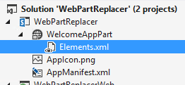

0. Open the **Elements.xml** file.
  
  * Note that the ClientWebPart definition defines some standard web part attributes like Title, Description and dimensions and also provides a reference to the page which will serve the content of the App Part.

  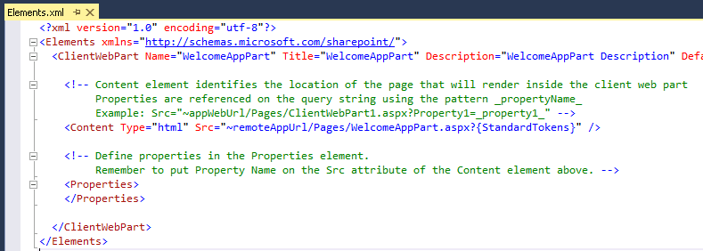

0. Press **F5** or choose **Debug – Start Debugging** to deploy the application and grant it the necessary permissions.

0. Click Trust It, when the trust notification appears.
  
  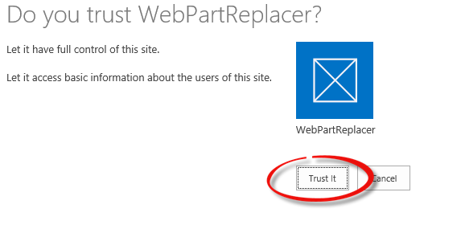

0. You should now see the initial design for the app as follows.
    * Notice that actual implementation is missing from the buttons, but you can already see how the app will work. 
  
  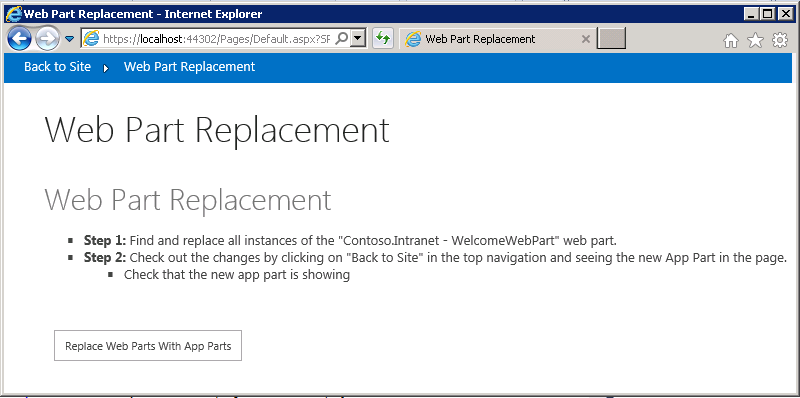

  * In case a message **Only secure content is displayed** appears at the bottom and the blue chrome at the top is missing, click on **Show all content**
   
  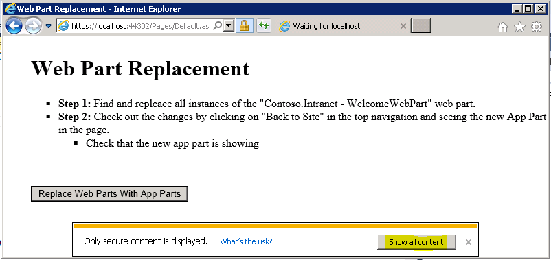


0. Click on **Back to Site** in the top left to navigate to the home page of the site to be modified during this lab,

0. Click on the **Gear icon** in the upper right and then **Edit Page**

  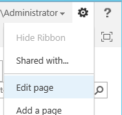

0. Click on **Add a Web Part** in the Top Web Part Zone.

0. Click on **WelcomeAppPart** then **Add**

0. In the **WelcomeAppPart** click on the **drop down arrow next to the web part title** and then **Edit Web Part**

  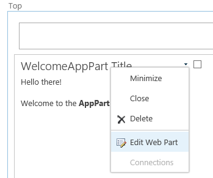

0. In the **Web Part Properties pane**, expand the **Advanced** section, set the **Export Mode** to **Export all data** and click **OK**

  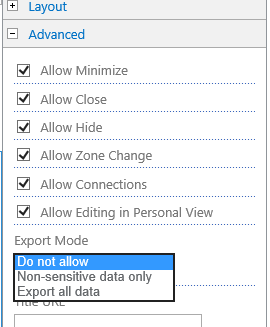

0. In the **WelcomeAppPart** click on the **drop down arrow next to the web part title** and then **Export**

  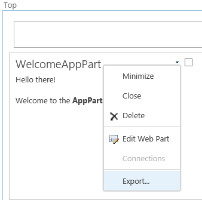

0. In the prompt at the bottom of the browser window click **Save**

    

0. After the download has been completed click **Open folder**

   

0. Then **right-click** and choose **Open with**

  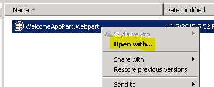 
  
0. Choose **Select a program from a list of installed programs** and click **OK**

  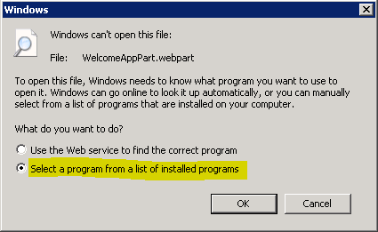 

0. Select **Notepad** in the list and click **OK**

  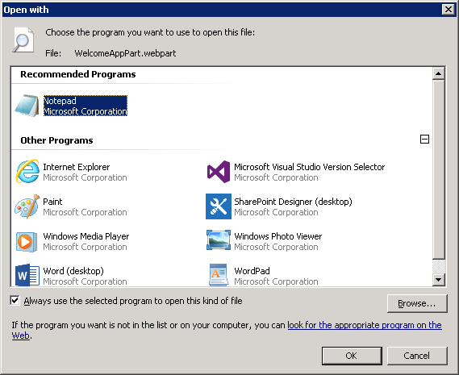 

0. This is a standard web part definition, the key elements here to take note of are, the type, this web part is a **Microsoft.SharePoint.WebPartPages.ClientWebPart** which has **FeatureId**, **ProductId** and **ProductWebId** which are used needed to load the appropriate app part.
 
  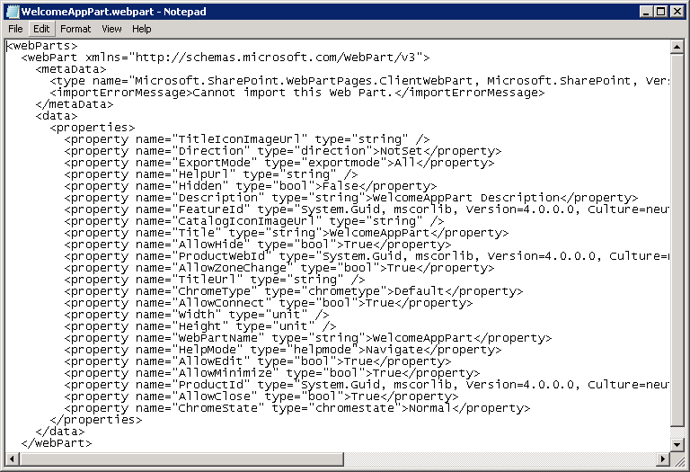 

0. Press **Ctrl + H** or click **Edit | Replace**

0. In the **Find what** box enter **"**, then enter **""** in the Replace with box and press **Replace All**

  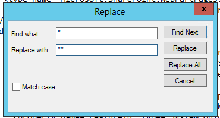
0. Close the replace dialog and press **Ctrl + A** or click **Edit | Select All** then **Ctrl + C** or **Edit | Copy**

0. Switch back to **Internet Explorer**, in the Ribbon on the **Page Tab** choose to **Discard Check Out**

  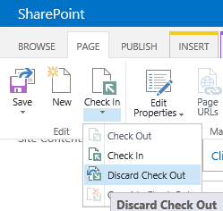

0. Move back to the **Visual Studio** window and press **Shift+F5** or choose **Stop Debugging** from the **Debug** menu.

0. From the **Solution Explorer** Open **Default.aspx.cs** 

  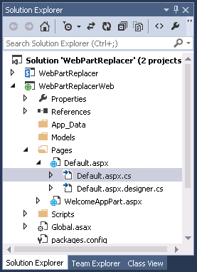

0. Locate the line which defines the **appPartXml** field.
  ```csharp
  private const string appPartXml = @"";
  ```

0. Paste in the Web Part Xml and save your changes, the code should now look like:  
  ```csharp
  private const string appPartXml = @"<webParts>
    <webPart xmlns=""http://schemas.microsoft.com/WebPart/v3"">
      <metaData>
        <type name=""Microsoft.SharePoint.WebPartPages.ClientWebPart, Microsoft.SharePoint, Version=15.0.0.0, Culture=neutral, PublicKeyToken=71e9bce111e9429c"" />
        <importErrorMessage>Cannot import this Web Part.</importErrorMessage>
      </metaData>
      <data>
        <properties>
          <property name=""TitleIconImageUrl"" type=""string"" />
          <property name=""Direction"" type=""direction"">NotSet</property>
          <property name=""ExportMode"" type=""exportmode"">All</property>
          <property name=""HelpUrl"" type=""string"" />
          <property name=""Hidden"" type=""bool"">False</property>
          <property name=""Description"" type=""string"">WelcomeAppPart Description</property>
          <property name=""FeatureId"" type=""System.Guid, mscorlib, Version=4.0.0.0, Culture=neutral, PublicKeyToken=b77a5c561934e089"">0b846986-3474-4f1a-93cf-b7817ef057f9</property>
          <property name=""CatalogIconImageUrl"" type=""string"" />
          <property name=""Title"" type=""string"">WelcomeAppPart Title</property>
          <property name=""AllowHide"" type=""bool"">True</property>
          <property name=""ProductWebId"" type=""System.Guid, mscorlib, Version=4.0.0.0, Culture=neutral, PublicKeyToken=b77a5c561934e089"">717c00a1-08ea-41a5-a2b7-4c8f9c1ce770</property>
          <property name=""AllowZoneChange"" type=""bool"">True</property>
          <property name=""TitleUrl"" type=""string"" />
          <property name=""ChromeType"" type=""chrometype"">Default</property>
          <property name=""AllowConnect"" type=""bool"">True</property>
          <property name=""Width"" type=""unit"" />
          <property name=""Height"" type=""unit"" />
          <property name=""WebPartName"" type=""string"">WelcomeAppPart</property>
          <property name=""HelpMode"" type=""helpmode"">Navigate</property>
          <property name=""AllowEdit"" type=""bool"">True</property>
          <property name=""AllowMinimize"" type=""bool"">True</property>
          <property name=""ProductId"" type=""System.Guid, mscorlib, Version=4.0.0.0, Culture=neutral, PublicKeyToken=b77a5c561934e089"">0b846986-3474-4f1a-93cf-b7817ef057f8</property>
          <property name=""AllowClose"" type=""bool"">True</property>
          <property name=""ChromeState"" type=""chromestate"">Normal</property>
        </properties>
      </data>
    </webPart>
  </webParts>";
  ```

|Note 
|:---------
|The **ProductId** can be obtained from the AppManifest.xml file by selecting it and pressing **F7** to view the XML code. 
|The **FeatureId** can be obtained by extracting the contents of the app package and locating the Feature it contains, this can also be extracted via CSOM after the app has been installed. 
|The **ProductWebId** is the Id of the Web to which the app is deployed and can be read via CSOM  


### Add the required code and run the app ###

0. In the **Default.aspx.cs** file locate the **ReplaceWebPartsWithAppParts_Click** method and paste in the following code. 
  ```csharp
  protected void ReplaceWebPartsWithAppParts_Click(object sender, EventArgs e)
  {
      var spContext = SharePointContextProvider.Current.GetSharePointContext(Context);
      using (var clientContext = spContext.CreateUserClientContextForSPHost())
      {
          Web web = clientContext.Web;
          // Get a few properties from the web
          clientContext.Load(web,
                              w => w.ServerRelativeUrl,
                              w => w.AllProperties);
          clientContext.ExecuteQuery();
          //Read the pages library name from the web properties
          var pagesListName = web.AllProperties["__pageslistname"] as string;

          var list = web.Lists.GetByTitle(pagesListName);
          var items = list.GetItems(CamlQuery.CreateAllItemsQuery());
          //make sure to include the File on each Item fetched
          clientContext.Load(items,
                              i => i.Include(
                                      item => item.File));
          clientContext.ExecuteQuery();

          // Iterate through all available pages in the pages list
          foreach (var item in items)
          {
              FindWebPartForReplacement(item, clientContext, web);
          }
      }
  }
  ```

  * The above code simply gets the Pages library and iterates over all of the list items contained in the Pages library. The **FindWebPartForReplacement** method looks to find Web Parts which should be replaced with our new App Part.

0. Include the following piece of code to the **FindWebPartForReplacement** method.
  ```csharp
  private static void FindWebPartForReplacement(ListItem item, ClientContext clientContext, Web web)
  {
      File page = item.File;
      // Requires Full Control permissions on the Web
      LimitedWebPartManager webPartManager = page.GetLimitedWebPartManager(PersonalizationScope.Shared);
      clientContext.Load(webPartManager,
                          wpm => wpm.WebParts,
                          wpm => wpm.WebParts.Include(
                                              wp => wp.WebPart.Title));
      clientContext.ExecuteQuery();

      foreach (var oldWebPartDefinition in webPartManager.WebParts)
      {
          var oldWebPart = oldWebPartDefinition.WebPart;
          // only modify if we find the old web part
          if (oldWebPart.Title != oldWebPartTitle) continue;

          ReplaceWebPart(web, item, webPartManager, oldWebPartDefinition, clientContext, page);
      }
  }
  ```

  * This method uses the **LimitedWebPartManager** object for the given page to access all of the web parts in the page to find any which should be replaced. When a web part which is to be replaced then the **ReplaceWebPart** method is called
0. Add the following of code to the **ReplaceWebPart** method.
  ```csharp
    private static void ReplaceWebPart(Web web, ListItem item, LimitedWebPartManager webPartManager,
        WebPartDefinition oldWebPartDefinition, ClientContext clientContext, File page)
    {
        // Check out the page for editing
        PublishingHelper.CheckOutFile(web, item);
        // transform the xml into a web part definition
        var definition = webPartManager.ImportWebPart(appPartXml);
        webPartManager.AddWebPart(definition.WebPart, "RightColumn", 0);

        // Now delete the old web part from the page
        oldWebPartDefinition.DeleteWebPart();
        clientContext.Load(page,
                            p => p.CheckOutType,
                            p => p.Level);

        clientContext.ExecuteQuery();
        // check in all the changes
        PublishingHelper.CheckInPublishAndApproveFile(page);
    }
  ```

  * *Note*: If you do not provide a zone present in the page, in our case "RightColum", you will encounter an Exception when calling ExecuteQuery with the message "Specified argument was out of the range of valid values".
  * This method uses the **ImportWebPart** method of the **LimitedWebPartManager** to convert our Xml string set up earlier in the lab into a WebPartDefinition and then the **AddWebPart** method to add the web part to page in the specified zone.
  * The included PublishingHelper class is used to ensure that Check-In/Check-Out and publishing steps are performed appropriately.

0. Press **F5** or choose **Debug – Start Debugging** to start up the application again.

0. Click the **Replace Web Parts With App Parts** button.

  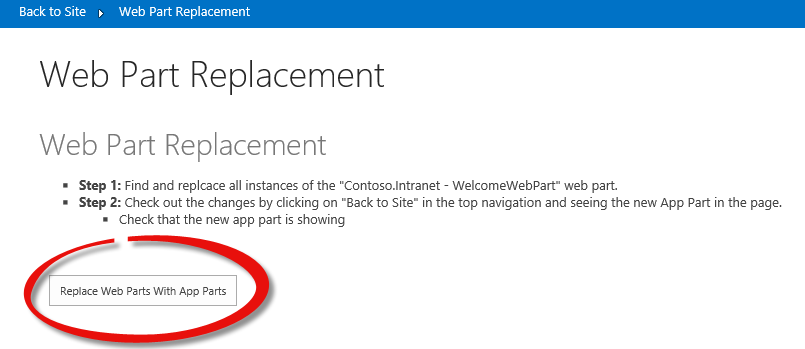

0. Click the **Back to Site** link in the top left of the page.

  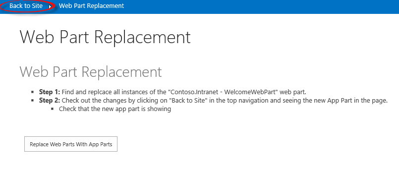

0. Note that the Welcome Web Part has been replaced with the Welcome App Part.

  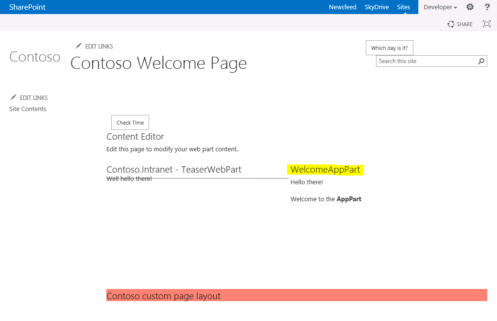
