##Module 8 - Using Enterprise Content Management Capabilities with app model

###Lab Environment
During this lab, you will work in your own environment with your own Office365 tenant. Following pre-requisites should be completed or be available before you start the lab.

###Prerequisites

The required prerequisite for this course are:

* Basic skill set on managing Office365
* Access to an Office365 tenant with an existing developer site. (The [pre-requisite lab](../O3658-0 Requesting Office365 Trial Tenant/Lab.md) provides directions to complete this task.)
* Visual Studio 2013 Ultimate with Azure SDK v2.5
* Ensure you have configured a local NuGet package repository: [Screenshot of the previous step](http://www.mbgreen.com/blog/2014/8/8/sharepoint-2013-apps-fail-on-nuget-package-restore)
* Access to an existing Windows Azure tenant (to be used as the hosting platform for applications that are installed for a typical Office365 sites.) 
* SharePoint Designer 2013. 
* Download and install the latest version of the SharePoint online client SDK from following link - http://aka.ms/spocsom
* Download the material from [Demos folder](Demos). Note the location of these files. You will need these files to complete the labs.

##Exercise 1: Build Cross Site Collection Navigation with Custom Taxonomy Driven Navigation

###Lab Overview

###Abstract
In this lab you will create custom cross site collection navigation based on the term configuration in taxonomy store.

###Learning Objectives

After completing the exercises in this lab, you will be able to:

* Use term set information as the navigation source.
* Access custom properties of terms using CSOM.

***Estimated time to complete this lab: 15 minutes***

###Open the pre-created structure and test the initial deployment.

1.  Start __Visual Studio 2013 Ultimate__.
2.  Click __File | Open Project__.  
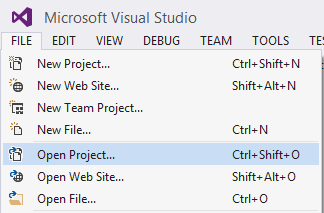
3. Navigate to the __Demos/TaxonomyMenuInject__ folder and open the existing solution named __TaxonomyMenuInject.sln__.  
__Note:__ The actual folder location ID is dependent on where you copied the files to in your local computer.  
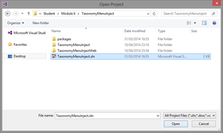
4. Provide your tenant login information when the __Connect to SharePoint__ dialog is prompted.  
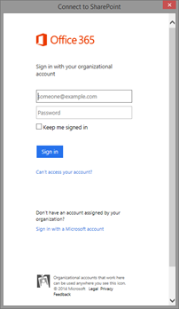
5. Ensure that the __Site URL__ property is correct for the app project by first activating the  __TaxonomyMenuInject__ project.  
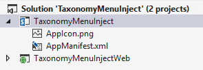
6. Confirm the __Site URL__ from the property window. This this should be pointing to your personal Office365 tenant and to the existing developer site collection which can be used for the exercise creation.  
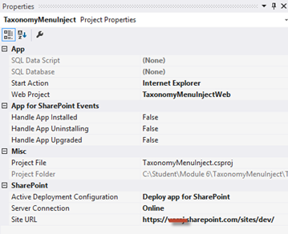
7. Open AppManifest.xml from the app project.  

8. Ensure that the permission match as follows: __Read__ for __User Profiles__, __Write__ for __Taxonomy__, and __FullControl__ for __Web__ scopes. (Modify the permissions if needed.)  

9.  Press __F5__ or choose __Debug - Start Debugging__ to ensure that application can be properly deployed.
10. Log in to your test tenant by providing the right user ID and password, if required.  
  
Note: If you have any challenges to logging in from your corporate tenant, follow this support article: [http://support.microsoft.com/kb/2507767](http://support.microsoft.com/kb/2507767).  
11. Click __Trust It__, when the trust notification is shown.  
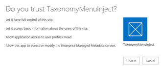
12. You should now see the initial design for the app as follows.  
Note: We will implement the actual functionality as an app part, so there won't be any actual code in default.aspx.  
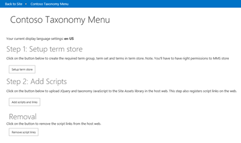
13. Since this app is operating taxonomies or creating them on behalf of the user, we'll need to ensure that the user has the right permissions for initial operations (an app only token could be an alternative), so move to the host web by clicking __Back to Site__ from top navigation.
14. Click __SharePoint__ from the __Admin__ menu to access Office365 tenant SharePoint configuration.  
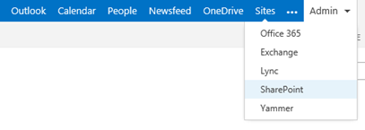
15. Click __Term Store__ from the left navigation.
16. Ensure that the account which you use for development and debugging is listed as one of the __Term Store Administrators__.  
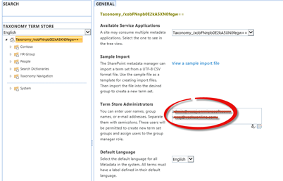
17. Move back to __Visual Studio__ size and press __Shift+F5__ or choose __Stop Debugging__ from the __Debug__ menu.

### Include the actual code for operations.

1.  Move to the __Solution View__ and open the __default.aspx.cs__ file to add the needed code for actual button clicks.
2.  Update __AddTaxonomy_Clicks__ as follows to add the used taxonomy structure to the taxonomy store.  
Notice that we use a helper class called __TaxonomyHelper__, which has the code for creating the needed group, term set, and terms to the taxonomy store.  
Take some time to check the code needed for this.
  ```csharp
        protected void AddTaxonomy_Click(object sender, EventArgs e)
        {
            var spContext = SharePointContextProvider.Current.GetSharePointContext(Context);
            using (var clientContext = spContext.CreateUserClientContextForSPHost())
            {
                TaxonomyHelper.SetupTermStore(clientContext);
            }
        }
  ```

3. Update the __AddScripts_Click__ method as follows, so that we have a starting point for injecting needed elements to host web.
  ```csharp
        protected void AddScripts_Click(object sender, EventArgs e)
        {
            var spContext = SharePointContextProvider.Current.GetSharePointContext(Context);
            using (var clientContext = spContext.CreateUserClientContextForSPHost())
            {
                AddScriptsToHostWeb(clientContext);
                AddScriptLinksToHostWeb(clientContext);
            }
        }
  ```

4. The next step is to include the supporting methods. Include the following methods below the existing code. Take some time to understand what these codes do. We use a JavaScript injection pattern to modify the rending in the host web.
  ```csharp
        private void AddScriptsToHostWeb(ClientContext clientContext)
        {
            var web = clientContext.Web;
            var library = web.Lists.GetByTitle("Site Assets");
            clientContext.Load(library, l => l.RootFolder);
            UploadScript(clientContext, library, "jquery-1.9.1.min.js");
            UploadScript(clientContext, library, "taxnav.js");
        }
        private static void UploadScript(ClientContext clientContext, List library, string fileName)
        {
            var filePath = System.Web.Hosting.HostingEnvironment.MapPath(string.Format("~/Scripts/{0}", fileName));
            var newFile = new FileCreationInformation();
            newFile.Content = System.IO.File.ReadAllBytes(filePath);
            newFile.Url = fileName;
            newFile.Overwrite = true;
            var uploadFile = library.RootFolder.Files.Add(newFile);
            clientContext.Load(uploadFile);
            clientContext.ExecuteQuery();
        }
        private static void AddScriptLinksToHostWeb(ClientContext clientContext)
        {
            var existingActions = clientContext.Web.UserCustomActions;
            clientContext.Load(existingActions);
            clientContext.ExecuteQuery();
            RemoveScriptLinksFromHostWeb(clientContext, existingActions);
            var customActionJQuery = existingActions.Add();
            customActionJQuery.Description = "taxonomyNavigationJQuery";
            customActionJQuery.Location = "ScriptLink";
            customActionJQuery.ScriptSrc = "~site/SiteAssets/jquery-1.9.1.min.js";
            customActionJQuery.Sequence = 1000;
            customActionJQuery.Update();
            var customActionTaxonomy = existingActions.Add();
            customActionTaxonomy.Description = "taxonomyNavigationScript";
            customActionTaxonomy.Location = "ScriptLink";
            customActionTaxonomy.ScriptSrc = "~site/SiteAssets/taxnav.js";
            customActionTaxonomy.Sequence = 1010;
            customActionTaxonomy.Update();
            clientContext.ExecuteQuery();
        }
        private static void RemoveScriptLinksFromHostWeb(ClientContext clientContext, UserCustomActionCollection existingActions)
        {
            var actions = existingActions.ToArray();
            foreach (var action in actions)
            {
                if (action.Location.Equals("ScriptLink") &&
                    (action.Description.Equals("taxonomyNavigationJQuery") || action.Description.Equals("taxonomyNavigationScript")))
                {
                    action.DeleteObject();
                }
            }
            clientContext.ExecuteQuery();
        }
  ```

5. Update the __RemoveScripts_Click__ method as follows, so that we complete the different button event handlers. This method is calling __RemoveScriptLinksFromHostWeb__, which we already added to the code in the previous step.
  ```csharp
        protected void RemoveScripts_Click(object sender, EventArgs e)
        {
            var spContext = SharePointContextProvider.Current.GetSharePointContext(Context);
            using (var clientContext = spContext.CreateUserClientContextForSPHost())
            {
                var existingActions = clientContext.Web.UserCustomActions;
                clientContext.Load(existingActions);
                clientContext.ExecuteQuery();
                RemoveScriptLinksFromHostWeb(clientContext, existingActions);
            }
        }
  ```

6.  Now we are ready to see our code in practice. Press __F5__ or choose __Start Debugging__ from Debug menu.
7.  Once the app starts, click __Setup term store__ to populate the needed structure.
8.  After that is completed, check the status from the term store. Notice how we have added a new term set to the store.  
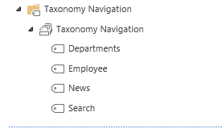
9. Move back to the app and click __Add Scripts and Links__. This button is uploading needed files to host web and creates user custom action entries, so that the scripts are executed when the user accesses the site.
10. Move to host web to see the change by clicking __Back to Site__ from the top left corner.
11. Notice how the top navigation is updated based on the taxonomy entries in term store.  
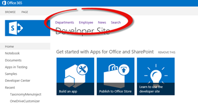
12. Move back to the app and click __Remove script links__ to clean up the user custom action definition.
13. Move back to the host web and confirm that custom navigation has been removed.

##Exercise 2: Synchronize Taxonomy Terms to Cloud from On-premises

###Lab Overview

In this lab you will build a small taxonomy tool which can be used for creating and reading terms in the Office 365. You can use this kind of process to access your on-premises farm terms and then replicate them to the cloud.

###Learning Objectives

After completing the exercises in this lab, you will be able to:

* Connect to Office365.
* Create new terms to Office365.
* Read terms from Office365.

***Estimated time to complete this lab: 15 minutes***

###Access Office365 term store remotely using taxonomy CSOM

1.  Open up Visual Studio 2013.
2.  Click __File | New Project__.
3.  Type __MMSCloudAccess__ as the solution name in the __Name__ textbox of the __New Project Dialog__ box.
4.  Choose project type as __Console Application__ under the __Windows__ templates.
5.  Set location as __O3658-5\MMSCloudAccess__.  
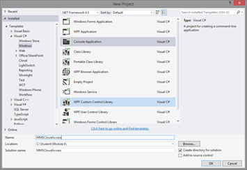
6.  Click __OK__.
7.  Right click the __References__ under the project in the __Solution Explorer__ and choose __Add Reference__...  
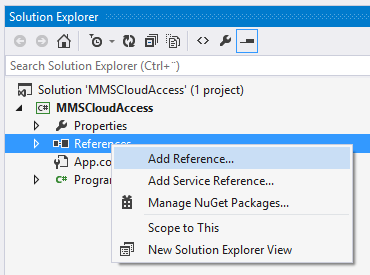
8.  Click __Browse...__
9.  Move to folder __C:\Program Files\Common Files\microsoft shared\Web Server Extensions\15\ISAPI__.
10. Select the following assemblies. You can select multiple assemblies by holding the __Ctrl__ button down while clicking the assemblies in dialog.
    * __Microsoft.SharePoint.Client.dll__
    * __Microsoft.SharePoint.Client.RunTime.dll__
    * __Microsoft.SharePoint.Client.Taxonomy.dll__
11. Click __Add__.
12. Click __OK__.
13. Now you should have the right references to be able to access Office365 remotely in the __References__ section.  
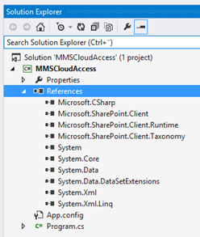
14. Open up __Program.cs__ from the solution explorer and add the following using statements.
  ```csharp
    using System.Security;
    using Microsoft.SharePoint.Client;
    using Microsoft.SharePoint.Client.Taxonomy;
  ```

15. Update the __Main__ method as follows.  
Notice that we are calling multiple sub methods to ensure that code is more understandable. We will first request the connectivity information to Office365 and then access the taxonomy functionality.
  ```csharp
    static void Main(string[] args)
    {
        // Request Office365 site from the user
        string siteUrl = GetSite();
        /* Prompt for Credentials */
        Console.WriteLine("Enter Credentials for {0}", siteUrl);
        string userName = GetUserName();
        SecureString pwd = GetPassword();
        /* End Program if no Credentials */
        if (string.IsNullOrEmpty(userName) || (pwd == null))
            return;
        ClientContext cc = new ClientContext(siteUrl);
        cc.AuthenticationMode = ClientAuthenticationMode.Default;
        cc.Credentials = new SharePointOnlineCredentials(userName, pwd);
        try
        {
            // Let's ensure that the theme is available in root web
            Web web = cc.Web;
            cc.Load(web);
            cc.ExecuteQuery();
            // Call creation of terms
            CreateNecessaryMMSTermsToCloud(cc);
            Console.ForegroundColor = ConsoleColor.Green;
            Console.WriteLine(" - MMS terms created to cloud successfully.");
            Console.WriteLine(" - Reconnecting and listing what terms we have in cloud.");
            // Call looping of the terms
            GetMMSTermsFromCloud(cc);
            Console.WriteLine("Press any key to continue.");
            Console.Read();
        }
        catch (Exception ex)
        {
            Console.ForegroundColor = ConsoleColor.Red;
            Console.WriteLine(string.Format("Exception!"), ex.ToString());
            Console.WriteLine("Press any key to continue.");
            Console.Read();
            throw;
        }
    }
  ```

16. Add the following __GetSite__ method to request the target URL under the __Main__ method.
  ```csharp
    public static string GetSite()
    {
        string siteUrl = string.Empty;
        try
        {
            Console.Write("Give Office365 site URL: ");
            siteUrl = Console.ReadLine();
        }
        catch (Exception e)
        {
            Console.WriteLine(e.Message);
            siteUrl = string.Empty;
        }
        return siteUrl;
    }
  ```

17. Add the following __GetUserName__ method under the method which we added on previous step.
  ```csharp
    public static string GetUserName()
    {
        string strUserName = string.Empty;
        try
        {
            Console.Write("SharePoint Username: ");
            strUserName = Console.ReadLine();
        }
        catch (Exception e)
        {
            Console.WriteLine(e.Message);
            strUserName = string.Empty;
        }
        return strUserName;
    }
  ```

18. Add the following __GetPassword__ method under the method which we just added.  
Now we have all the code needed to connect to Office365. Notice how we use the __SharePointOnlineCredentials__ object in the __Main__ method for providing the user name and password. This is Office365 specific, but other code works as such across any environment.
  ```csharp
    public static SecureString GetPassword()
    {
        SecureString sStrPwd = new SecureString();
        try
        {
            Console.Write("SharePoint Password: ");
            for (ConsoleKeyInfo keyInfo = Console.ReadKey(true); keyInfo.Key != ConsoleKey.Enter; keyInfo = Console.ReadKey(true))
            {
                if (keyInfo.Key == ConsoleKey.Backspace)
                {
                    if (sStrPwd.Length > 0)
                    {
                        sStrPwd.RemoveAt(sStrPwd.Length - 1);
                        Console.SetCursorPosition(Console.CursorLeft - 1, Console.CursorTop);
                        Console.Write(" ");
                        Console.SetCursorPosition(Console.CursorLeft - 1, Console.CursorTop);
                    }
                }
                else if (keyInfo.Key != ConsoleKey.Enter)
                {
                    Console.Write("*");
                    sStrPwd.AppendChar(keyInfo.KeyChar);
                }
            }
            Console.WriteLine("");
        }
        catch (Exception e)
        {
            sStrPwd = null;
            Console.WriteLine(e.Message);
        }
        return sStrPwd;
    }
  ```

19. Now we can actually add the needed code for creating the custom taxonomy group, term set, and term remotely. Add the following __CreateNecessaryMMSTermsToCloud__ method as a new method under just added methods.
  ```csharp
    private static void CreateNecessaryMMSTermsToCloud(ClientContext cc)
    {
        // Get access to taxonomy CSOM
        TaxonomySession taxonomySession = TaxonomySession.GetTaxonomySession(cc);
        cc.Load(taxonomySession);
        cc.ExecuteQuery();
        if (taxonomySession != null)
        {
            TermStore termStore = taxonomySession.GetDefaultSiteCollectionTermStore();
            if (termStore != null)
            {
                //
                //  Create group, termset, and terms.
                //
                TermGroup myGroup = termStore.CreateGroup("Custom", Guid.NewGuid());
                TermSet myTermSet = myGroup.CreateTermSet("Colors", Guid.NewGuid(), 1033);
                myTermSet.CreateTerm("Red", 1033, Guid.NewGuid());
                myTermSet.CreateTerm("Orange", 1033, Guid.NewGuid());
                myTermSet.CreateTerm("Yellow", 1033, Guid.NewGuid());
                myTermSet.CreateTerm("Green", 1033, Guid.NewGuid());
                myTermSet.CreateTerm("Blue", 1033, Guid.NewGuid());
                myTermSet.CreateTerm("Purple", 1033, Guid.NewGuid());
                cc.ExecuteQuery();
            }
        }
    }
  ```

20. Add the actual listing of the terms to the cloud as the __GetMMSTermsFromCloud__ method to the class by adding the following code.
  ```csharp
    private static void GetMMSTermsFromCloud(ClientContext cc)
    {
        //
        // Load up the taxonomy item names.
        //
        TaxonomySession taxonomySession = TaxonomySession.GetTaxonomySession(cc);
        TermStore termStore = taxonomySession.GetDefaultSiteCollectionTermStore();
        cc.Load(termStore,
                store => store.Name,
                store => store.Groups.Include(
                    group => group.Name,
                    group => group.TermSets.Include(
                        termSet => termSet.Name,
                        termSet => termSet.Terms.Include(
                            term => term.Name)
                    )
                )
        );
        cc.ExecuteQuery();
        //
        //Writes the taxonomy item names.
        //
        if (taxonomySession != null)
        {
            if (termStore != null)
            {
                foreach (TermGroup group in termStore.Groups)
                {
                    Console.WriteLine("Group " + group.Name);
                    foreach (TermSet termSet in group.TermSets)
                    {
                        Console.WriteLine("TermSet " + termSet.Name);
                        foreach (Term term in termSet.Terms)
                        {
                            //Writes root-level terms only.
                            Console.WriteLine("Term " + term.Name);
                        }
                    }
                }
            }
        }
    }
  ```

21. Now the code needed has been added. You should move cursor to appropriate locations in the code and use __F9__ to add some break points to the code, so that you can more easily track what is actually happening when the code is executed.
22. Press __F5__ or choose __Debug - Start debugging__.
23. Provide the connectivity information relevant to your test tenant as shown in the following picture. __Url__, __user name__, and __password__ are asked one-by-one.  
The URL should be something like __https://yourtenant.sharepoint.com/sites/dev__.  
__Note:__ This relies on the assumption that you have completed Exercise 1 and have made the user you are logging in with a __Term Store Administrator__ as you did in the first exercise.


24. Execution will take a while and you should see some of the terms listed from the taxonomy store in green like in following picture.  
If you get a red exception message, double check your login information. Note that the code does fail if a group exists in the taxonomy store with the same name as the just added code.  

25. Open your browser and connect to your tenant and the site collection. The URL should be something like __https://yourtenant.sharepoint.com/sites/dev__.
26. Log in to the tenant.  

27. Choose __Site Settings__ from the __Site Actions__ menu.  
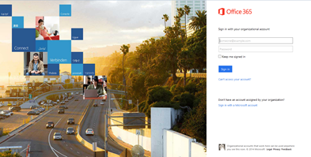
28. Click __Term store management__ under the __Site Administration__.  
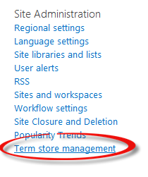
29. Expand the left side groups section for the __Custom__ group and verify that the terms where successfully created.  
Notice that in your case the list of groups might look slightly different, but you should have the Contoso group with __Color__ term set, which was created using the code from this lab.  
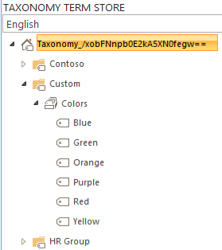  

That ends this lab. In this lab we did access Office365 term store remotely using taxonomy CSOM. You can use the techniques in this lab to synchronize or push terms from your line of business solutions to the cloud.