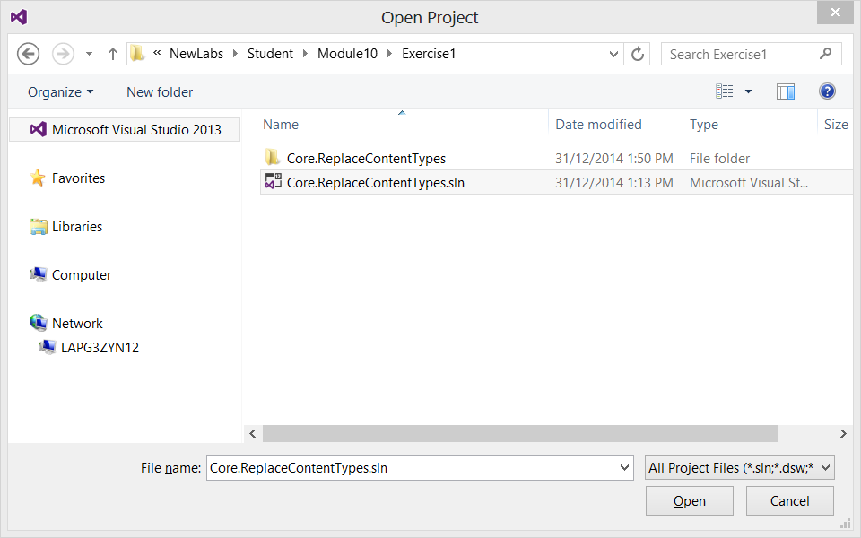
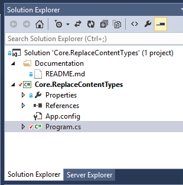
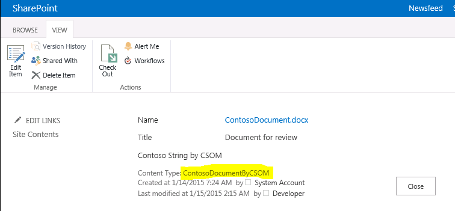

# Module 3 — Content Type and Site columns replacements #


## Lab Environment ##
During this lab, you will work in the provided virtual machine. The following prerequisites have been completed and are provided should you wish to undertake this lab in your own environment.

### Before You Begin ###
To complete the labs in this course you need to install or configure the following items.
  - Access to a SharePoint 2013 server with the Contoso.Intranet solution deployed and a site collection provisioned using the **WTContosoPublishing Web Template**. (The PowerShell for site creation is available in the [Patterns & Practice reference materials](https://github.com/OfficeDev/PnP/tree/master/Reference%20Material/Contoso.Intranet) .)
    + You should be logged in as an administrator of the site collection to ensure that you have all the necessary permissions for this lab  

  - Visual Studio 2013 Ultimate Update 3 with Azure SDK v2.5, available via the web platform installer.  

  - Ensure you have configured a local NuGet package repository: http://www.mbgreen.com/blog/2014/8/8/sharepoint-2013-apps-fail-on-nuget-package-restore    
  - Download and unzip the Student folder. Note the unzipped location of these files. You will need these files to complete the labs.  The following graphic shows the unzipped file structure.  
    


## Lab Overview ##

### Abstract ###

In this lab you will learn how to replace existing content types by deploying new content types and updating the content to the new content type with new site columns using remote provisioning.

### Learning Objectives ###

After completing the exercises in this lab, you will be able to:

- Create a new content type using CSOM
- Create a new site column using CSOM
- Add a site column to a content type using CSOM
- Replace an existing content type using CSOM

**Estimated time to complete this lab: *15 minutes*.**


 


## Exercise 1: Create a new content type using CSOM and replace an existing one ##

### Open the pre-created structure and test the initial deployment. ###

0. Start **Visual Studio 2013.**
0. Click **File | Open Project.**  
  
  

0. Move to the **Module11/Core.ReplaceContentTypes** folder and open the existing solution named  **Core.ReplaceContentTypes.sln.**
  * Note: The actual folder location is dependent on where you copied the files to in your local computer. 
  
  


### Add the required code ###

0. Move to **Solution View** and double-click the **Program.cs** file to see the starting point for adding the required code. 

  

0. Paste in the following code to create the first stage of execution in the **Main** method:

    ```csharp
    static void Main(string[] args)
    {
        using (var clientContext = new ClientContext("http://w15-sp/sites/ftclab"))
        {
            // Load reference to content type collection
            Web web = clientContext.Web;

            // Ensure that we have the initial config available
            CreateContentType(clientContext, web);
            CreateSiteColumn(clientContext, web);
            AddSiteColumnToContentType(clientContext, web);

            // Now replace the old with the new content type
            ReplaceContentType(clientContext, web);
        }

    }
    ```

0. Include the following piece of code to the **CreateContentType** method. This will check first if the content type is already available; if not the content type will be created.

    ```csharp
    private static void CreateContentType(ClientContext cc, Web web)
    {
        // The new content type will be created with this name
        const string contentTypeName = "ContosoDocumentByCSOM";

        // Check if the content type does not exist yet
        var contentType = GetContentTypeByName(cc, web, contentTypeName);

        // Content type exists already, no further action required
        if (contentType != null) return;

        // Create a Content Type Information object
        ContentTypeCreationInformation newCt = new ContentTypeCreationInformation();
        // Set the name for the content type
        newCt.Name = "ContosoDocumentByCSOM";
        //Inherit from oob document - 0x0101 and assign 
        newCt.Id = "0x0101009189AB5D3D2647B580F011DA2F356FB2";
        // Set content type to be avaialble from specific group
        newCt.Group = "Contoso Content Types";
        // Create the content type
        ContentType myContentType = web.ContentTypes.Add(newCt);
        cc.ExecuteQuery();
    }
```

0. Include the following piece of code to the **CreateSiteColumn** method. This will check first if the site column "ContosoStringCSOM" exists already; if not the site column will be created.

    ```csharp
    private static void CreateSiteColumn(ClientContext cc, Web web)
    {
        // The new field name
        const string fieldName = "ContosoStringCSOM";

        // Load the list of site columns
        FieldCollection fields = web.Fields;
        cc.Load(fields);
        cc.ExecuteQuery();

        // Check existing fields
        var fieldExists = fields.Any(f => f.InternalName == fieldName);

        // Site column exists already, no further action required
        if (fieldExists) return;

        // Otherwise create the new field
        string FieldAsXML = @"<Field ID='{CB8E24F6-E1EE-4482-877B-19A51B4BE319}' 
                                    Name='" + fieldName + @"' 
                                    DisplayName='Contoso String by CSOM' 
                                    Type='Text' 
                                    Hidden='False' 
                                    Group='Contoso Site Columns' 
                                    Description='Contoso Text Field' />";
        Field fld = fields.AddFieldAsXml(FieldAsXML, true, AddFieldOptions.DefaultValue);
        cc.ExecuteQuery();
    }
```

0. Include the following piece of code to the **AddSiteColumnToContentType** method. This will check first if there is a connection between the created content type and site column; if not this connection will be created.

    ```csharp
    private static void AddSiteColumnToContentType(ClientContext cc, Web web)
    {
        // The new content type will be created with this name
        const string contentTypeName = "ContosoDocumentByCSOM";
        // The new field name
        const string fieldName = "ContosoStringCSOM";

        // Try to load the new content type
        var contentType = GetContentTypeByName(cc, web, contentTypeName);
        if (contentType == null) return; // not found

        // Load field links to content type
        cc.Load(contentType.FieldLinks);
        cc.ExecuteQuery();

        // Try to load the new field
        Field fld = web.Fields.GetByInternalNameOrTitle(fieldName);
        cc.Load(fld);
        cc.ExecuteQuery();

        // Try to load the content type/site column connection
        var hasFieldConnected = contentType.FieldLinks.Any(f => f.Name == fieldName);

        // Reference exists already, no further action required
        if (hasFieldConnected) return;

        // Reference does not exist yet - create the connection
        FieldLinkCreationInformation link = new FieldLinkCreationInformation();
        link.Field = fld;
        contentType.FieldLinks.Add(link);
        contentType.Update(true);
        cc.ExecuteQuery();
    }
```

0. Include the following piece of code to the **ReplaceContentType** method. This will check all items in the all libraries for assignments to the old content type (Contoso Document) and will replace those with the new content type (ContosoDocumentByCSOM).

    ```csharp
    private static void ReplaceContentType(ClientContext cc, Web web)
    {
        // The old content type (0x010100C32DDAB6381C44868DCD5ADC4A5307D6001D104C6E9F5EA74FBDFDC3C018A02D56)
        const string oldContentTypeId = "0x010100C32DDAB6381C44868DCD5ADC4A5307D6";
        // The new content type name
        const string newContentTypeName = "ContosoDocumentByCSOM";

        // Get content type and list
        ContentType newContentType = GetContentTypeByName(cc, web, newContentTypeName);
        ListCollection lists = web.Lists;
        // Load all data required
        cc.Load(newContentType);
        cc.Load(lists,
                l => l.Include(list => list.ContentTypes));
        cc.ExecuteQuery();
        var listsWithContentType = new List<List>();
        foreach (List list in lists)
        {
            bool hasOldContentType = list.ContentTypes.Any(c => c.StringId.StartsWith(oldContentTypeId));
            if (hasOldContentType)
            {
                listsWithContentType.Add(list);
            }
        }
        foreach (List list in listsWithContentType)
        {
            // Check if the new content type is already attached to the library
            var listHasContentTypeAttached = list.ContentTypes.Any(c => c.Name == newContentTypeName);
            if (!listHasContentTypeAttached)
            {
                // Attach content type to list
                list.ContentTypes.AddExistingContentType(newContentType);
                cc.ExecuteQuery();
            }
            // Lost all list items
            CamlQuery query = CamlQuery.CreateAllItemsQuery();
            ListItemCollection items = list.GetItems(query);
            cc.Load(items);
            cc.ExecuteQuery();

            // For each list item check if it is set to the old content type, update to new one if required
            foreach (ListItem listItem in items)
            {
                // Currently assigned content type to this item
                var currentContentTypeId = listItem["ContentTypeId"] + "";
                var isOldContentTypeAssigned = currentContentTypeId.StartsWith(oldContentTypeId);

                // This item is not assigned to the old content type - skip to next one
                if (!isOldContentTypeAssigned) continue;

                // Update to new content type
                listItem["ContentTypeId"] = newContentType.StringId; // newContentTypeId;
                listItem.Update();
            }
            // Submit all changes
            cc.ExecuteQuery();
        }
    }
```

0. Add a little helper method to get a content type by name:

    ```csharp
    private static ContentType GetContentTypeByName(ClientContext cc, Web web, string name)
    {
        ContentTypeCollection contentTypes = web.ContentTypes;
        cc.Load(contentTypes);
        cc.ExecuteQuery();
        return contentTypes.FirstOrDefault(o => o.Name == name);
    }
```        

0. Press **F5** or choose **Debug – Start Debugging** to run the console application and create the content type and site column and replace the old one.

0. Navigate to the Contoso Library and open the view for the ContosoDocument, it should have the new content type assigned now: 

    

    * If required add a document to the library, assign it to the old content type and run the program again to test if the content type replacement works.


Note |
---------|
When you perform content type replacement operations, it is important to remember to also update other possible dependencies on the content type. In this lab we perform content type replacement for document content types. In the scenario where you are replacing content types which are used with WCM page layouts, you would have to remember to also update the Associated Content Type property for each page layout in the site collection which relies on the content type being replaced.|